# B+Tree

---

[参考链接：B+树的插入图片演示](https://www.cnblogs.com/zh718594493/p/12208878.html)

[参考链接：MySQL索引的数据结构-B+树介绍](https://www.cnblogs.com/nickchen121/p/11152523.html)

---

## B+Tree性质

+ B+树由B树和索引顺序访问方法（ISAM，这就是MyISAM引擎最初参考的数据结构）演化而来，实际中已经没有使用B树的情况了
+ B+树是为磁盘或其他直接存储辅助设备设计的一种平衡查找时
+ B+树中，`所有记录节点都是按键值的大小顺序存放在同一层的叶子节点上`，由各叶子节点指针进行连接
+ 如下：其高度为2，每页存放4条记录，扇出（fan out）为5，所有记录都在叶子节点上，并且是顺序存放的
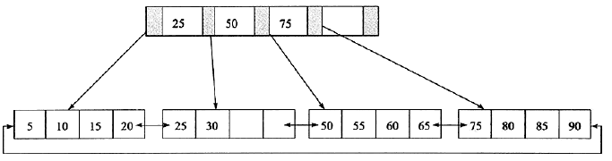
+ IO次数取决于B+Tree的高度h，假设当前数据表的数据为N，每个磁盘块的数据项的数量是m，则有h=㏒(m+1)N，当数据量N一定的情况下，m越大，h越小；而m = 磁盘块的大小 / 数据项的大小，磁盘块的大小也就是一个数据页的大小，是固定的，如果数据项占的空间越小，数据项的数量越多，树的高度越低
+ b+树要求把真实的数据放到叶子节点而不是内层节点，一旦放到内层节点，磁盘块的数据项会大幅度下降，导致树增高，当数据项等于1时将会退化成线性表

## B+Tree的插入操作

B+树的插入必须保证插入后叶子节点中的记录依然排序，同时需要考虑插入到B+树的三种情况，每种情况都会导致不同的插入算法

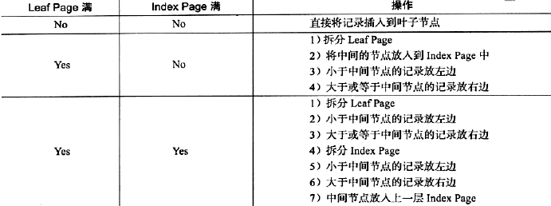

1. 如下图这颗B+树，若用户插入28这个值，发现当前叶子页leafPage和IndexPage索引页都没有满，直接插入就行
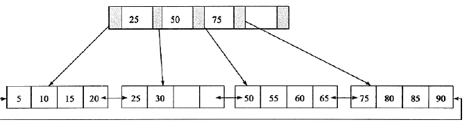
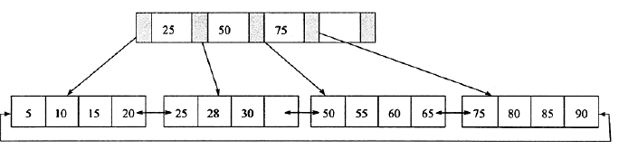

2. 从上图接着插入70这个键值，这时原来的leafPage已经满了，但是IndexPage还没有，这时插入leafPage后的情况为50、55、60、65、70，并根据中间值60来拆分叶子节点，可得下图
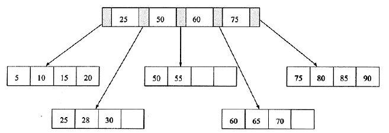

    为了保持平衡对于新插入的键值可能需要做大量的拆分页（split）操作，因为B+树结构主要用于磁盘，也拆分意味着磁盘操作，所以应该在可能的情况下尽量减小页的拆分操作，因此B+树会提出`因此B+树会提出平衡二叉树的旋转（Rotation）功能`
    旋转发生在leafPage已满，但是其左右兄弟节点没有满的情况下，这时B+树不会急于去拆分页操作，而是将记录移到所在页的兄弟页节点上，通常情况下，左兄弟会被首先检查用来做旋转操作，若如此，插入70应该左旋为：
    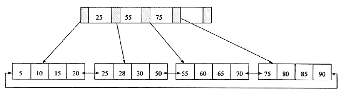

3. 插入95，这时复合第三种情况，即leafPage和IndexPage都满了，这时需要做两次拆分
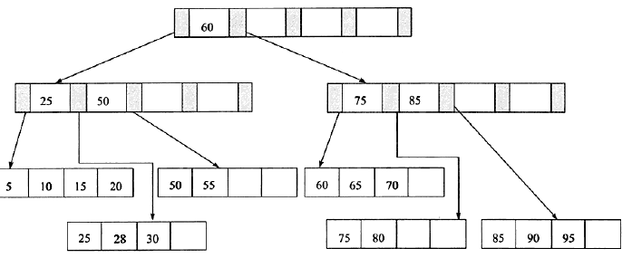

## B+Tree的删除操作

B+树使用填充因子（fill factor）来控制树的删除变化，50%是填充因子可设的最小值
B+树的删除操作同样必须保证删除后叶子节点中的记录依然排序，同插入一样，B+树删除操作同样需要考虑以下三种情况：
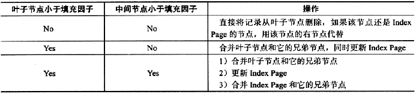

根据下图进行删除操作，删除值为70的节点

删除70后
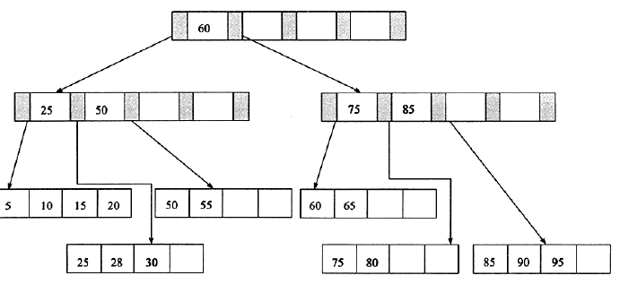
接着删除键值为25的记录，但是该值还是IndexPage中的值，因此在删除LeafPage中的25后，还应将25的右兄弟节点28更新到PageIndex中，如图：
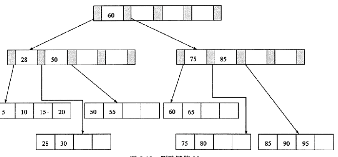
删除LeafPage中键值为60的记录后，Fill Factor小于50%，这时需要做合并操作，同样，在删除IndexPage中相关记录后需要做IndexPage的合并操作
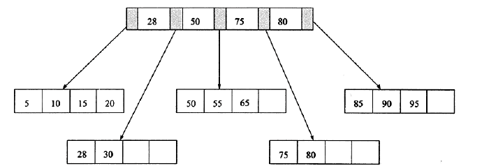