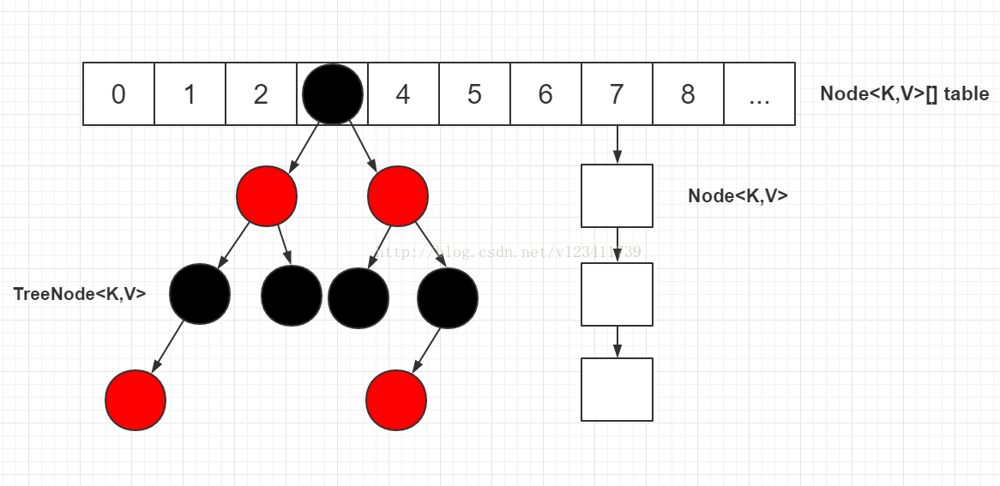
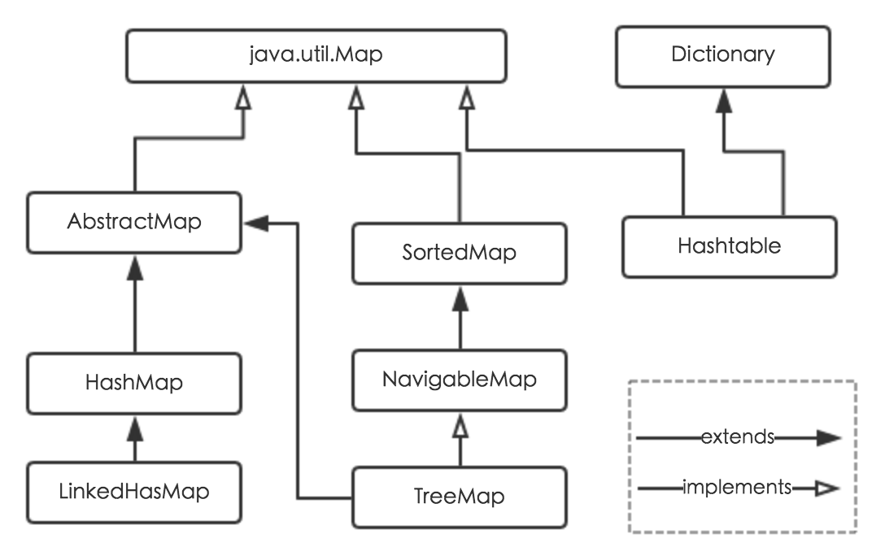
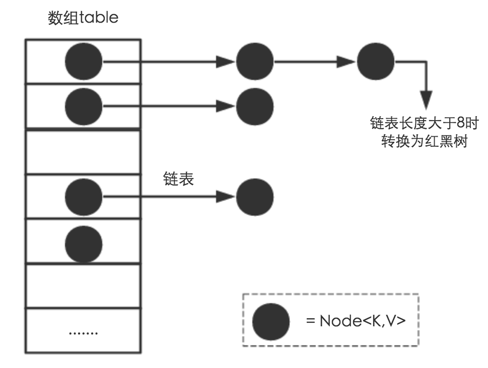
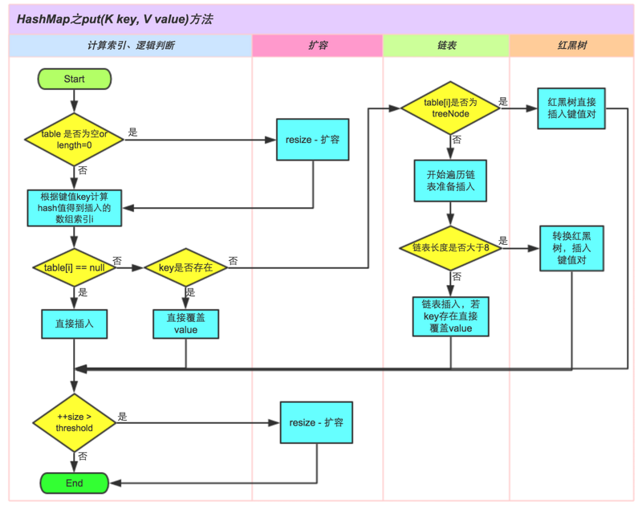
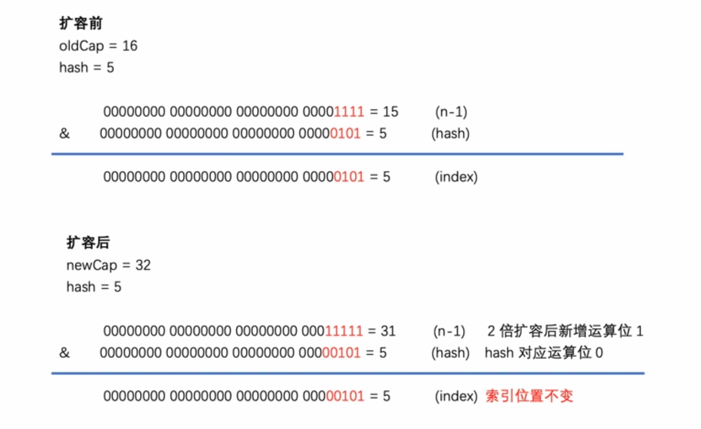
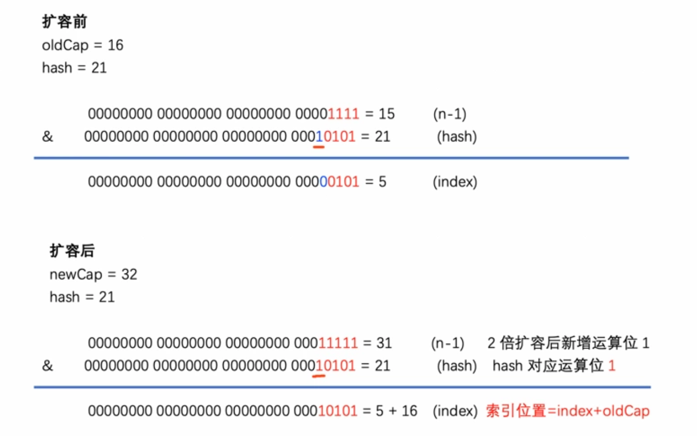

# HashMap

---

[参考链接：史上最详细的 JDK 1.8 HashMap 源码解析](https://blog.csdn.net/v123411739/article/details/78996181)

[参考链接：深入理解HashMap底层原理剖析(JDK1.8)](https://my.oschina.net/u/2307589/blog/1800587)

[参考链接：Java面试必问之Hashmap底层实现原理(JDK1.8)](https://segmentfault.com/a/1190000021928659)

---

## 概述

+ JDK 1.8 对 HashMap 进行了比较大的优化，底层实现由之前的 “数组+链表” 改为 “数组+链表+红黑树”
+ JDK 1.8 的 HashMap 的数据结构如下图所示，当链表节点较少时仍然是以链表存在，当链表节点较多时（默认大于8）会转为红黑树



+ 转为红黑树节点后，链表的结构还存在，通过 next 属性维持，红黑树节点在进行操作时都会维护链表的结构，并不是转为红黑树节点，链表结构就不存在了
+ 在红黑树上，叶子节点也可能有 next 节点，因为红黑树的结构跟链表的结构是互不影响的，不会因为是叶子节点就说该节点已经没有 next 节点
+ 源码中进行红黑树的查找时，会反复用到以下两条规则：`1）如果目标节点的 hash 值小于 p 节点的 hash 值，则向 p 节点的左边遍历；否则向 p 节点的右边遍历` `2）如果目标节点的 key 值小于 p 节点的 key 值，则向 p 节点的左边遍历；否则向 p 节点的右边遍历` 这两条规则是利用了红黑树的特性（左节点 < 根节点 < 右节点
+ 源码中进行红黑树的查找时，会用 dir（direction）来表示向左还是向右查找，dir 存储的值是目标节点的 hash/key 与 p 节点的 hash/key 的比较结果

## HashMap继承结构



+ HashMap 根据键的 hashCode 值存储数据，大多数情况下可以直接定位到它的值，因而具有很快的访问速度，但遍历顺序却是不确定的
+ HashMap 最多只允许一条记录的键为 null ，允许多条记录的值为 null
+ HashMap 非线程安全，即任一时刻可以有多个线程同时写 HashMap，可能会导致数据的不一致
+ 如果需要满足线程安全，可以用 Collections的synchronizedMap 方法使 HashMap 具有线程安全的能力，或者使用ConcurrentHashMap

## HashMap存储结构



## HashMap常量

```java
    /**
     * The default initial capacity - MUST be a power of two.
     * 默认初始化容量，必须是2的次方，这里默认是16
     */
    static final int DEFAULT_INITIAL_CAPACITY = 1 << 4; // aka 16

    /**
     * The maximum capacity, used if a higher value is implicitly specified
     * by either of the constructors with arguments.
     * MUST be a power of two <= 1<<30.
     * 最大容量，2^30，必须是2的次方，且可以设置或扩容的容量最大不会超过2^30
     */
    static final int MAXIMUM_CAPACITY = 1 << 30;

    /**
     * The load factor used when none specified in constructor.
     * 默认负载因子，当HashMap中的元素数量超过 容量*DEFAULT_LOAD_FACTOR 时，进行resize()操作
     */
    static final float DEFAULT_LOAD_FACTOR = 0.75f;

    /**
     * The bin count threshold for using a tree rather than list for a
     * bin.  Bins are converted to trees when adding an element to a
     * bin with at least this many nodes. The value must be greater
     * than 2 and should be at least 8 to mesh with assumptions in
     * tree removal about conversion back to plain bins upon
     * shrinkage.
     * 决定将链表转为红黑树所需要发生哈希冲突的节点达到的数量，即当哈希冲突的节点达到9个时，转红黑树
     */
    static final int TREEIFY_THRESHOLD = 8;

    /**
     * The bin count threshold for untreeifying a (split) bin during a
     * resize operation. Should be less than TREEIFY_THRESHOLD, and at
     * most 6 to mesh with shrinkage detection under removal.
     * 决定将红黑树转为链表所需要发生哈希冲突的节点减少到的数量，即当哈希冲突的节点减少到6个时，转链表
     */
    static final int UNTREEIFY_THRESHOLD = 6;

    /**
     * The smallest table capacity for which bins may be treeified.
     * (Otherwise the table is resized if too many nodes in a bin.)
     * Should be at least 4 * TREEIFY_THRESHOLD to avoid conflicts
     * between resizing and treeification thresholds.
     * 需要链表转红黑树时，table需要达到的最小容量，若容量小于该值，将不进行转红黑树的操作，改为执行resize()操作进行扩容
     */
    static final int MIN_TREEIFY_CAPACITY = 64;
```

## HashMap Node

```java
    /**
     * Basic hash bin node, used for most entries.  (See below for
     * TreeNode subclass, and in LinkedHashMap for its Entry subclass.)
     */
    static class Node<K,V> implements Map.Entry<K,V> {
        final int hash;
        final K key;
        V value;
        Node<K,V> next;

        Node(int hash, K key, V value, Node<K,V> next) {
            this.hash = hash;
            this.key = key;
            this.value = value;
            this.next = next;
        }

        public final K getKey()        { return key; }
        public final V getValue()      { return value; }
        public final String toString() { return key + "=" + value; }

        public final int hashCode() {
            return Objects.hashCode(key) ^ Objects.hashCode(value);
        }

        public final V setValue(V newValue) {
            V oldValue = value;
            value = newValue;
            return oldValue;
        }

        public final boolean equals(Object o) {
            if (o == this)
                return true;
            if (o instanceof Map.Entry) {
                Map.Entry<?,?> e = (Map.Entry<?,?>)o;
                if (Objects.equals(key, e.getKey()) &&
                    Objects.equals(value, e.getValue()))
                    return true;
            }
            return false;
        }
    }
```

## HashMap Fields

```java
/**
     * The table, initialized on first use, and resized as
     * necessary. When allocated, length is always a power of two.
     * (We also tolerate length zero in some operations to allow
     * bootstrapping mechanics that are currently not needed.)
     * 保存Node的数组，即不发生哈希冲突的情况下，Node将会保存在这个数组
     */
    transient Node<K,V>[] table;

    /**
     * Holds cached entrySet(). Note that AbstractMap fields are used
     * for keySet() and values().
     * 由　HashMap 中 Node<K,V>　节点构成的 set
     */
    transient Set<Map.Entry<K,V>> entrySet;

    /**
     * The number of key-value mappings contained in this map.
     * 记录HashMap中当前存储的元素的数量
     */
    transient int size;

    /**
     * The number of times this HashMap has been structurally modified
     * Structural modifications are those that change the number of mappings in
     * the HashMap or otherwise modify its internal structure (e.g.,
     * rehash).  This field is used to make iterators on Collection-views of
     * the HashMap fail-fast.  (See ConcurrentModificationException).
     * 记录　HashMap 发生结构性变化的次数（注意　value 的覆盖不属于结构性变化）
     */
    transient int modCount;

    /**
     * The next size value at which to resize (capacity * load factor).
     *
     * @serial
     */
    // (The javadoc description is true upon serialization.
    // Additionally, if the table array has not been allocated, this
    // field holds the initial array capacity, or zero signifying
    // DEFAULT_INITIAL_CAPACITY.)
    // threshold 的值应等于 table.length * loadFactor，size 超过这个值时进行　resize()扩容
    int threshold;

    /**
     * The load factor for the hash table.
     *
     * @serial
     * 记录负载因子
     */
    final float loadFactor;
```

## HashMap Constructors

```java
    /**
     * Constructs an empty <tt>HashMap</tt> with the specified initial
     * capacity and load factor.
     * 指定初始容量和负载因子
     *
     * @param  initialCapacity the initial capacity
     * @param  loadFactor      the load factor
     * @throws IllegalArgumentException if the initial capacity is negative
     *         or the load factor is nonpositive
     */
    public HashMap(int initialCapacity, float loadFactor) {
        if (initialCapacity < 0)
            throw new IllegalArgumentException("Illegal initial capacity: " +
                                               initialCapacity);
        if (initialCapacity > MAXIMUM_CAPACITY)
            initialCapacity = MAXIMUM_CAPACITY;
        if (loadFactor <= 0 || Float.isNaN(loadFactor))
            throw new IllegalArgumentException("Illegal load factor: " +
                                               loadFactor);
        this.loadFactor = loadFactor;
        this.threshold = tableSizeFor(initialCapacity);
    }

    /**
     * Constructs an empty <tt>HashMap</tt> with the specified initial
     * capacity and the default load factor (0.75).
     * 指定初始容量，使用默认负载因子
     *
     * @param  initialCapacity the initial capacity.
     * @throws IllegalArgumentException if the initial capacity is negative.
     */
    public HashMap(int initialCapacity) {
        this(initialCapacity, DEFAULT_LOAD_FACTOR);
    }

    /**
     * Constructs an empty <tt>HashMap</tt> with the default initial capacity
     * (16) and the default load factor (0.75).
     * 无参构造函数，所有字段都是用默认值
     */
    public HashMap() {
        this.loadFactor = DEFAULT_LOAD_FACTOR; // all other fields defaulted
    }

    /**
     * Constructs a new <tt>HashMap</tt> with the same mappings as the
     * specified <tt>Map</tt>.  The <tt>HashMap</tt> is created with
     * default load factor (0.75) and an initial capacity sufficient to
     * hold the mappings in the specified <tt>Map</tt>.
     * 传入Map作为参数，使用默认负载因子
     *
     * @param   m the map whose mappings are to be placed in this map
     * @throws  NullPointerException if the specified map is null
     */
    public HashMap(Map<? extends K, ? extends V> m) {
        this.loadFactor = DEFAULT_LOAD_FACTOR;
        putMapEntries(m, false);
    }

        /**
     * Implements Map.putAll and Map constructor
     *
     * @param m the map
     * @param evict false when initially constructing this map, else
     * true (relayed to method afterNodeInsertion).
     */
    final void putMapEntries(Map<? extends K, ? extends V> m, boolean evict) {
        int s = m.size();
        if (s > 0) {
            if (table == null) { // pre-size
                // 如果在创建时调用putMapEntries，table必定为null
                // 根据传入的Map的元素数量，计算需要创建的HashMap的大小
                float ft = ((float)s / loadFactor) + 1.0F;
                // 与最大容量比较，小于最大容量时取计算得出的容量
                int t = ((ft < (float)MAXIMUM_CAPACITY) ? (int)ft : MAXIMUM_CAPACITY);
                // 需要创建的HashMap容量已经超过扩容阈值，此时需要更新扩容阈值
                if (t > threshold)
                    threshold = tableSizeFor(t);
            }
            else if (s > threshold)
                // 如果Map的元素数量已经直接超过扩容阈值，直接进行resize
                resize();
            for (Map.Entry<? extends K, ? extends V> e : m.entrySet()) {
                // 循环复制元素到HashMap
                K key = e.getKey();
                V value = e.getValue();
                putVal(hash(key), key, value, false, evict);
            }
        }
    }
```

## HashMap Important Methods

### HashMap put

#### 关于put方法



HashMap在取得key的索引位置时，基本上分为3步：

+ 拿到 key 的 hashCode 值
+ 将 hashCode 的高位参与运算，重新计算 hash 值
+ 将计算出来的 hash 值与 (table.length - 1) 进行 & 运算

对于任意给定的对象，只要它的 hashCode() 返回值相同，那么计算得到的 hash 值总是相同的
首先想到的就是把 hash 值对 table 长度取模运算，这样一来，元素的分布相对来说是比较均匀的
但是`模运算消耗还是比较大的`，计算机比较快的运算为位运算，因此 JDK 团队对取模运算进行了优化，使用(table.length - 1) & hash来代替hash % table.length
这个优化是基于以下公式：`x mod 2^n = x & (2^n - 1)`
HashMap 底层数组的长度总是 2 的 n 次方，并且取模运算为 `h mod table.length`，对应上面的公式，可以得到该运算等同于`h & (table.length - 1)`
这是 HashMap 在速度上的优化，因为 & 比 % 具有更高的效率
在 JDK1.8 的实现中，还优化了高位运算的算法，将 hashCode 的高 16 位与 hashCode 进行异或运算，主要是为了在 table 的 length 较小的时候，让高位也参与运算，并且不会有太大的开销

#### 源码

```java
    /**
     * Associates the specified value with the specified key in this map.
     * If the map previously contained a mapping for the key, the old
     * value is replaced.
     *
     * @param key key with which the specified value is to be associated
     * @param value value to be associated with the specified key
     * @return the previous value associated with <tt>key</tt>, or
     *         <tt>null</tt> if there was no mapping for <tt>key</tt>.
     *         (A <tt>null</tt> return can also indicate that the map
     *         previously associated <tt>null</tt> with <tt>key</tt>.)
     */
    public V put(K key, V value) {
        // 这里的hash方法调用的是HashMap的静态方法
        return putVal(hash(key), key, value, false, true);
    }

    /**
     * Implements Map.put and related methods
     *
     * @param hash hash for key
     * @param key the key
     * @param value the value to put
     * @param onlyIfAbsent if true, don't change existing value
     * @param evict if false, the table is in creation mode.
     * @return previous value, or null if none
     */
    final V putVal(int hash, K key, V value, boolean onlyIfAbsent, boolean evict) {
        Node<K,V>[] tab;
        Node<K,V> p;
        int n, i;
        if ((tab = table) == null || (n = tab.length) == 0)
            n = (tab = resize()).length;
        // 根据hash值确定value插入的位置
        // 这里使用(n - 1) & hash来确定插入的索引位置，由于table的length必定是2的幂次，因此(n - 1) & hash可以等价为hash % n
        if ((p = tab[i = (n - 1) & hash]) == null)
            // 索引位置为null，直接插入节点
            tab[i] = newNode(hash, key, value, null);
        else {
            Node<K,V> e;
            K k;
            if (p.hash == hash && ((k = p.key) == key || (key != null && key.equals(k))))
                // 索引到的位置在table数组上，key相同
                e = p;
            else if (p instanceof TreeNode)
                // 索引到的位置上有元素，并且是红黑树节点，此时需要往红黑树上插入节点
                e = ((TreeNode<K,V>)p).putTreeVal(this, tab, hash, key, value);
            else {
                // table上的有元素，并且是链表节点
                for (int binCount = 0; ; ++binCount) {
                    // 开始遍历链表
                    if ((e = p.next) == null) {
                        // 下一节点为null，可以直接将需要的节点插入
                        p.next = newNode(hash, key, value, null);
                        if (binCount >= TREEIFY_THRESHOLD - 1) // -1 for 1st
                            // 判断是否需要转为红黑树
                            treeifyBin(tab, hash);
                        break;
                    }
                    if (e.hash == hash && ((k = e.key) == key || (key != null && key.equals(k))))
                        // 这里直接打断循环，因为当前节点的key和需要插入的key相同
                        break;
                    p = e;
                }
            }
            if (e != null) { // existing mapping for key
                V oldValue = e.value;
                if (!onlyIfAbsent || oldValue == null)
                    e.value = value;
                afterNodeAccess(e);
                // 改变value值时，返回旧value的值
                return oldValue;
            }
        }
        // 除了已存在的key的情况外，其他情况均为改变了HashMap的结构（修改value的值不算做改变结构）
        ++modCount;
        if (++size > threshold)
            // 判断是否需要扩容
            resize();
        afterNodeInsertion(evict);
        // 添加新节点时，该方法返回null
        return null;
    }
```

### HashMap TreeNode putTreeVal

```java
    /**
     * Tree version of putVal.
     */
    final TreeNode<K,V> putTreeVal(HashMap<K,V> map, Node<K,V>[] tab, int h, K k, V v) {
        Class<?> kc = null;
        boolean searched = false;
        // 查找根节点，索引位置的节点不一定是红黑树的根节点
        TreeNode<K,V> root = (parent != null) ? root() : this;
        // 开始遍历红黑树查找
        for (TreeNode<K,V> p = root;;) {
            int dir, ph;
            K pk;
            if ((ph = p.hash) > h)
                // 传入的hash值小于p的hash值，将dir赋值为-1，表示向p节点的左子树进行查找
                dir = -1;
            else if (ph < h)
                // 传入的hash值大于p的hash值，将dir赋值为1，表示向p的右子树进行查找
                dir = 1;
            else if ((pk = p.key) == k || (k != null && k.equals(pk)))
                // key相同，p节点即传入key值所需要插入的位置，直接返回p节点
                return p;
            else if ((kc == null &&
                        (kc = comparableClassFor(k)) == null) ||
                        (dir = compareComparables(kc, k, pk)) == 0) {
                // 进入该else if表示hash值相同，但是key值不同
                // 并且key是不可比较的，即key并未实现Comparable<K>接口（若实现了Comparable<K>接口，则comparableClassFor(k)方法返回的是key的Class对象，而不是null）
                // 或者可能实现了Comparable<K>但是compareComparables(kc, k, pk)返回0，当pk为null时会直接返回0，或者k的compareTo方法返回0，此时可以认为k.compareTo方法实现不当，因为上个else if判定了k.equals(pk) == false，但是compareTo判定相等
                if (!searched) {
                    // 在以当前节点为根的整个树上搜索是否存在待插入节点（只会搜索一次）
                    TreeNode<K,V> q, ch;
                    searched = true;
                    if (((ch = p.left) != null &&
                            (q = ch.find(h, k, kc)) != null) ||
                        ((ch = p.right) != null &&
                            (q = ch.find(h, k, kc)) != null))
                        // 若树中存在待插入节点，直接返回
                        return q;
                }
                // 搜索一次后没有找到待插入的节点
                // 使用定义的一套规则来比较k和p节点的key的大小, 用来决定向左还是向右查找
                dir = tieBreakOrder(k, pk);
            }

            // 此时，要么已找到节点返回，要么已知dir的值

            TreeNode<K,V> xp = p;
            if ((p = (dir <= 0) ? p.left : p.right) == null) {
                // 根据dir判断下一节点为null，即可以直接插入到子节点
                Node<K,V> xpn = xp.next;
                // 新增一个树节点
                TreeNode<K,V> x = map.newTreeNode(h, k, v, xpn);
                if (dir <= 0)
                    // 左子树
                    xp.left = x;
                else
                    // 右子树
                    xp.right = x;
                // 调整节点的指向
                xp.next = x;
                x.parent = x.prev = xp;
                if (xpn != null)
                    ((TreeNode<K,V>)xpn).prev = x;
                // 进行红黑树的插入平衡调整
                moveRootToFront(tab, balanceInsertion(root, x));
                // 新增的节点，返回null
                return null;
            }
        }
    }

    /**
        * Tie-breaking utility for ordering insertions when equal
        * hashCodes and non-comparable. We don't require a total
        * order, just a consistent insertion rule to maintain
        * equivalence across rebalancings. Tie-breaking further than
        * necessary simplifies testing a bit.
        * 实际是利用对象 a,b 的内存地址进行比较
        */
    static int tieBreakOrder(Object a, Object b) {
        int d;
        if (a == null || b == null ||
            (d = a.getClass().getName().
                compareTo(b.getClass().getName())) == 0)
            d = (System.identityHashCode(a) <= System.identityHashCode(b) ?
                    -1 : 1);
        return d;
    }
```

### HashMap get

```java
    /**
     * Returns the value to which the specified key is mapped,
     * or {@code null} if this map contains no mapping for the key.
     *
     * <p>More formally, if this map contains a mapping from a key
     * {@code k} to a value {@code v} such that {@code (key==null ? k==null :
     * key.equals(k))}, then this method returns {@code v}; otherwise
     * it returns {@code null}.  (There can be at most one such mapping.)
     *
     * <p>A return value of {@code null} does not <i>necessarily</i>
     * indicate that the map contains no mapping for the key; it's also
     * possible that the map explicitly maps the key to {@code null}.
     * The {@link #containsKey containsKey} operation may be used to
     * distinguish these two cases.
     *
     * @see #put(Object, Object)
     */
    public V get(Object key) {
        Node<K,V> e;
        return (e = getNode(hash(key), key)) == null ? null : e.value;
    }

    /**
     * Implements Map.get and related methods
     *
     * @param hash hash for key
     * @param key the key
     * @return the node, or null if none
     */
    final Node<K,V> getNode(int hash, Object key) {
        Node<K,V>[] tab;
        Node<K,V> first, e;
        int n; K k;
        if ((tab = table) != null && (n = tab.length) > 0 &&
            (first = tab[(n - 1) & hash]) != null) {
            if (first.hash == hash && // always check first node
                ((k = first.key) == key || (key != null && key.equals(k))))
                // 索引直接定位到了节点，key相同，直接返回
                return first;
            if ((e = first.next) != null) {
                if (first instanceof TreeNode)
                    // 红黑树节点，进入树搜索
                    return ((TreeNode<K,V>)first).getTreeNode(hash, key);
                do {
                    // 链表，开始遍历链表查找节点
                    if (e.hash == hash &&
                        ((k = e.key) == key || (key != null && key.equals(k))))
                        return e;
                } while ((e = e.next) != null);
            }
        }
        // 查找不到，返回null
        return null;
    }

    /**
     * Calls find for root node.
     */
    final TreeNode<K,V> getTreeNode(int h, Object k) {
        return ((parent != null) ? root() : this).find(h, k, null);
    }

    /**
     * Finds the node starting at root p with the given hash and key.
     * The kc argument caches comparableClassFor(key) upon first use
     * comparing keys.
     */
    final TreeNode<K,V> find(int h, Object k, Class<?> kc) {
        TreeNode<K,V> p = this;
        do {
            int ph, dir;
            K pk;
            TreeNode<K,V> pl = p.left, pr = p.right, q;
            if ((ph = p.hash) > h)
                // hash值小于节点hash值，往左子树搜索
                p = pl;
            else if (ph < h)
                // hash值大于节点hash值，往右子树搜索
                p = pr;
            else if ((pk = p.key) == k || (k != null && k.equals(pk)))
                // key相同，搜索成功，返回节点
                return p;
            else if (pl == null)
                // hash值相等，key不同，左子树为null，向右子树搜索
                p = pr;
            else if (pr == null)
                // hash值相等，key不同，右子树为null，向左子树搜索
                p = pl;
            else if ((kc != null ||
                        (kc = comparableClassFor(k)) != null) &&
                        (dir = compareComparables(kc, k, pk)) != 0)
                // get方法时，kc传入null，即进入该分支需要comparableClassFor(k) != null，即k是可比较的，实现Comparable接口，并且compareComparables不返回0
                p = (dir < 0) ? pl : pr;
            else if ((q = pr.find(h, k, kc)) != null)
                // 进入该分支，即表示key是不可比较的，此时需要以当前节点为根进行检索，从右子树开始
                return q;
            else
                p = pl;
        } while (p != null);
        return null;
    }
```

### HashMap treeifyBin

```java
    /**
     * Replaces all linked nodes in bin at index for given hash unless
     * table is too small, in which case resizes instead.
     */
    final void treeifyBin(Node<K,V>[] tab, int hash) {
        int n, index;
        Node<K,V> e;
        if (tab == null || (n = tab.length) < MIN_TREEIFY_CAPACITY)
            // table为null或者table的长度未达到转红黑树的最小值，直接进行扩容
            resize();
        // 根据hash值计算索引
        else if ((e = tab[index = (n - 1) & hash]) != null) {
            TreeNode<K,V> hd = null, tl = null;
            do {
                // 链表节点转红黑树节点
                TreeNode<K,V> p = replacementTreeNode(e, null);
                if (tl == null)
                    // 第一次进入循环，将头节点赋值给hd，后面以hd为根节点构建红黑树
                    hd = p;
                else {
                    // 维持链表关联
                    p.prev = tl;
                    tl.next = p;
                }
                tl = p;
            } while ((e = e.next) != null);
            // 将hd赋值给tab[index]，即在table数组中的位置
            if ((tab[index] = hd) != null)
                // 以hd为根节点构建红黑树
                hd.treeify(tab);
        }
    }

    // For treeifyBin
    TreeNode<K,V> replacementTreeNode(Node<K,V> p, Node<K,V> next) {
        return new TreeNode<>(p.hash, p.key, p.value, next);
    }

    /**
     * Forms tree of the nodes linked from this node.
     * @return root of tree
     */
    final void treeify(Node<K,V>[] tab) {
        TreeNode<K,V> root = null;
        // 将调用此方法的节点赋值给x，以x作为起点，开始进行遍历
        for (TreeNode<K,V> x = this, next; x != null; x = next) {
            next = (TreeNode<K,V>)x.next; // next赋值为x的下个节点
            x.left = x.right = null; // 将x的左右节点设置为null
            if (root == null) {
                // 如果还没有根节点，则设置当前节点为root
                x.parent = null; // 根节点没有父节点
                x.red = false; // 根节点必须为黑色
                root = x;
            }
            else {
                // 已有root节点
                K k = x.key;
                int h = x.hash;
                Class<?> kc = null;
                // 从root节点开始遍历，查找属于该节点的位置
                for (TreeNode<K,V> p = root;;) {
                    int dir, ph;
                    K pk = p.key;
                    if ((ph = p.hash) > h)
                        // hash值小于p的hash值，往p节点左子树方向
                        dir = -1;
                    else if (ph < h)
                        // hash值大于p的hash值，往p节点右子树方向
                        dir = 1;
                    // 走到这代表x的hash值和p的hash值相等，则比较key值
                    // 如果k没有实现Comparable接口 或者 x节点的key和p节点的key相等
                    else if ((kc == null &&
                                (kc = comparableClassFor(k)) == null) ||
                                (dir = compareComparables(kc, k, pk)) == 0)
                        // 使用定义的一套规则来比较x节点和p节点的大小，用来决定向左还是向右查找
                        dir = tieBreakOrder(k, pk);

                    // 此时，已得出dir的值

                    // 将p赋值到临时节点
                    TreeNode<K,V> xp = p;
                    if ((p = (dir <= 0) ? p.left : p.right) == null) {
                        // 根据dir的值判断p的左右子节点是否为null，为null则表示x可以插入到p的子节点
                        // x的parent即为p节点
                        x.parent = xp;
                        if (dir <= 0)
                            // 小于等于0即左节点
                            xp.left = x;
                        else
                            // 否则为右节点
                            xp.right = x;
                        // 红黑树平衡操作
                        root = balanceInsertion(root, x);
                        break;
                    }
                }
            }
        }
        // 将红黑树的root节点移动到table数组中
        moveRootToFront(tab, root);
    }
```

### HashMap resize

#### 关于resize方法

+ 扩容时，一般为 `oldCap << 1` （旧的容量*2）
+ 扩容后，元素的索引位置可能会发生变化
+ 在JDK8中，扩容后的元素索引位置会分两种情况发生变化
+ `index = (cap - 1) & e.hash`

1. 索引不变，如图，当cap为16时，cap - 1 = 15，二进制表示为 1111，当元素的hash值10进制小于16时，即只有低4位时，进行&运算值不变


2. 索引变化，索引变为oldIndex + oldCap，如图说是，即元素的hash值二进制表示超过了4位，扩容后，cap << 1，增多一位，原本的高位也可参与&运算，因此索引发生变化


#### resize()源码

```java
    /**
     * Initializes or doubles table size.  If null, allocates in
     * accord with initial capacity target held in field threshold.
     * Otherwise, because we are using power-of-two expansion, the
     * elements from each bin must either stay at same index, or move
     * with a power of two offset in the new table.
     *
     * @return the table
     */
    final Node<K,V>[] resize() {
        Node<K,V>[] oldTab = table;
        int oldCap = (oldTab == null) ? 0 : oldTab.length;
        int oldThr = threshold;
        int newCap, newThr = 0;
        if (oldCap > 0) { // table不为空，即有元素
            if (oldCap >= MAXIMUM_CAPACITY) {
                // 容量已经达到最大容量，仅将扩容阈值设置为最大值，返回就table
                threshold = Integer.MAX_VALUE;
                return oldTab;
            }
            else if ((newCap = oldCap << 1) < MAXIMUM_CAPACITY && oldCap >= DEFAULT_INITIAL_CAPACITY)
                // 原容量*2后仍然小于最大容量并且旧容量大于初始化容量16
                newThr = oldThr << 1; // double threshold
        }
        else if (oldThr > 0) // initial capacity was placed in threshold
            // 阈值被初始容量填充，这里直接将新容量设置为阈值
            newCap = oldThr;
        else {               // zero initial threshold signifies using defaults
            // 容量和阈值均为0，这种情况属于没有传初始容量的构造方法创建的HashMap，使用默认值的容量和阈值
            newCap = DEFAULT_INITIAL_CAPACITY;
            newThr = (int)(DEFAULT_LOAD_FACTOR * DEFAULT_INITIAL_CAPACITY);
        }
        if (newThr == 0) {
            // 如果新的阈值为空，通过容量和负载因子计算出阈值
            float ft = (float)newCap * loadFactor;
            newThr = (newCap < MAXIMUM_CAPACITY && ft < (float)MAXIMUM_CAPACITY ?
                      (int)ft : Integer.MAX_VALUE);
        }
        threshold = newThr; // 当前阈值
        @SuppressWarnings({"rawtypes","unchecked"})
            Node<K,V>[] newTab = (Node<K,V>[])new Node[newCap]; // 新的table数组
        table = newTab; // 当前table赋值为新table
        // 至此，完成了新容量、新阈值、新table的创建

        // 如果旧的table数组不为空，需要遍历旧table，将元素赋值给新table
        if (oldTab != null) {
            for (int j = 0; j < oldCap; ++j) {
                Node<K,V> e;
                if ((e = oldTab[j]) != null) {
                    oldTab[j] = null;
                    if (e.next == null)
                        // e的next为null，即e为单节点，不是链表头也不是红黑树根，直接进行索引运算，插入到对应的table位置中
                        newTab[e.hash & (newCap - 1)] = e;
                    else if (e instanceof TreeNode)
                        // e是树节点
                        ((TreeNode<K,V>)e).split(this, newTab, j, oldCap);
                    else { // preserve order
                        // e是链表节点
                        // 注意，e的链表上的节点，在扩容后只有两个新位置，要么在原索引位置oldIndex上（即索引位置不变），要么在oldIndex + oldCap上
                        Node<K,V> loHead = null, loTail = null;
                        Node<K,V> hiHead = null, hiTail = null;
                        Node<K,V> next;
                        do {
                            next = e.next;
                            if ((e.hash & oldCap) == 0) {
                                // 这里是索引位置不变的节点
                                if (loTail == null)
                                    // 如果loTail为null，表示这是头节点，设置loHead为e
                                    loHead = e;
                                else
                                    // 如果loTail不为null，表示已有头节点，加入到链表尾
                                    loTail.next = e;
                                // 链表尾部赋值为e，进入下一次循环
                                loTail = e;
                            }
                            else {
                                // 这里是索引位置改变的节点
                                if (hiTail == null)
                                    // 如果hiTail为null，表示这是头节点，设置hiHead为e
                                    hiHead = e;
                                else
                                    // 如果hiTail不为null，表示已有头节点，加入到链表尾
                                    hiTail.next = e;
                                // 链表尾部赋值为e，进入下一次循环
                                hiTail = e;
                            }
                        } while ((e = next) != null);
                        if (loTail != null) {
                            // loTail不为null，即索引不变的节点存在
                            // 将链表最后的节点的next赋值为null
                            loTail.next = null;
                            // 将table索引位置的节点设置为链表头
                            newTab[j] = loHead;
                        }
                        if (hiTail != null) {
                            // hiTail不为null，即索引改变的节点存在
                            // 将链表最后的节点的next赋值为null
                            hiTail.next = null;
                            // 将table索引位置的节点设置为链表头
                            newTab[j + oldCap] = hiHead;
                        }
                    }
                }
            }
        }
        return newTab;
    }

    /**
     * Splits nodes in a tree bin into lower and upper tree bins,
     * or untreeifies if now too small. Called only from resize;
     * see above discussion about split bits and indices.
     *
     * @param map the map
     * @param tab the table for recording bin heads
     * @param index the index of the table being split
     * @param bit the bit of hash to split on
     */
    final void split(HashMap<K,V> map, Node<K,V>[] tab, int index, int bit) {
        TreeNode<K,V> b = this;
        // Relink into lo and hi lists, preserving order
        TreeNode<K,V> loHead = null, loTail = null;
        TreeNode<K,V> hiHead = null, hiTail = null;
        int lc = 0, hc = 0;
        for (TreeNode<K,V> e = b, next; e != null; e = next) {
            next = (TreeNode<K,V>)e.next;
            e.next = null;
            if ((e.hash & bit) == 0) {
                if ((e.prev = loTail) == null)
                    loHead = e;
                else
                    loTail.next = e;
                loTail = e;
                ++lc;
            }
            else {
                if ((e.prev = hiTail) == null)
                    hiHead = e;
                else
                    hiTail.next = e;
                hiTail = e;
                ++hc;
            }
        }

        if (loHead != null) {
            if (lc <= UNTREEIFY_THRESHOLD)
                tab[index] = loHead.untreeify(map);
            else {
                tab[index] = loHead;
                if (hiHead != null) // (else is already treeified)
                    loHead.treeify(tab);
            }
        }
        if (hiHead != null) {
            if (hc <= UNTREEIFY_THRESHOLD)
                tab[index + bit] = hiHead.untreeify(map);
            else {
                tab[index + bit] = hiHead;
                if (loHead != null)
                    hiHead.treeify(tab);
            }
        }
    }
```

## HashMap Static utilities

```java
    /**
     * Computes key.hashCode() and spreads (XORs) higher bits of hash
     * to lower.  Because the table uses power-of-two masking, sets of
     * hashes that vary only in bits above the current mask will
     * always collide. (Among known examples are sets of Float keys
     * holding consecutive whole numbers in small tables.)  So we
     * apply a transform that spreads the impact of higher bits
     * downward. There is a tradeoff between speed, utility, and
     * quality of bit-spreading. Because many common sets of hashes
     * are already reasonably distributed (so don't benefit from
     * spreading), and because we use trees to handle large sets of
     * collisions in bins, we just XOR some shifted bits in the
     * cheapest possible way to reduce systematic lossage, as well as
     * to incorporate impact of the highest bits that would otherwise
     * never be used in index calculations because of table bounds.
     */
    static final int hash(Object key) {
        /**
         * key 的 hash　值的计算是通过hashCode()的高16位异或低16位实现的：(h = k.hashCode() ^ (h >>> 16)，主要是从速度、功效、质量来考虑的，这么做可以在数组table的length比较小的* 时候，也能保证考虑到高低Bit都参与到Hash的计算中，同时不会有太大的开销
         */
        int h;
        return (key == null) ? 0 : (h = key.hashCode()) ^ (h >>> 16);
    }

    /**
     * Returns x's Class if it is of the form "class C implements
     * Comparable<C>", else null.
     */
    static Class<?> comparableClassFor(Object x) {
        if (x instanceof Comparable) {
            Class<?> c; Type[] ts, as; Type t; ParameterizedType p;
            if ((c = x.getClass()) == String.class) // bypass checks
                return c;
            if ((ts = c.getGenericInterfaces()) != null) {
                for (int i = 0; i < ts.length; ++i) {
                    if (((t = ts[i]) instanceof ParameterizedType) &&
                        ((p = (ParameterizedType)t).getRawType() ==
                         Comparable.class) &&
                        (as = p.getActualTypeArguments()) != null &&
                        as.length == 1 && as[0] == c) // type arg is c
                        return c;
                }
            }
        }
        return null;
    }

    /**
     * Returns k.compareTo(x) if x matches kc (k's screened comparable
     * class), else 0.
     */
    @SuppressWarnings({"rawtypes","unchecked"}) // for cast to Comparable
    static int compareComparables(Class<?> kc, Object k, Object x) {
        return (x == null || x.getClass() != kc ? 0 :
                ((Comparable)k).compareTo(x));
    }

    /**
     * Returns a power of two size for the given target capacity.
     * 返回的值是最接近 cap 的2的幂
     */
    static final int tableSizeFor(int cap) {
        int n = cap - 1;
        n |= n >>> 1;
        n |= n >>> 2;
        n |= n >>> 4;
        n |= n >>> 8;
        n |= n >>> 16;
        return (n < 0) ? 1 : (n >= MAXIMUM_CAPACITY) ? MAXIMUM_CAPACITY : n + 1;
    }
```

## HashMap Simple Methods

```java
/**
     * Returns the number of key-value mappings in this map.
     *
     * @return the number of key-value mappings in this map
     */
    public int size() {
        return size;
    }

    /**
     * Returns <tt>true</tt> if this map contains no key-value mappings.
     *
     * @return <tt>true</tt> if this map contains no key-value mappings
     */
    public boolean isEmpty() {
        return size == 0;
    }

    /**
     * Removes all of the mappings from this map.
     * The map will be empty after this call returns.
     */
    public void clear() {
        Node<K,V>[] tab;
        modCount++;
        if ((tab = table) != null && size > 0) {
            size = 0;
            for (int i = 0; i < tab.length; ++i)
                tab[i] = null;
        }
    }
```
