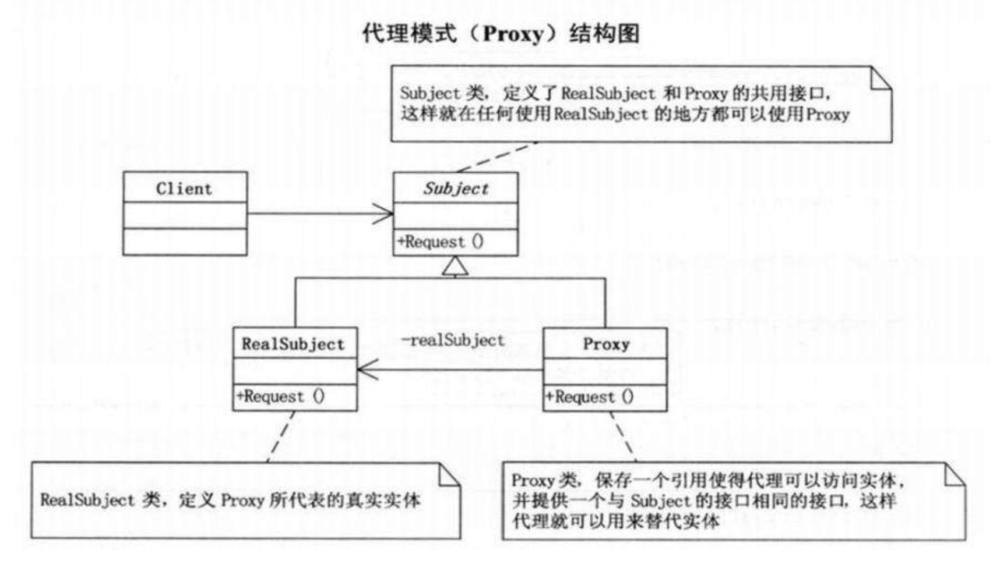

# JDK Proxy

---

[参考链接：java动态代理实现与原理详细分析](https://www.cnblogs.com/gonjan-blog/p/6685611.html)

---

## 代理模式

+ 结构性设计模式
+ 代理模式是常用的java设计模式，特征是代理类与委托类有同样的接口，代理类主要负责为委托类预处理消息、过滤消息、把消息转发给委托类，以及事后处理消息等
+ 代理类与委托类之间通常会存在关联关系，一个代理类的对象与一个委托类的对象关联，代理类的对象本身并不真正实现服务，而是通过调用委托类的对象的相关方法，来提供特定的服务
+ 简单的说就是，我们在访问实际对象时，是通过代理对象来访问的，代理模式就是在访问实际对象时引入一定程度的间接性，因为这种间接性，可以附加多种用途



## 静态代理

+ 静态代理可以理解为纯设计模式上的一种思想
+ 在程序运行前，就已经将接口、代理类等确定下来，所有的代理类都会在编译时生成class文件

```java
package top.tjsanshao;

/**
 * @author TjSanshao
 * @date 2020-06-16 10:26
 */
public interface Princess {
    void say();

    void sing();
}
```

```java
package top.tjsanshao;

/**
 * impl
 *
 * @author TjSanshao
 * @date 2020-06-16 10:27
 */
public class Chuyinweilai implements Princess {
    @Override
    public void say() {
        System.out.println("Chuyinweilai");
    }

    @Override
    public void sing() {
        System.out.println("参见公主殿下");
    }
}
```

```java
package top.tjsanshao;

/**
 * impl
 *
 * @author TjSanshao
 * @date 2020-06-16 10:28
 */
public class Luotianyi implements Princess {
    @Override
    public void say() {
        System.out.println("Luotianyi");
    }

    @Override
    public void sing() {
        System.out.println("如果真爱有颜色，一定是蓝色");
    }
}
```

```java
package top.tjsanshao;

import java.util.Objects;

/**
 * static proxy
 *
 * @author TjSanshao
 * @date 2020-06-16 15:13
 */
public class PrincessStaticProxy<T extends Princess> implements Princess {
    T princess;

    public PrincessStaticProxy(T princess) {
        this.princess = princess;
    }

    @Override
    public void say() {
        System.out.println("static proxy before");
        if (Objects.nonNull(this.princess)) {
            this.princess.say();
        } else {
            System.out.println("null say");
        }
    }

    @Override
    public void sing() {
        System.out.println("static proxy before");
        if (Objects.nonNull(this.princess)) {
            this.princess.sing();
        } else {
            System.out.println("null sing");
        }
    }
}
```

代理模式最主要的就是有一个公共接口（Person），一个具体的类（Student），一个代理类（StudentsProxy），代理类持有具体类的实例，代为执行具体类实例方法
代理模式就是在访问实际对象时引入一定程度的间接性，因为这种间接性，可以附加多种用途
`间接性就是指不直接调用实际对象的方法`，那么在代理过程中就可以加上一些其他用途
Spring AOP中大量使用了代理的思想

## 动态代理

+ `代理类在程序运行时创建的代理方式被称为动态代理`
+ 动态代理，代理类并不是在Java代码中定义的，而是在运行时根据在Java代码中的“指示”动态生成的
+ 相比于静态代理， `动态代理的优势在于可以很方便的对代理类的函数进行统一的处理`，而不用修改每个代理类中的方法
+ 在`java的java.lang.reflect包下提供了一个Proxy类和一个InvocationHandler接口`，通过这个类和这个接口可以生成JDK动态代理类和动态代理对象

```java
package top.tjsanshao;

/**
 * @author TjSanshao
 * @date 2020-06-16 10:26
 */
public interface Princess {
    void say();

    void sing();
}
```

```java
package top.tjsanshao;

/**
 * impl
 *
 * @author TjSanshao
 * @date 2020-06-16 10:27
 */
public class Chuyinweilai implements Princess {
    @Override
    public void say() {
        System.out.println("Chuyinweilai");
    }

    @Override
    public void sing() {
        System.out.println("参见公主殿下");
    }
}
```

```java
package top.tjsanshao;

/**
 * impl
 *
 * @author TjSanshao
 * @date 2020-06-16 10:28
 */
public class Luotianyi implements Princess {
    @Override
    public void say() {
        System.out.println("Luotianyi");
    }

    @Override
    public void sing() {
        System.out.println("如果真爱有颜色，一定是蓝色");
    }
}
```

```java
package top.tjsanshao;

import java.lang.reflect.InvocationHandler;
import java.lang.reflect.Method;

/**
 * proxy
 *
 * @author TjSanshao
 * @date 2020-06-16 10:29
 */
public class PrincessProxy<T> implements InvocationHandler {
    private T princess;

    public PrincessProxy(T princess) {
        this.princess = princess;
    }

    @Override
    public Object invoke(Object proxy, Method method, Object[] args) throws Throwable {
        System.out.println("proxy pre");
        final Object result = method.invoke(this.princess, args);
        System.out.println("proxy result:" + result);
        return result;
    }
}
```

```java
    private static void dynamicProxy() {
        final Chuyinweilai chuyinweilai = new Chuyinweilai();
        final Luotianyi luotianyi = new Luotianyi();
        final PrincessProxy<Chuyinweilai> chuyinweilaiPrincessProxy = new PrincessProxy<>(chuyinweilai);
        final PrincessProxy<Luotianyi> luotianyiPrincessProxy = new PrincessProxy<>(luotianyi);
        Princess chuyinweilaiProxy = (Princess) Proxy.newProxyInstance(chuyinweilaiPrincessProxy.getClass().getClassLoader(), chuyinweilai.getClass().getInterfaces(), chuyinweilaiPrincessProxy);
        Princess luotianyiProxy = (Princess) Proxy.newProxyInstance(luotianyiPrincessProxy.getClass().getClassLoader(), luotianyi.getClass().getInterfaces(), luotianyiPrincessProxy);
        chuyinweilaiProxy.say();
        luotianyiProxy.say();
        chuyinweilaiProxy.sing();
        luotianyiProxy.sing();
    }
```

+ 动态代理的优势在于可以很方便的对代理类的函数进行统一的处理，而不用修改每个代理类中的方法
+ 是因为所有被代理执行的方法，都是通过在InvocationHandler中的invoke方法调用的，所以只要在invoke方法中统一处理，就可以对所有被代理的方法进行相同的操作

### JDK动态代理源码

```java
    /**
     * loader指代理类的类加载器
     * interfaces指被代理类的实现接口列表
     * h即代理类实例
     */
    @CallerSensitive
    public static Object newProxyInstance(ClassLoader loader,
                                          Class<?>[] interfaces,
                                          InvocationHandler h)
        throws IllegalArgumentException
    {
        Objects.requireNonNull(h);

        final Class<?>[] intfs = interfaces.clone();
        final SecurityManager sm = System.getSecurityManager();
        if (sm != null) {
            checkProxyAccess(Reflection.getCallerClass(), loader, intfs);
        }

        /*
         * Look up or generate the designated proxy class.
         * 获取到动态生成的代理类类型，这里的代理类可以认为是一个实现了接口的类
         */
        Class<?> cl = getProxyClass0(loader, intfs);

        /*
         * Invoke its constructor with the designated invocation handler.
         */
        try {
            if (sm != null) {
                checkNewProxyPermission(Reflection.getCallerClass(), cl);
            }

            // 获取构造器
            final Constructor<?> cons = cl.getConstructor(constructorParams);
            final InvocationHandler ih = h;
            if (!Modifier.isPublic(cl.getModifiers())) {
                AccessController.doPrivileged(new PrivilegedAction<Void>() {
                    public Void run() {
                        cons.setAccessible(true);
                        return null;
                    }
                });
            }
            // 生成代理类实例返回，生成的代理类会有一个接受InvocationHandler类型参数的构造器
            return cons.newInstance(new Object[]{h});
        } catch (IllegalAccessException|InstantiationException e) {
            throw new InternalError(e.toString(), e);
        } catch (InvocationTargetException e) {
            Throwable t = e.getCause();
            if (t instanceof RuntimeException) {
                throw (RuntimeException) t;
            } else {
                throw new InternalError(t.toString(), t);
            }
        } catch (NoSuchMethodException e) {
            throw new InternalError(e.toString(), e);
        }
    }
```

JVM生成的代理类大致如下：

```java
import java.lang.reflect.InvocationHandler;
import java.lang.reflect.Method;
import java.lang.reflect.Proxy;
import java.lang.reflect.UndeclaredThrowableException;
import proxy.Person;

public final class $Proxy0 extends Proxy implements Person
{
  private static Method m1;
  private static Method m2;
  private static Method m3;
  private static Method m0;
  
 /**
  * 注意这里是生成代理类的构造方法，方法参数为InvocationHandler类型
  * 代理对象调用方法都是执行InvocationHandler中的invoke方法，而InvocationHandler又持有一个
  * 被代理对象的实例
  *
  * super(paramInvocationHandler)，是调用父类Proxy的构造方法。
  * 父类持有：protected InvocationHandler h;
  * Proxy构造方法：
  *    protected Proxy(InvocationHandler h) {
  *         Objects.requireNonNull(h);
  *         this.h = h;
  *     }
  *
  */
  public $Proxy0(InvocationHandler paramInvocationHandler)
    throws Throwable
  {
    super(paramInvocationHandler);
  }
  
  //这个静态块本来是在最后的，我把它拿到前面来，方便描述
   static
  {
    try
    {
      m1 = Class.forName("java.lang.Object").getMethod("equals", new Class[] { Class.forName("java.lang.Object") });
      m2 = Class.forName("java.lang.Object").getMethod("toString", new Class[0]);
      m3 = Class.forName("proxy.Person").getMethod("giveMoney", new Class[0]);
      m0 = Class.forName("java.lang.Object").getMethod("hashCode", new Class[0]);
      return;
    }
    catch (NoSuchMethodException localNoSuchMethodException)
    {
      throw new NoSuchMethodError(localNoSuchMethodException.getMessage());
    }
    catch (ClassNotFoundException localClassNotFoundException)
    {
      throw new NoClassDefFoundError(localClassNotFoundException.getMessage());
    }
  }

 /**
  * 这里调用代理对象的giveMoney方法，直接就调用了InvocationHandler中的invoke方法，并把m3传了进去
  * this.h.invoke(this, m3, null)
  * 代理对象持有一个InvocationHandler对象，InvocationHandler对象持有一个被代理的对象，
  * 再联系到InvacationHandler中的invoke方法
  */
  public final void giveMoney()
    throws Throwable
  {
    try
    {
      this.h.invoke(this, m3, null);
      return;
    }
    catch (Error|RuntimeException localError)
    {
      throw localError;
    }
    catch (Throwable localThrowable)
    {
      throw new UndeclaredThrowableException(localThrowable);
    }
  }

  //注意，这里为了节省篇幅，省去了toString，hashCode、equals方法的内容。原理和giveMoney方法一毛一样

}
```

+ jdk为我们的生成了一个叫$Proxy0（这个名字后面的0是编号，有多个代理类会一次递增）的代理类，这个类文件时放在内存中的，在创建代理对象时，就是通过反射获得这个类的构造方法，然后创建的代理实例
+ 可以对InvocationHandler看做一个中介类，中介类持有一个被代理对象，在invoke方法中调用了被代理对象的相应方法，通过聚合方式持有被代理对象的引用，把外部对invoke的调用最终都转为对被代理对象的调用
+ 代理类调用自己方法时，通过自身持有的中介类对象来调用中介类对象的invoke方法，从而达到代理执行被代理对象的方法，也就是说，动态代理通过中介类实现了具体的代理功能
