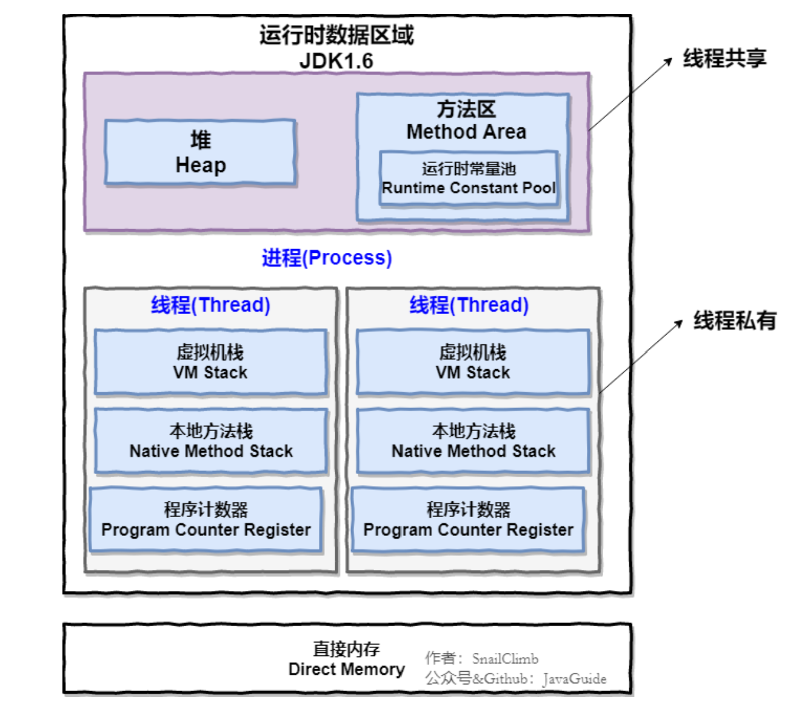
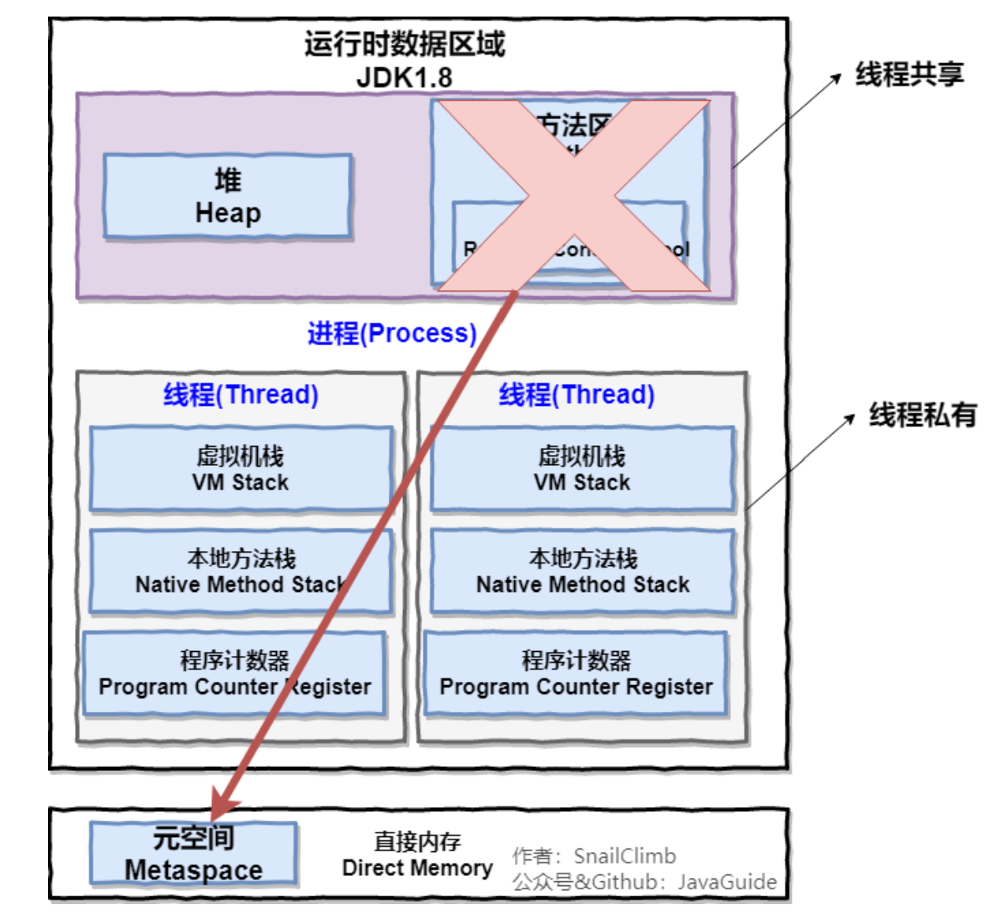
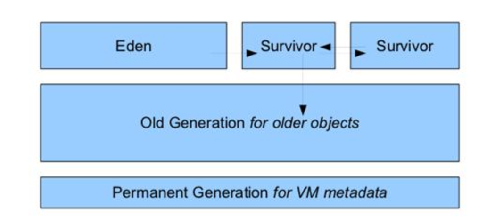
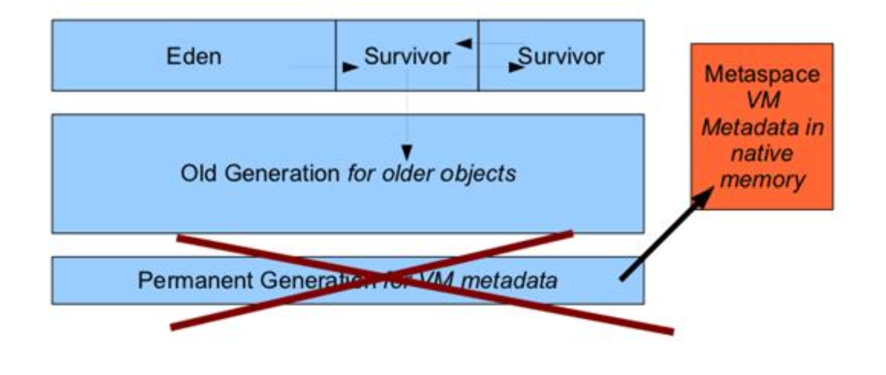

# JVM 内存

---

[参考链接：JavaGuide](https://github.com/Snailclimb/JavaGuide.git)

---

## 运行时内存区域

JDK1.8之前：



JDK1.8之后：


大体上，可分为2类：

+ 线程私有：
  + 程序计数器
  + 虚拟机栈
  + 本地方法栈

+ 线程共享：
  + 堆
  + 方法区
  + 直接内存（非运行时数据区的一部分）

### 程序计数器

程序计数器是一块较小的内存空间，可以看作是当前线程所执行的字节码的行号指示器（记录当前程序执行的位置）
字节码解释器工作时通过改变这个计数器的值来选取下一条需要执行的字节码指令，分支、循环、跳转、异常处理、线程恢复等功能都需要依赖这个计数器来完成
`为了线程切换后能恢复到正确的执行位置，每条线程都需要有一个独立的程序计数器`，各线程之间计数器互不影响，独立存储，这类内存区域为“线程私有”的内存

+ `字节码解释器通过改变程序计数器来依次读取指令`，从而实现代码的流程控制，如：顺序执行、选择、循环、异常处理
+ 在多线程的情况下，`程序计数器用于记录当前线程执行的位置`，从而当线程被切换回来的时候能够知道该线程上次运行的位置

`程序计数器是唯一一个不会出现 OutOfMemoryError 的内存区域，它的生命周期随着线程的创建而创建，随着线程的结束而死亡`

### Java虚拟机栈

`与程序计数器一样，Java 虚拟机栈也是线程私有的，它的生命周期和线程相同，描述的是 Java 方法执行的内存模型，每次方法调用的数据都是通过栈传递的`

Java 内存可以粗糙的区分为堆内存（Heap）和栈内存 (Stack)，其中栈就是现在说的虚拟机栈，或者说是虚拟机栈中局部变量表部分，`实际上，Java 虚拟机栈是由一个个栈帧组成，而每个栈帧中都拥有：局部变量表、操作数栈、动态链接、方法出口信息`

`局部变量表`主要存放了编译期可知的各种数据类型（boolean、byte、char、short、int、float、long、double）、对象引用（reference 类型，它不同于对象本身，可能是一个指向对象起始地址的引用指针，也可能是指向一个代表对象的句柄或其他与此对象相关的位置）

Java 虚拟机栈会出现两种错误：StackOverFlowError 和 OutOfMemoryError:

+ `StackOverFlowError：` 若 Java 虚拟机栈的内存大小不允许动态扩展，那么当线程请求栈的深度超过当前 Java 虚拟机栈的最大深度的时候，就抛出 StackOverFlowError 错误
+ `OutOfMemoryError：` 若 Java 虚拟机栈的内存大小允许动态扩展，且当线程请求栈时内存用完了，无法再动态扩展了，此时抛出 OutOfMemoryError 错误

`Java 虚拟机栈也是线程私有的，每个线程都有各自的 Java 虚拟机栈，而且随着线程的创建而创建，随着线程的死亡而死亡`

Java 栈可用类比数据结构中栈，Java 栈中保存的主要内容是栈帧，`每一次函数调用都会有一个对应的栈帧被压入 Java 栈，每一个函数调用结束后，都会有一个栈帧被弹出`
Java 方法有两种返回方式：

+ return 语句
+ 抛出异常

不管哪种返回方式都会导致栈帧被弹出

### 本地方法栈

和虚拟机栈所发挥的作用非常相似，区别是： `虚拟机栈为虚拟机执行 Java 方法 （也就是字节码）服务，而本地方法栈则为虚拟机使用到的 Native 方法服务`，在 HotSpot 虚拟机中和 Java 虚拟机栈合二为一

本地方法被执行的时候，在本地方法栈也会创建一个栈帧，用于存放该本地方法的局部变量表、操作数栈、动态链接、出口信息

方法执行完毕后相应的栈帧也会出栈并释放内存空间，也会出现 StackOverFlowError 和 OutOfMemoryError 两种错误

### 堆

Java 虚拟机所管理的内存中最大的一块，Java 堆是所有线程共享的一块内存区域，在虚拟机启动时创建

`此内存区域的唯一目的就是存放对象实例，几乎所有的对象实例以及数组都在这里分配内存`

Java中“几乎”所有的对象都在堆中分配，但是，随着JIT编译期的发展与逃逸分析技术逐渐成熟，栈上分配、标量替换优化技术将会导致一些微妙的变化，所有的对象都分配到堆上也渐渐变得不那么“绝对”了
从`jdk 1.7`开始已经默认开启逃逸分析，`如果某些方法中的对象引用没有被返回或者未被外面使用（也就是未逃逸出去），那么对象可以直接在栈上分配内存`

Java 堆是垃圾收集器管理的主要区域，因此也被称作`GC 堆（Garbage Collected Heap）`
从垃圾回收的角度，由于现在收集器基本都采用`分代垃圾收集算法`，所以 Java 堆还可以细分为：新生代和老年代
再细致一点有：Eden 空间、From Survivor、To Survivor 空间等，进一步划分的目的是更好地回收内存，或者更快地分配内存

在 JDK 7 版本及JDK 7 版本之前，堆内存被通常被分为下面三部分（JDK7之前，堆和方法区（永久代）的内存是连续的，并且永久代和老年代的垃圾收集是捆绑的，无论哪一方满了，都会触发永久代和老年代GC）：

+ 新生代内存(Young Generation)
+ 老生代(Old Generation)
+ 永生代(Permanent Generation)



JDK 8 版本之后方法区（HotSpot 的永久代）被彻底移除了（JDK1.7 就已经开始了），取而代之是元空间，元空间使用的是直接内存（元空间即JVM规范中方法区的实现，同JDK7之前的永久代也是对方法区的实现）



上图所示的 Eden 区、两个 Survivor 区都属于新生代（为了区分，这两个 Survivor 区域按照顺序被命名为 from 和 to），中间一层属于老年代
大部分情况，对象都会首先在 Eden 区域分配，在一次新生代垃圾回收后，如果对象还存活，则会进入 s0 或者 s1，并且对象的年龄还会加 1(Eden 区->Survivor 区后对象的初始年龄变为 1)，当它的年龄增加到一定程度（默认为 15 岁），就会被晋升到老年代中
对象晋升到老年代的年龄阈值，可以通过参数 `-XX:MaxTenuringThreshold` 来设置

> 修正（[issue552](https://github.com/Snailclimb/JavaGuide/issues/552)）：“Hotspot遍历所有对象时，按照年龄从小到大对其所占用的大小进行累积，当累积的某个年龄大小超过了survivor区的一半时，取这个年龄和MaxTenuringThreshold中更小的一个值，作为新的晋升年龄阈值”。
>
> **动态年龄计算的代码如下**
>
> ```c++
> uint ageTable::compute_tenuring_threshold(size_t survivor_capacity) {
>   //survivor_capacity是survivor空间的大小
>   size_t desired_survivor_size = (size_t)((((double) survivor_capacity)*TargetSurvivorRatio)/100);
>   size_t total = 0;
>   uint age = 1;
>   while (age < table_size) {
>     total += sizes[age];//sizes数组是每个年龄段对象大小
>     if (total > desired_survivor_size) break;
>     age++;
>   }
>   uint result = age < MaxTenuringThreshold ? age : MaxTenuringThreshold;
> }
> ```

堆这里最容易出现的就是 OutOfMemoryError 错误，并且出现这种错误之后的表现形式还会有几种，比如：

+ `OutOfMemoryError: GC Overhead Limit Exceeded ：` 当JVM花太多时间执行垃圾回收并且只能回收很少的堆空间时，就会发生此错误
+ `java.lang.OutOfMemoryError: Java heap space：` 假如在创建新的对象时, 堆内存中的空间不足以存放新创建的对象, 就会引发java.lang.OutOfMemoryError: Java heap space 错误（与JVM配置的内存有关）

### 方法区

方法区与 Java 堆一样，是各个线程共享的内存区域，它用于存储已被虚拟机加载的类信息、常量、静态变量、即时编译器编译后的代码等数据

Java 虚拟机规范把方法区描述为堆的一个逻辑部分，但是它却有一个别名叫做 Non-Heap（非堆），目的应该是与 Java 堆区分开来

方法区也被称为永久代

JDK7之前，方法区的内存与堆连续，并且和堆上的老年代捆绑GC（无论哪一方内存满了，都会触发双方GC）

#### 方法区和永久代的关系

方法区是JVM规范中的说法（主要存放类的信息），属于一种概念，永久代则是Hotspot虚拟机对于方法区的实现（在不同的虚拟机实现中，方法区的实现也不同）
Hotspot虚拟机中，无论是永久代，还是元空间，都是对方法区的一种实现

#### 元空间参数

```java
-XX:MetaspaceSize=N //设置 Metaspace 的初始（和最小大小）
-XX:MaxMetaspaceSize=N //设置 Metaspace 的最大大小
```

#### 关于为何要将永久代（PermGen）改为元空间（MetaSpace）

+ 整个永久代有一个 JVM 本身设置固定大小上限，无法进行调整，而`元空间使用的是直接内存，受本机可用内存的限制`，虽然元空间仍旧可能溢出，但是比原来出现的几率会更小
  + `当元空间溢出时会得到如下错误： java.lang.OutOfMemoryError: MetaSpace`
  + 可以使用 `-XX：MaxMetaspaceSize` 标志设置最大元空间大小，默认值为 `unlimited`，这意味着它只受系统内存的限制
  + `-XX：MetaspaceSize` 调整标志定义元空间的初始大小如果未指定此标志，则 Metaspace 将根据运行时的应用程序需求动态地重新调整大小
+ 元空间里面存放的是类的元数据，这样加载多少类的元数据就不由 MaxPermSize 控制了, 而由系统的实际可用空间来控制，这样能加载的类就更多了
+ 在 JDK8，合并 HotSpot 和 JRockit 的代码时, JRockit 从来没有一个叫永久代的东西, 合并之后就没有必要额外的设置这么一个永久代的地方了

### 运行时常量池

[有关于常量池](./常量池.md)

运行时常量池是方法区的一部分
Class 文件中除了有类的版本、字段、方法、接口等描述信息外，还有常量池表（用于存放编译期生成的各种字面量和符号引用）
既然运行时常量池是方法区的一部分，自然受到方法区内存的限制，当常量池无法再申请到内存时会抛出 OutOfMemoryError 错误

> 修正([issue747](https://github.com/Snailclimb/JavaGuide/issues/747)，[reference](https://blog.csdn.net/q5706503/article/details/84640762))： 
>
> 1. **JDK1.7之前运行时常量池逻辑包含字符串常量池存放在方法区, 此时hotspot虚拟机对方法区的实现为永久代**
> 2. **JDK1.7 字符串常量池被从方法区拿到了堆中, 这里没有提到运行时常量池,也就是说字符串常量池被单独拿到堆,运行时常量池剩下的东西还在方法区, 也就是hotspot中的永久代** 。
> 3. **JDK1.8 hotspot移除了永久代用元空间(Metaspace)取而代之, 这时候字符串常量池还在堆, 运行时常量池还在方法区, 只不过方法区的实现从永久代变成了元空间(Metaspace)**
>

### 直接内存

直接内存并不是虚拟机运行时数据区的一部分，也不是虚拟机规范中定义的内存区域，但是这部分内存也被频繁地使用，而且也可能导致 OutOfMemoryError 错误出现

JDK1.4 中新加入的 NIO(New Input/Output) 类，引入了一种基于通道（Channel） 与缓存区（Buffer） 的 I/O 方式，它可以直接使用 Native 函数库直接分配堆外内存，然后通过一个存储在 Java 堆中的 DirectByteBuffer 对象作为这块内存的引用进行操作
这样就能在一些场景中显著提高性能，因为`避免了在 Java 堆和 Native 堆之间来回复制数据`

本机直接内存的分配不会受到 Java 堆的限制，但是，既然是内存就会受到本机总内存大小以及处理器寻址空间的限制
