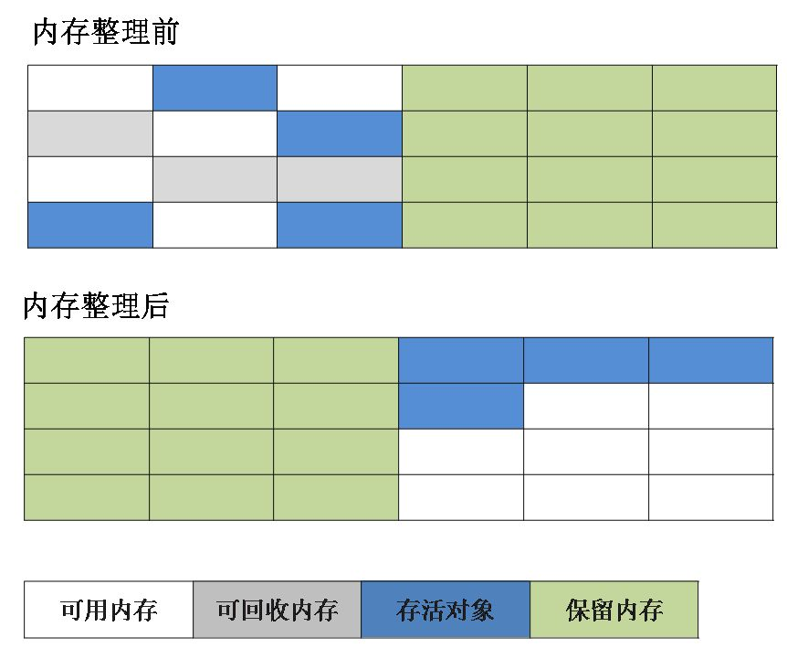

# JVM 垃圾回收

## JVM 内存分配与回收

Java 的自动内存管理主要是针对对象内存的回收和对象内存的分配

Java 自动内存管理最核心的功能是 **堆** 内存中对象的分配与回收

Java 堆是垃圾收集器管理的主要区域，因此也被称作**GC 堆（Garbage Collected Heap）**

从垃圾回收的角度，由于现在收集器基本都采用分代垃圾收集算法，所以 Java 堆还可以细分为：新生代和老年代；再细致一点有：Eden 空间、From Survivor、To Survivor 空间等；进一步划分的目的是更好地回收内存，或者更快地分配内存

堆空间的基本结构：


上图所示的 Eden 区、From Survivor0("From") 区、To Survivor1("To") 区都属于新生代，Old Memory 区属于老年代

大部分情况，对象都会**首先在 Eden 区域分配**，在一次新生代垃圾回收后，如果对象还存活，则会进入 s0 或者 s1，并且对象的年龄还会加 1(Eden 区->Survivor 区后对象的初始年龄变为 1)，当它的年龄增加到一定程度（默认为 15 岁（默认晋升年龄并不都是15，这个是要区分垃圾收集器的，CMS就是6）），就会被晋升到老年代中

对象晋升到老年代的年龄阈值，可以通过参数 `-XX:MaxTenuringThreshold` 来设置

> Hotspot遍历所有对象时，按照年龄从小到大对其所占用的大小进行累积，当累积的某个年龄大小超过了survivor区的一半时，取这个年龄和MaxTenuringThreshold中更小的一个值，作为新的晋升年龄阈值
>
> **动态年龄计算的代码如下**
>
> ```c++
> uint ageTable::compute_tenuring_threshold(size_t survivor_capacity) {
> //survivor_capacity是survivor空间的大小
> size_t desired_survivor_size = (size_t)((((double) survivor_capacity)*TargetSurvivorRatio)/100);
> size_t total = 0;
> uint age = 1;
> while (age < table_size) {
>  total += sizes[age];//sizes数组是每个年龄段对象大小
>  if (total > desired_survivor_size) break;
>  age++;
> }
> uint result = age < MaxTenuringThreshold ? age : MaxTenuringThreshold;
> ...
> }
> ```

经过这次GC后，Eden区和"From"区已经被清空

这个时候，"From"和"To"会交换他们的角色，也就是新的"To"就是上次GC前的“From”，新的"From"就是上次GC前的"To"

不管怎样，都会保证名为To的Survivor区域是空的

Minor GC会一直重复这样的过程，直到“To”区被填满，"To"区被填满之后，会将所有对象移动到老年代中


## 对象优先在 eden 区分配

目前主流的垃圾收集器都会采用分代回收算法，因此需要将堆内存分为新生代和老年代，这样就可以根据各个年代的特点选择合适的垃圾收集算法

大多数情况下，对象在新生代中 eden 区分配，当 eden 区没有足够空间进行分配时，虚拟机将发起一次 Minor GC

### Minor GC 和 Full GC

+ 新生代 GC（Minor GC）：指发生新生代的的垃圾收集动作，Minor GC 非常频繁，回收速度一般也比较快
+ 老年代 GC（Major GC/Full GC）：指发生在老年代的 GC，出现了 Major GC 经常会伴随至少一次的 Minor GC（并非绝对），Major GC 的速度一般会比 Minor GC 的慢 10 倍以上

## 大对象直接进入老年代

大对象就是需要大量连续内存空间的对象（比如：字符串、数组）

为了避免为大对象分配内存时由于分配担保机制带来的复制而降低效率

## 长期存活的对象将进入老年代

既然虚拟机采用了分代收集的思想来管理内存，那么内存回收时就必须能识别哪些对象应放在新生代，哪些对象应放在老年代中，为了做到这一点，虚拟机给每个对象一个对象年龄（Age）计数器

如果对象在 Eden 出生并经过第一次 Minor GC 后仍然能够存活，并且能被 Survivor 容纳的话，将被移动到 Survivor 空间中，并将对象年龄设为 1

对象在 Survivor 中每熬过一次 MinorGC,年龄就增加 1 岁，当它的年龄增加到一定程度（默认为 15 岁），就会被晋升到老年代中

对象晋升到老年代的年龄阈值，可以通过参数 `-XX:MaxTenuringThreshold` 来设置

## 判断一个对象可以被回收

堆中几乎放着所有的对象实例，对堆垃圾回收前的第一步就是要判断那些对象已经死亡（即不能再被任何途径使用的对象）

### 引用计数法

给对象中添加一个引用计数器，每当有一个地方引用它，计数器就加 1；当引用失效，计数器就减 1；任何时候计数器为 0 的对象就是不可能再被使用的

这个方法实现简单，效率高，但是目前主流的虚拟机中并没有选择这个算法来管理内存，其最主要的原因是它**很难解决对象之间相互循环引用的问题**

### 可达性分析算法

这个算法的基本思想就是通过一系列的称为 **“GC Roots”** 的对象作为起点，从这些节点开始向下搜索，节点所走过的路径称为引用链，当一个对象到 GC Roots 没有任何引用链相连的话，则证明此对象是不可用的


不可达的对象并非“非死不可”

即使在可达性分析法中不可达的对象，也并非是“非死不可”的，这时候它们暂时处于“缓刑阶段”，要真正宣告一个对象死亡，至少要经历两次标记过程

可达性分析法中不可达的对象被第一次标记并且进行一次筛选，筛选的条件是此对象是否有必要执行 finalize 方法

当对象没有覆盖 finalize 方法，或 finalize 方法已经被虚拟机调用过时，虚拟机将这两种情况视为没有必要执行

被判定为需要执行的对象将会被放在一个队列中进行第二次标记，除非这个对象与引用链上的任何一个对象建立关联，否则就会被真的回收

## 判断一个常量是废弃常量

假如在常量池中存在字符串 "abc"，如果当前没有任何 String 对象引用该字符串常量的话，就说明常量 "abc" 就是废弃常量，如果这时发生内存回收的话而且有必要的话，"abc" 就会被系统清理出常量池

## 判断一个类是无用的类

类需要同时满足下面 3 个条件才能算是**无用的类**：

+ 该类所有的实例都已经被回收，也就是 Java 堆中不存在该类的任何实例
+ 加载该类的 ClassLoader 已经被回收
+ 该类对应的 java.lang.Class 对象没有在任何地方被引用，无法在任何地方通过反射访问该类的方法

虚拟机**可以**对满足上述 3 个条件的无用类进行回收，而并不是和对象一样不使用了就会必然被回收

## 垃圾收集算法

### 标记-清除算法

该算法分为 **“标记”** 和 **“清除”** 阶段：首先比较出所有需要回收的对象，在标记完成后统一回收掉所有被标记的对象

最基础的收集算法，后续的算法都是对其不足进行改进得到

这种垃圾收集算法会带来两个明显的问题：

1. 效率问题
2. 空间问题（标记清除后会产生大量不连续的碎片）


### 复制算法

为了解决效率问题，“复制”收集算法出现了，它可以将内存分为大小相同的两块，每次使用其中的一块

当这一块的内存使用完后，就将还存活的对象复制到另一块去，然后再把使用的空间一次清理掉

这样就使每次的内存回收都是对内存区间的一半进行回收



### 标记-整理算法

根据老年代的特点提出的一种标记算法，标记过程仍然与“标记-清除”算法一样，但后续步骤不是直接对可回收对象回收，而是让所有存活的对象向一端移动，然后直接清理掉端边界以外的内存


### 分代收集算法

**当前虚拟机的垃圾收集都采用分代收集算法**，这种算法没有什么新的思想，只是根据对象存活周期的不同将内存分为几块

一般将 java 堆分为新生代和老年代，这样就可以根据各个年代的特点选择合适的垃圾收集算法

比如在新生代中，每次收集都会有大量对象死去，所以可以选择复制算法，只需要付出少量对象的复制成本就可以完成每次垃圾收集

而老年代的对象存活几率是比较高的，而且没有额外的空间对它进行分配担保，所以我们必须选择“标记-清除”或“标记-整理”算法进行垃圾收集

## 垃圾收集器

收集算法是内存回收的方法论

垃圾收集器就是内存回收的具体实现

根据具体应用场景选择适合自己的垃圾收集器

### Serial 收集器

Serial（串行）收集器收集器是最基本、历史最悠久的垃圾收集器了

Serial 收集器是一个**单线程**收集器

“单线程” 的意义不仅仅意味着它只会使用一条垃圾收集线程去完成垃圾收集工作，更重要的是它在进行垃圾收集工作的时候**必须暂停其他所有的工作线程（ "Stop The World" ），直到它收集结束**


新生代采用复制算法，老年代采用标记-整理算法

**优点**：简单而高效（与其他收集器的单线程相比），Serial 收集器由于没有线程交互的开销，自然可以获得很高的单线程收集效率，Serial 收集器对于运行在 Client 模式下的虚拟机来说是个不错的选择

### ParNew 收集器

ParNew 收集器其实就是 Serial 收集器的多线程版本，除了使用多线程进行垃圾收集外，其余行为（控制参数、收集算法、回收策略等等）和 Serial 收集器完全一样


新生代采用复制算法，老年代采用标记-整理算法

是许多运行在 Server 模式下的虚拟机的首要选择，除了 Serial 收集器外，只有它能与 CMS 收集器配合工作

**并行（Parallel）** 指多条垃圾收集线程并行工作，但此时用户线程仍然处于等待状态
**并发（Concurrent）** 指用户线程与垃圾收集线程同时执行（但不一定是并行，可能会交替执行），用户程序在继续运行，而垃圾收集器运行在另一个 CPU 上

### Parallel Scavenge 收集器

Parallel Scavenge 收集器也是使用复制算法的多线程收集器，它看上去几乎和ParNew都一样

Parallel Scavenge 收集器关注点是吞吐量（高效率的利用 CPU），所谓吞吐量就是 CPU 中用于运行用户代码的时间与 CPU 总消耗时间的比值

CMS 等垃圾收集器的关注点更多的是用户线程的停顿时间（提高用户体验）

Parallel Scavenge 收集器提供了很多参数供用户找到最合适的停顿时间或最大吞吐量，如果对于收集器运作不太了解的话，手工优化存在困难的话可以选择把内存管理优化交给虚拟机去完成也是一个不错的选择


新生代采用复制算法，老年代采用标记-整理算法

### Serial Old 收集器

Serial 收集器的老年代版本，它同样是一个单线程收集器

主要有两大用途：一种用途是在 JDK1.5 以及以前的版本中与 Parallel Scavenge 收集器搭配使用，另一种用途是作为 CMS 收集器的后备方案

### Parallel Old 收集器

Parallel Scavenge 收集器的老年代版本

使用多线程和“标记-整理”算法

在注重吞吐量以及 CPU 资源的场合，都可以优先考虑 Parallel Scavenge 收集器和 Parallel Old 收集器

### CMS 收集器

***CMS（Concurrent Mark Sweep）收集器是一种以获取最短回收停顿时间为目标的收集器，非常符合在注重用户体验的应用上使用***

***CMS（Concurrent Mark Sweep）收集器是 HotSpot 虚拟机第一款真正意义上的并发收集器，它第一次实现了让垃圾收集线程与用户线程（基本上）同时工作***

从名字中的Mark Sweep这两个词可以看出，CMS 收集器是一种 **“标记-清除”** 算法实现的，它的运作过程相比于前面几种垃圾收集器来说更加复杂一些

1. **初始标记**：暂停所有的其他线程，并记录下直接与 root 相连的对象，速度很快
2. **并发标记**：同时开启 GC 和用户线程，用一个闭包结构去记录可达对象，但在这个阶段结束，这个闭包结构并不能保证包含当前所有的可达对象，因为用户线程可能会不断的更新引用域，所以 GC 线程无法保证可达性分析的实时性，所以这个算法里会跟踪记录这些发生引用更新的地方
3. **重新标记**：重新标记阶段就是为了修正并发标记期间因为用户程序继续运行而导致标记产生变动的那一部分对象的标记记录，这个阶段的停顿时间一般会比初始标记阶段的时间稍长，远远比并发标记阶段时间短
4. **并发清除**：开启用户线程，同时 GC 线程开始对未标记的区域做清扫


CMS 优点：

+ 并发收集
+ 低停顿

CMS 缺点：

+ 对 CPU 资源敏感
+ 无法处理浮动垃圾
+ 它使用的回收算法-“标记-清除”算法会导致收集结束时会有大量空间碎片产生

### G1 收集器

***G1 (Garbage-First) 是一款面向服务器的垃圾收集器，主要针对配备多颗处理器及大容量内存的机器，以极高概率满足 GC 停顿时间要求的同时，还具备高吞吐量性能特征***

被视为 JDK1.7 中 HotSpot 虚拟机的一个重要进化特征

G1 有以下特点：

+ **并行与并发**：G1 能充分利用 CPU、多核环境下的硬件优势，使用多个 CPU（CPU 或者 CPU 核心）来缩短 Stop-The-World 停顿时间，部分其他收集器原本需要停顿 Java 线程执行的 GC 动作，G1 收集器仍然可以通过并发的方式让 java 程序继续执行
+ **分代收集**：虽然 G1 可以不需要其他收集器配合就能独立管理整个 GC 堆，但是还是保留了分代的概念
+ **空间整合**：与 CMS 的“标记--清理”算法不同，G1 从整体来看是基于“标记整理”算法实现的收集器；从局部上来看是基于“复制”算法实现的
+ **可预测的停顿**：这是 G1 相对于 CMS 的另一个大优势，降低停顿时间是 G1 和 CMS 共同的关注点，但 G1 除了追求低停顿外，还能建立可预测的停顿时间模型，能让使用者明确指定在一个长度为 M 毫秒的时间片段内

G1 的运作大致有以下步骤：

1. 初始标记
2. 并发标记
3. 最终标记
4. 筛选回收

***G1 收集器在后台维护了一个优先列表，每次根据允许的收集时间，优先选择回收价值最大的 Region(这也就是它的名字 Garbage-First 的由来)***

这种使用 Region 划分内存空间以及有优先级的区域回收方式，保证了 G1 收集器在有限时间内可以尽可能高的收集效率（把内存化整为零）
