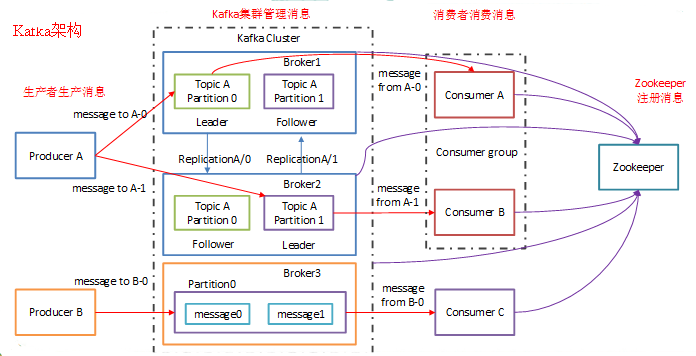
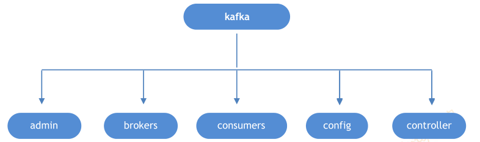
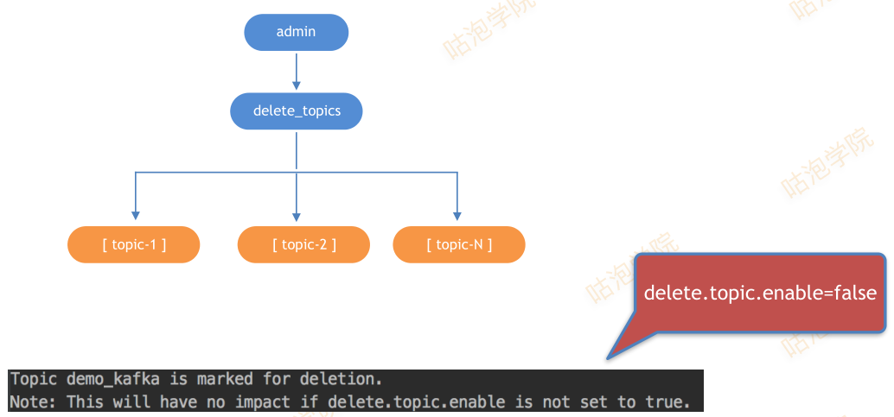
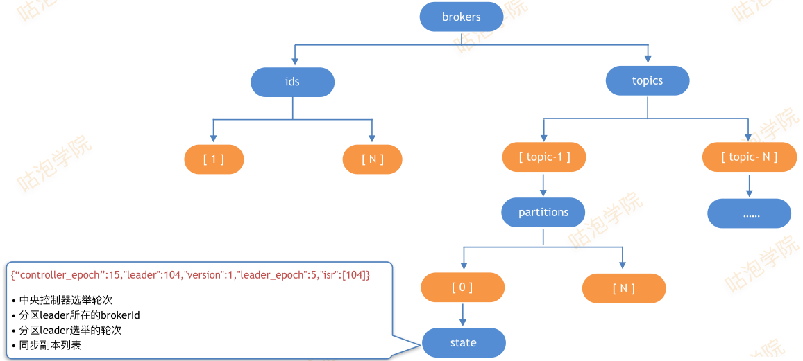
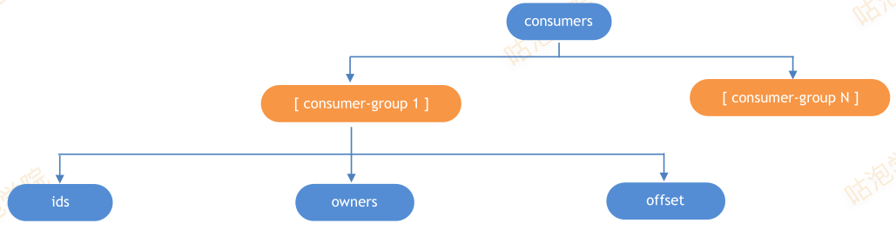
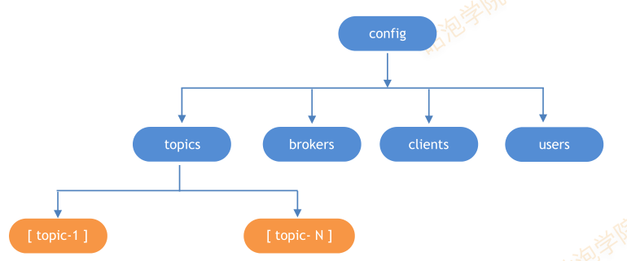
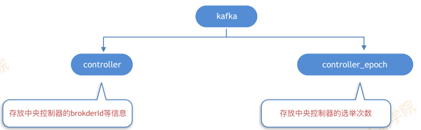

# Kafka

## Kafka 概述

Kafka是一个分布式的，基于发布/订阅模式的消息队列（Message Queue），主要应用于大数据实时处理领域

## Kafka 架构



如上图所示，一个典型的Kafka集群中包含若干Producer（可以是web前端产生的page view，或者是服务日志、系统CPU、Memory等），若干broker（Kafka支持水平扩展，一般broker数量越多，集群的吞吐率越高），若干Consumer Group，以及一个Zookeeper集群

Kafka通过Zookeeper管理集群配置，选举leader，以及在Consumer Group发生变化时进行rebalance

Producer使用push模式将消息发布到broker，Consumer使用pull模式从broker订阅并消费消息

***注意：0.9版本之前，offset存储在zk，0.9版本之后，offset存储在broker本地***

### 分布式模型

+ Kafka 每个主题的多个分区日志分布式地存储在 Kafka 集群上，同时为了故障容错，每个分区都会以副本的方式复制到多个消息代理节点上，其中一个节点会作为主副本（Leader），其他节点作为备份副本（Follower，也叫作从副本）
+ 主副本会负责所有的客户端读写操作，**备份副本仅仅从主副本同步数据**
+ 当主副本出现故障时，备份副本中的一个副本会被选择为新的主副本
+ Kafka 的生产者和消费者相对于服务器端而言都是客户端
+ Kafka生产者客户端发布消息到服务端的指定主题，**会指定消息所属的分区**，生产者发布消息时根据消息是否有键，采用不同的分区策略，消息没有键时，通过轮询方式进行客户端负载均衡；消息有键时，根据分区语义（例如hash）确保相同键的消息总是发送到同一分区
+ Kafka的消费者通过订阅主题来消费消息，并且每个消费者都会设置一个消费组名称，因为**生产者发布到主题的每一条消息都只会发送给消费者组的一个消费者**
+ 如果要实现传统消息系统的“队列”模型，可以让每个消费者都拥有相同的消费组名称，这样消息就会负责均衡到所有的消费者；如果要实现“发布-订阅”模型，则每个消费者的消费者组名称都不相同，这样每条消息就会广播给所有的消费者

### zookeeper 与 kafka

+ **Broker注册**：
  +Broker是分布式部署并且相互之间相互独立，但是需要有一个注册系统能够将整个集群中的Broker管理起来，此时就使用到了Zookeeper
  + 在Zookeeper上会有一个专门用来进行Broker服务器列表记录的节点 `/brokers/ids`
  + 每个Broker在启动时，都会到Zookeeper上进行注册，即到 `/brokers/ids` 下创建属于自己的节点，如 `/brokers/ids/[0...N]`
  + Kafka使用了全局唯一的数字来指代每个Broker服务器，不同的Broker必须使用不同的Broker ID进行注册，创建完节点后，**每个Broker就会将自己的IP地址和端口信息记录到该节点中去**
  + 其中，Broker创建的节点类型是临时节点，**一旦Broker宕机，则对应的临时节点也会被自动删除**
+ **Topic注册**：
  + 在Kafka中，同一个Topic的消息会被分成多个分区并将其分布在多个Broker上，这些分区信息及与Broker的对应关系也都是由Zookeeper在维护，由专门的节点来记录： `/borkers/topics`
  + Kafka中每个Topic都会以 `/brokers/topics/[topic]` 的形式被记录，如/brokers/topics/login和/brokers/topics/search等
  + Broker服务器启动后，会到对应Topic节点（/brokers/topics）上注册自己的Broker ID并写入针对该Topic的分区总数，如/brokers/topics/login/3->2，这个节点表示Broker ID为3的一个Broker服务器，对于"login"这个Topic的消息，提供了2个分区进行消息存储，同样，这个分区节点也是临时节点

#### zk-kafka 结构树



#### zk-kafka admin



#### zk-kafka brokers



#### zk-kafka consumers

+ ids： 临时znode，每创建一个consumer实例，就会创建一个consumerid节点
+ owners： 临时节点，用来标示partition被哪个consumer消费
+ offset： 持久节点，用来跟踪每个consumer目前所消费的partiton中最大的offset



+ /consumers/[groupId]/ids/[consumerIdString]
+ /consumers/[groupId]/owners/[topic]/[partitionId] -> consumerIdString + threadId
+ /consumers/[groupId]/offsets/[topic]/[partitionId] -> offset

#### zk-kafka config



#### zk-kafka controller

+ controller:
  + broker通过抢注此节点而成为controller
  + 其他broker时刻监控此节点，实现HA
  + controller的作用：broker退出时，负责分区首领的选举
+ controller_epoch
  + 每次重新选举后，epoch顺序递增，避免“脑裂”
  + broker收到包含旧epoch的消息，会自动忽略



### topic 与 partition

+ Topic在逻辑上可以被认为是一个queue，每条消费都必须指定它的Topic，可以简单理解为必须指明把这条消息放进哪个queue里
+ 为了使得Kafka的吞吐率可以线性提高，**物理上把Topic分成一个或多个Partition**，每个Partition在物理上对应一个文件夹，该文件夹下存储这个Partition的所有消息和索引文件
+ 创建一个topic时，同时可以指定分区数目，分区数越多，其吞吐量也越大，但是需要的资源也越多，同时也会导致更高的不可用性
+ Producer会根据kafka集群的状态决定消息路由的partition
+ 因为每条消息都被append到该Partition中，属于顺序写磁盘，因此效率非常高（经验证，顺序写磁盘效率比随机写内存还要高，这是Kafka高吞吐率的一个很重要的保证）
+ 对于传统的message queue而言，一般会删除已经被消费的消息，而Kafka集群会保留所有的消息，无论其被消费与否
+ Kafka提供两种策略删除旧数据
  + 可以通过配置$KAFKA_HOME/config/server.properties，让Kafka删除一周前的数据
  + 在Partition文件超过1GB时删除旧数据

  ```properties
    # The minimum age of a log file to be eligible for deletion
    log.retention.hours=168
    # The maximum size of a log segment file. When this size is reached a new log segment will be created.
    log.segment.bytes=1073741824
    # The interval at which log segments are checked to see if they can be deleted according to the retention policies
    log.retention.check.interval.ms=300000
    # If log.cleaner.enable=true is set the cleaner will be enabled and individual logs can then be marked for log compaction.
    log.cleaner.enable=false
  ```

### Producer 消息路由

+ Producer发送消息到broker时，会根据Paritition机制选择将其存储到哪一个Partition
+ 如果Partition机制设置合理，所有消息可以均匀分布到不同的Partition里，这样就实现了负载均衡（**由生产者决定消息发送到哪个Partition**）
+ 如果一个Topic对应一个文件，那这个文件所在的机器I/O将会成为这个Topic的性能瓶颈，而有了Partition后，不同的消息可以并行写入不同broker的不同Partition里，极大的提高了吞吐率
+ $KAFKA_HOME/config/server.properties中通过配置项num.partitions来指定新建Topic的默认Partition数量，也可在创建Topic时通过参数指定，同时也可以在Topic创建之后通过Kafka提供的工具修改
+ 在发送一条消息时，可以指定这条消息的key，Producer根据这个key和Partition机制来判断应该将这条消息发送到哪个Parition

### Consumer Group

+ 同一Topic的一条消息只能被同一个Consumer Group内的一个Consumer消费，但多个Consumer Group可同时消费这一消息
+ 如果需要实现广播，只要每个Consumer有一个独立的Group就可以了
+ 要实现单播只要所有的Consumer在同一个Group里
+ consumer group 下有多个 Consumer（消费者）
+ 对于每个消费者组 (Consumer Group)，Kafka都会为其分配一个全局唯一的Group ID，Group 内部的所有消费者共享该 ID
+ 订阅的topic下的每个分区只能分配给某个 group 下的一个consumer
+ Kafka为每个消费者分配一个Consumer ID，通常采用"Hostname:UUID"形式表示
+ 在Kafka中，**规定了每个消息分区 只能被同组的一个消费者进行消费**
+ 消费者服务器在初始化启动时加入消费者分组的步骤如下：
  + **注册到消费者分组**，每个消费者服务器启动时，都会到Zookeeper的指定节点下创建一个属于自己的消费者节点，例如 `/consumers/[group_id]/ids/[consumer_id]` ，完成节点创建后，消费者就会将自己订阅的Topic信息写入该临时节点
  + **对 `消费者分组` 中的 `消费者` 的变化注册监听**，每个 `消费者` 都需要关注所属 `消费者分组` 中其他消费者服务器的变化情况，即对 `/consumers/[group_id]/ids` 节点注册子节点变化的Watcher监听，一旦发现消费者新增或减少，就触发**消费者的负载均衡**
  + **对Broker服务器变化注册监听**，消费者需要对 `/broker/ids/[0-N]` 中的节点进行监听，如果发现Broker服务器列表发生变化，那么就根据具体情况来决定是否需要进行消费者负载均衡
  + **进行消费者负载均衡**，为了让同一个Topic下不同分区的消息尽量均衡地被多个 消费者 消费而进行 消费者 与 消息 分区分配的过程，通常，对于一个消费者分组，如果组内的消费者服务器发生变更或Broker服务器发生变更，会发出消费者负载均衡

***作为一个消息系统，Kafka遵循了传统的方式，选择由Producer向broker push消息并由Consumer从broker pull消息***

### Kafka Delivery Guarantee

1. At most once 　　消息可能会丢，但绝不会重复传输
2. At least once 　 消息绝不会丢，但可能会重复传输
3. Exactly once 　　每条消息肯定会被传输一次且仅传输一次，很多时候这是用户所想要的

当Producer向broker发送消息时，一旦这条消息被commit，因数replication的存在，它就不会丢。但是如果Producer发送数据给broker后，遇到网络问题而造成通信中断，那Producer就无法判断该条消息是否已经commit。虽然Kafka无法确定网络故障期间发生了什么，但是Producer可以生成一种类似于主键的东西，发生故障时幂等性的重试多次，这样就做到了Exactly once。
接下来讨论的是消息从broker到Consumer的delivery guarantee语义。（仅针对Kafka consumer high level API）。Consumer在从broker读取消息后，可以选择commit，该操作会在Zookeeper中保存该Consumer在该Partition中读取的消息的offset。该Consumer下一次再读该Partition时会从下一条开始读取。如未commit，下一次读取的开始位置会跟上一次commit之后的开始位置相同。当然可以将Consumer设置为autocommit，即Consumer一旦读到数据立即自动commit。如果只讨论这一读取消息的过程，那Kafka是确保了Exactly once。但实际使用中应用程序并非在Consumer读取完数据就结束了，而是要进行进一步处理，而数据处理与commit的顺序在很大程度上决定了消息从broker和consumer的delivery guarantee semantic。
Kafka默认保证At least once，并且允许通过设置Producer异步提交来实现At most once。而Exactly once要求与外部存储系统协作，幸运的是Kafka提供的offset可以非常直接非常容易得使用这种方式。

来自 <https://www.cnblogs.com/frankdeng/p/9310684.html> 
