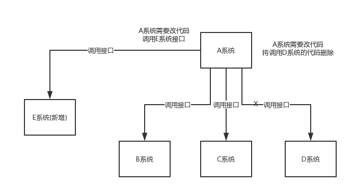

# MQ

## MQ核心应用场景

### 解耦

即系统之间没有强关联，只通过MQ做关联，系统之间可以选择是否消费MQ来决定是否对某系统的某操作做出响应，区别于系统之间的远程调用的强关联，MQ可以极大降低系统之间的耦合

### 异步

在一个请求需要做多个操作并且耗时较长时，可以考虑将耗时操作变更为异步操作，提升用户体验

### 削峰

系统在某一个时间段可能达到远远超过普通时段的每秒并发请求，请求量甚至可以让 MySQL 宕机，但该时间段的占比非常少，增加机器会浪费资源，此时可以使用 MQ 来对该时间段进行削峰

使用 MQ ，在高峰时段，将请求写入 MQ ，由系统拉取消息进行消费，此时对于系统的处理速度并不会有压力，高峰期的大量请求会挤压在 MQ 中，但 MQ 的设计足以扛住高峰期的大量并发

即利用空闲时段资源处理高峰期请求

## MQ存在的缺陷

+ **降低可用性**：
  + 系统引入的外部依赖越多，越容易挂掉
  + 当 MQ 挂掉时，可能导致多个系统不可用
  + 关于 [MQ 高可用](./MQ-高可用.md)
+ **系统复杂度上升**：
  + 需要保证消息不重复消费
  + 需要保证消息的传递性
+ **一致性问题**：
  + 当多个系统依赖同一个消息时，需要保证依赖该消息的所有系统都成功消费

## Kafka、ActiveMQ、RabbitMQ、RocketMQ

| 特性 | ActiveMQ | RabbitMQ | RocketMQ | Kafka |
|---|---|---|---|---|
| 单机吞吐量 | 万级，比 RocketMQ、Kafka 低一个数量级 | 同 ActiveMQ | 10 万级，支撑高吞吐 | 10 万级，高吞吐，一般配合大数据类的系统来进行实时数据计算、日志采集等场景 |
| topic 数量对吞吐量的影响 | | | topic 可以达到几百/几千的级别，吞吐量会有较小幅度的下降，这是 RocketMQ 的一大优势，在同等机器下，可以支撑大量的 topic | topic 从几十到几百个时候，吞吐量会大幅度下降，在同等机器下，Kafka 尽量保证 topic 数量不要过多，如果要支撑大规模的 topic，需要增加更多的机器资源 |
| 时效性 | ms 级 | 微秒级，这是 RabbitMQ 的一大特点，延迟最低 | ms 级 | 延迟在 ms 级以内 |
| 可用性 | 高，基于主从架构实现高可用 | 同 ActiveMQ | 非常高，分布式架构 | 非常高，分布式，一个数据多个副本，少数机器宕机，不会丢失数据，不会导致不可用 |
| 消息可靠性 | 有较低的概率丢失数据 | 基本不丢 | 经过参数优化配置，可以做到 0 丢失 | 同 RocketMQ |
| 功能支持 | MQ 领域的功能极其完备 | 基于 erlang 开发，并发能力很强，性能极好，延时很低 | MQ 功能较为完善，还是分布式的，扩展性好 | 功能较为简单，主要支持简单的 MQ 功能，在大数据领域的实时计算以及日志采集被大规模使用 |

## 关于 MQ 的选择

+ 一般的业务系统要引入 MQ，最早大家都用 ActiveMQ，但是现在确实大家用的不多了，没经过大规模吞吐量场景的验证，社区也不是很活跃，现在并不建议使用
+ RabbitMQ，erlang 语言阻止了大量的 Java 工程师去深入研究和掌控它，对公司而言，几乎处于不可控的状态，但是确实人家是开源的，比较稳定的支持，活跃度也高
+ RocketMQ，阿里出品，但社区可能有突然黄掉的风险（目前 RocketMQ 已捐给 [Apache](https://github.com/apache/rocketmq)，但 GitHub 上的活跃度其实不算高）对自己公司技术实力有绝对自信的，推荐用 RocketMQ
+ 技术实力较为一般，技术挑战不是特别高，用 RabbitMQ 是不错的选择
+ 基础架构研发实力较强，用 RocketMQ 是很好的选择
+ 如果是**大数据领域**的实时计算、日志采集等场景， Kafka 是业内标准的，社区活跃度很高，绝对不会黄，何况几乎是全世界这个领域的事实性规范
