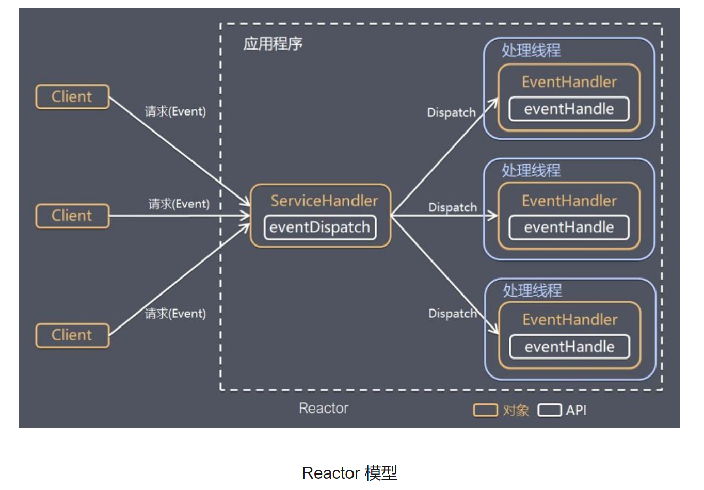
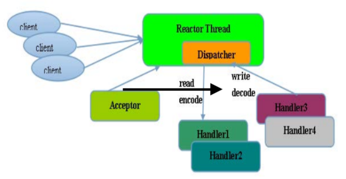
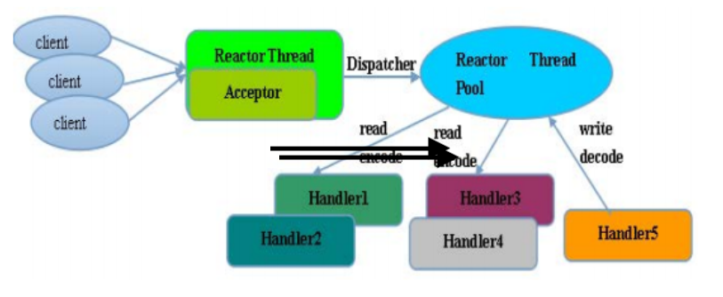
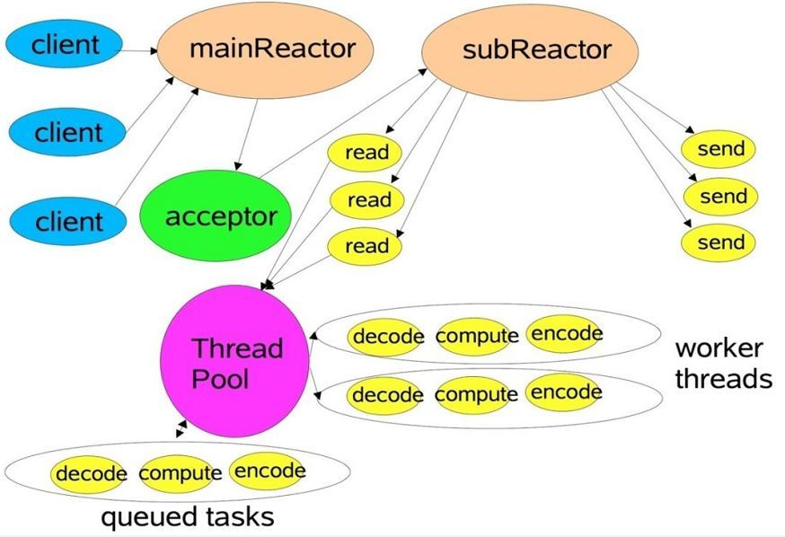
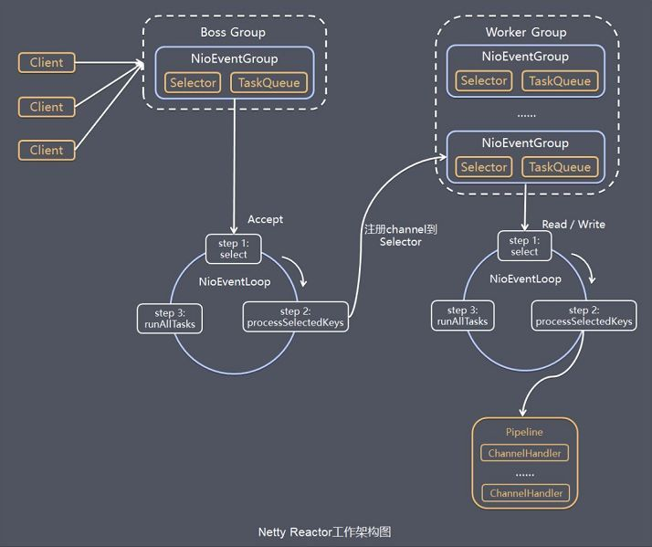
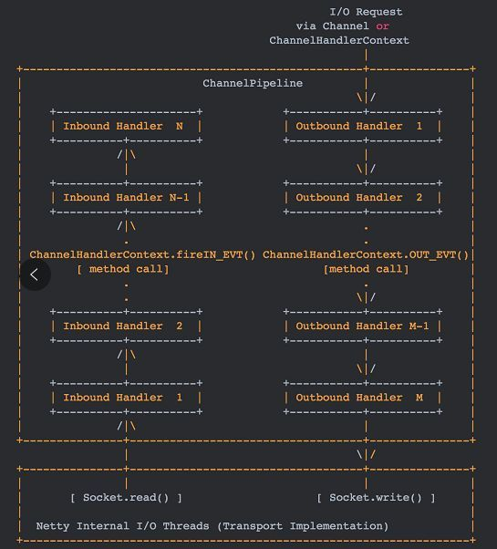
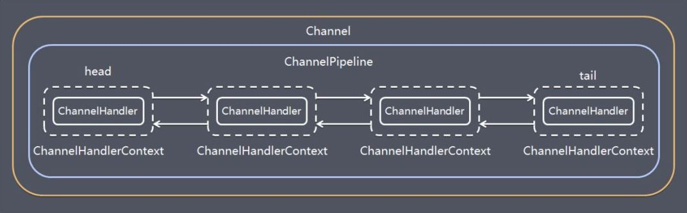
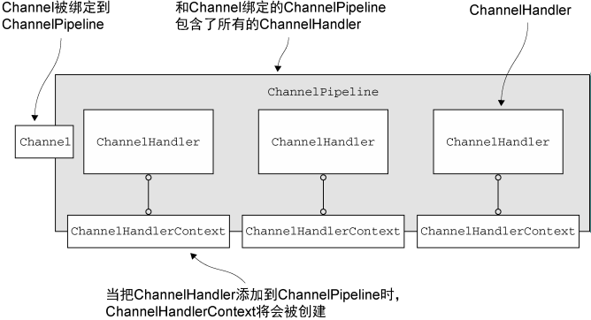

# Netty

---

[参考链接：彻底搞懂 netty 线程模型](https://www.cnblogs.com/luoxn28/p/11875340.html)

[参考链接：这可能是目前最透彻的Netty原理架构解析](https://www.sohu.com/a/272879207_463994)

[参考链接：Netty实战入门详解——让你彻底记住什么是Netty（看不懂你来找我）](https://www.cnblogs.com/nanaheidebk/p/11025362.html)

[参考链接：《跟闪电侠学Netty》开篇：Netty是什么？](https://www.jianshu.com/p/a4e03835921a)

---

## Netty Demo

### Netty Server

```java
package top.tjsanshao;

import io.netty.bootstrap.ServerBootstrap;
import io.netty.channel.ChannelHandlerContext;
import io.netty.channel.ChannelInitializer;
import io.netty.channel.SimpleChannelInboundHandler;
import io.netty.channel.nio.NioEventLoopGroup;
import io.netty.channel.socket.nio.NioServerSocketChannel;
import io.netty.channel.socket.nio.NioSocketChannel;
import io.netty.handler.codec.string.StringDecoder;

/**
 * netty server demo
 *
 * @author TjSanshao
 * @date 2020-06-30 15:49
 */
public class NettyServerDemo {
    public static void main(String[] args) {
        startServer();
    }

    private static void startServer() {
        // 新建启动辅助类，该类用来装配Netty启动的组件
        ServerBootstrap serverBootstrap = new ServerBootstrap();

        // 新建2个NioEventLoopGroup实例
        // 可以理解这2个NioEventLoopGroup实例是2个线程池，默认的线程数为CPU*2
        // parentGroup用于监听客户端请求，并将后续操作交由childGroup处理
        // 这里其实和NIO差不多，分别有线程用于监听和处理后续操作
        final NioEventLoopGroup parentGroup = new NioEventLoopGroup();
        final NioEventLoopGroup childGroup = new NioEventLoopGroup();

        // group方法即装配线程池
        // channel方法用于指定服务器端监听套接字通道 NioServerSocketChannel，其内部管理了一个 Java NIO 中的ServerSocketChannel实例
        // childHandler方法用于设置业务责任链，主要的操作将集中在这里
        serverBootstrap.group(parentGroup, childGroup).channel(NioServerSocketChannel.class).childHandler(new ChannelInitializer<NioSocketChannel>() {
            // 这里编写匿名内部类继承ChannelInitializer抽象类并实现抽象方法initChannel
            // ChannelInitializer 继承 ChannelInboundHandlerAdapter，用于初始化 Channel 的 ChannelPipeline
            // 通过 initChannel 方法参数 nioSocketChannel 得到 ChannelPipeline 的一个实例
            // 当一个新的连接被接受时， 一个新的 Channel （NioSocketChannel，对应NIO中的SocketChannel） 将被创建，同时它会被自动地分配到它专属的 ChannelPipeline
            // ChannelPipeline 提供了 ChannelHandler 链的容器
            @Override
            protected void initChannel(NioSocketChannel nioSocketChannel) throws Exception {
                // 使用addLast方法将一个一个的 ChannelHandler 添加到责任链上并给它们取个名称（不取也可以，Netty 会给它个默认名称），这样就形成了链式结构
                nioSocketChannel.pipeline().addLast(new StringDecoder());
                nioSocketChannel.pipeline().addLast(new SimpleChannelInboundHandler<String>() {
                    @Override
                    protected void channelRead0(ChannelHandlerContext channelHandlerContext, String s) throws Exception {
                        System.out.println(s);
                    }
                });
            }
        }).bind(9090);
        // 上面使用bind方法绑定端口
    }
}
```

### Netty Client

```java
package top.tjsanshao;

import io.netty.bootstrap.Bootstrap;
import io.netty.channel.Channel;
import io.netty.channel.ChannelInitializer;
import io.netty.channel.nio.NioEventLoopGroup;
import io.netty.channel.socket.nio.NioSocketChannel;
import io.netty.handler.codec.string.StringEncoder;

import java.util.concurrent.TimeUnit;

/**
 * netty client demo
 *
 * @author TjSanshao
 * @date 2020-06-30 16:49
 */
public class NettyClientDemo {
    public static void main(String[] args) {
        startClient();
    }

    private static void startClient() {
        // Netty启动辅助类
        Bootstrap bootstrap = new Bootstrap();

        // 做处理操作的线程池
        final NioEventLoopGroup group = new NioEventLoopGroup();

        // 装配线程池
        // 使用channel方法指定监听套接字通道NioSocketChannel
        // 使用Handler方法设置责任链
        // 这里的操作和NIO非常相似，但用起来更加简单，更多的是有种声明式的感觉
        bootstrap.group(group).channel(NioSocketChannel.class).handler(new ChannelInitializer<Channel>() {
            @Override
            protected void initChannel(Channel channel) throws Exception {
                // 添加一个ChannelHandler
                channel.pipeline().addLast(new StringEncoder());
            }
        });
        // 连接服务器，并开启通道
        final Channel channel = bootstrap.connect("127.0.0.1", 9090).channel();
        while (true) {
            // 每隔2秒向服务器发送时间戳
            try {
                channel.writeAndFlush(System.currentTimeMillis() + "-> Hello World!");
                TimeUnit.SECONDS.sleep(2);
            } catch (InterruptedException e) {
                e.printStackTrace();
            }
        }
    }
}
```

## Netty与NIO

+ JDK原生NIO从1.4开始，但是存在一系列的问题
  + NIO 的类库和 API 繁杂，使用麻烦，甚至有些反人类
  + 需要具备其他的额外技能做铺垫，例如熟悉 Java 多线程编程，因为 NIO 编程涉及到 Reactor 模式，必须对多线程和网路编程非常熟悉，才能编写出高质量的 NIO 程序
  + 可靠性能力不齐，开发工作量和难度都非常大，例如客户端面临断连重连、网络闪断、半包读写、失败缓存、网络拥塞和异常码流的处理等等，NIO 编程的特点是功能开发相对容易，但是可靠性能力补齐工作量和难度都非常大
  + JDK NIO 的 Bug，例如臭名昭著的 Epoll Bug，它会导致 Selector 空轮询，最终导致 CPU 100%，官方声称在 JDK 1.6 版本的 update 18 修复了该问题，但是直到 JDK 1.7 版本该问题仍旧存在，只不过该 Bug 发生概率降低了一些而已，它并没有被根本解决

+ Netty
  + Netty 对 JDK 自带的 NIO 的 API 进行封装，解决上述问题
  + 设计优雅，适用于各种传输类型的统一 API 阻塞和非阻塞 Socket；基于灵活且可扩展的事件模型，可以清晰地分离关注点；高度可定制的线程模型 - 单线程，一个或多个线程池；真正的无连接数据报套接字支持（自 3.1 起）
  + 使用方便，详细记录的 Javadoc，用户指南和示例；没有其他依赖项，JDK 5（Netty 3.x）或 6（Netty 4.x）就足够了
  + 高性能，吞吐量更高，延迟更低；减少资源消耗；最小化不必要的内存复制
  + 安全，完整的 SSL/TLS 和 StartTLS 支持
  + 社区活跃，不断更新，社区活跃，版本迭代周期短，发现的 Bug 可以被及时修复，同时，更多的新功能会被加入

一句话总结： `Netty 对 NIO 弃其糟粕，取其精华`

## Netty 线程模型

### Reactor 线程模型

+ Reactor 是反应堆的意思，Reactor 模型是指`通过一个或多个输入同时传递给服务处理器的服务请求的事件驱动处理模式`
+ 服务端程序处理传入多路请求，并将它们同步分派给请求对应的处理线程，Reactor 模式也叫 Dispatcher 模式，`即 I/O 多了复用统一监听事件，收到事件后分发(Dispatch 给某进程)`，是编写高性能网络服务器的必备技术之一
+ Reactor 模型中有 2 个关键组成:
  + Reactor：Reactor 在一个单独的线程中运行，`负责监听和分发事件`，分发给适当的处理程序来对 IO 事件做出反应
  + Handlers：处理程序执行 I/O 事件要完成的实际事件，Reactor 通过调度适当的处理程序来响应 I/O 事件，处理程序执行非阻塞操作



取决于 Reactor 的数量和 Hanndler 线程数量的不同，Reactor 模型有 3 个变种：

+ 单 Reactor 单线程
+ 单 Reactor 多线程
+ 主从 Reactor 多线程

可以这样理解，Reactor 就是一个执行 while (true) { selector.select(); …} 循环的线程，会源源不断的产生新的事件，称作反应堆很贴切

### Netty单线程模型

+ Reactor 单线程模型，是指`所有的 I/O 操作都在同一个 NIO 线程上面完成的`，此时NIO线程职责包括：接收新建连接请求、读写操作等，在一些小容量应用场景下，可以使用单线程模型



`注意，Redis的请求处理也是单线程模型，为什么Redis的性能会如此之高呢？因为Redis的读写操作基本都是内存操作，并且Redis协议比较简洁，序列化/反序列化耗费性能更低`

对于高负载、大并发的应用场景却不合适，主要原因如下:

+ 一个NIO线程同时处理成百上千的连接，性能上无法支撑，即便NIO线程的CPU负荷达到100%，也无法满足海量消息的编码、解码、读取和发送
+ 当NIO线程负载过重之后，处理速度将变慢，这会导致大量客户端连接超时，超时之后往往会进行重发，这更加重了NIO线程的负载，最终会导致大量消息积压和处理超时，成为系统的性能瓶颈
+ 可靠性问题：一旦NIO线程意外跑飞，或者进入死循环，会导致整个系统通信模块不可用，不能接收和处理外部消息，造成节点故障

### Netty多线程模型

+ 即单 Reactor 多线程
+ Rector 多线程模型与单线程模型最大的区别就是有一组 NIO 线程来处理连接读写操作，一个NIO线程处理Accept
+ 一个NIO线程可以处理多个连接事件，一个连接的事件只能属于一个NIO线程



+ 在个别特殊场景中，一个 NIO 线程负责监听和处理所有的客户端连接可能会存在性能问题
+ 例如并发百万客户端连接，或者服务端需要对客户端握手进行安全认证，但是认证本身非常损耗性能，在这类场景下，单独一个 Acceptor 线程可能会存在性能不足的问题，为了解决性能问题，产生了第三种 Reactor 线程模型——主从Reactor 多线程模型

### Netty主从多线程模型

+ 主从 Reactor 线程模型的特点是：服务端用于接收客户端连接的不再是一个单独的 NIO 线程，而是一个独立的 NIO 线程池
+ Acceptor 接收到客户端 TCP连接请求并处理完成后（可能包含接入认证等），将新创建的 SocketChannel注 册 到 I/O 线 程 池（sub reactor 线 程 池）的某个I/O线程上， 由它负责SocketChannel 的读写和编解码工作
+ Acceptor 线程池仅仅用于客户端的登录、握手和安全认证，一旦链路建立成功，就将链路注册到后端 subReactor 线程池的 I/O 线程上，由 I/O 线程负责后续的 I/O 操作





`特别说明的是：虽然 Netty 的线程模型基于主从 Reactor 多线程，借用了 MainReactor 和 SubReactor 的结构，但是实际实现上 SubReactor 和 Worker 线程在同一个线程池中`

### Netty IO

+ 异步的概念和同步相对，当一个异步过程调用发出后，调用者不能立刻得到结果。实际处理这个调用的部件在完成后，通过状态、通知和回调来通知调用者
+ Netty 中的 I/O 操作是异步的，包括 Bind、Write、Connect 等操作会简单的返回一个 ChannelFuture
+ 调用者并不能立刻获得结果，而是通过 Future-Listener 机制，用户可以方便的主动获取或者通过通知机制获得 IO 操作结果
+ 当 Future 对象刚刚创建时，处于非完成状态，调用者可以通过返回的 ChannelFuture 来获取操作执行的状态，注册监听函数来执行完成后的操作
+ 相比传统阻塞 I/O，执行 I/O 操作后线程会被阻塞住, 直到操作完成；异步处理的好处是不会造成线程阻塞，线程在 I/O 操作期间可以执行别的程序，在高并发情形下会更稳定和更高的吞吐量

## Netty组件

### Bootstrap、ServerBootstrap

Bootstrap 意思是引导，一个 Netty 应用通常由一个 Bootstrap 开始，主要作用是配置整个 Netty 程序，串联各个组件，Netty 中 Bootstrap 类是客户端程序的启动引导类，ServerBootstrap 是服务端启动引导类

### Future、ChannelFuture

通过 Future 和 ChannelFutures，可以注册一个监听，当操作执行成功或失败时监听会自动触发注册的监听事件

### Channel

Netty 网络通信的组件，能够用于执行网络 I/O 操作，Channel 为用户提供：

+ 当前网络连接的通道的状态（例如是否打开？是否已连接？）
+ 网络连接的配置参数 （例如接收缓冲区大小）
+ 提供异步的网络 I/O 操作(如建立连接，读写，绑定端口)，异步调用意味着任何 I/O 调用都将立即返回，并且不保证在调用结束时所请求的 I/O 操作已完成， 调用立即返回一个 ChannelFuture 实例，通过注册监听器到 ChannelFuture 上，可以 I/O 操作成功、失败或取消时回调通知调用方
+ 支持关联 I/O 操作与对应的处理程序
+ 以下是常用的Channel：
  + NioSocketChannel，异步的客户端 TCP Socket 连接
  + NioServerSocketChannel，异步的服务器端 TCP Socket 连接
  + NioDatagramChannel，异步的 UDP 连接
  + NioSctpChannel，异步的客户端 Sctp 连接
  + NioSctpServerChannel，异步的 Sctp 服务器端连接，这些通道涵盖了 UDP 和 TCP 网络 IO 以及文件 IO

### Selector

+ Netty 基于 Selector 对象实现 I/O 多路复用，通过 Selector 一个线程可以监听多个连接的 Channel 事件
+ 当向一个 Selector 中注册 Channel 后，Selector 内部的机制就可以自动不断地查询(Select) 这些注册的 Channel 是否有已就绪的 I/O 事件（例如可读，可写，网络连接完成等），这样程序就可以很简单地使用一个线程高效地管理多个 Channel

### NioEventLoop

+ NioEventLoop 中维护了一个线程和任务队列，支持异步提交执行任务，线程启动时会调用 NioEventLoop 的 run 方法，执行 I/O 任务和非 I/O 任务：
  + I/O 任务，即 selectionKey 中 ready 的事件，如 accept、connect、read、write 等，由 processSelectedKeys 方法触发
  + 非 IO 任务，添加到 taskQueue 中的任务，如 register0、bind0 等任务，由 runAllTasks 方法触发
+ 两种任务的执行时间比由变量 ioRatio 控制，默认为 50，则表示允许非 IO 任务执行的时间与 IO 任务的执行时间相等

### NioEventLoopGroup

+ NioEventLoopGroup，主要管理 eventLoop 的生命周期，可以理解为一个线程池，内部维护了一组线程，每个线程(NioEventLoop)负责处理多个 Channel 上的事件，而一个 Channel 只对应于一个线程

### ChannelHandler

+ ChannelHandler 是一个接口，处理 I/O 事件或拦截 I/O 操作，并将其转发到其 ChannelPipeline(业务处理链)中的下一个处理程序
+ ChannelHandler 本身并没有提供很多方法，因为这个接口有许多的方法需要实现，方便使用期间，可以继承它的子类：
  + ChannelInboundHandler 用于处理入站 I/O 事件
  + ChannelOutboundHandler 用于处理出站 I/O 操作
+ 或者使用以下适配器类：
  + ChannelInboundHandlerAdapter 用于处理入站 I/O 事件
  + ChannelOutboundHandlerAdapter 用于处理出站 I/O 操作
  + ChannelDuplexHandler 用于处理入站和出站事件

### ChannelHandlerContext

保存 Channel 相关的所有上下文信息，同时关联一个 ChannelHandler 对象

### ChannelPipline

+ 保存 ChannelHandler 的 List，用于处理或拦截 Channel 的入站事件和出站操作
+ ChannelPipeline 实现了一种高级形式的拦截过滤器模式，使用户可以完全控制事件的处理方式，以及 Channel 中各个的 ChannelHandler 如何相互交互
+ I/O 事件由 ChannelInboundHandler 或 ChannelOutboundHandler 处理，并通过调用 ChannelHandlerContext 中定义的事件传播方法



+ 入站事件由自下而上方向的入站处理程序处理，如图左侧所示，入站 Handler 处理程序通常处理由图底部的 I/O 线程生成的入站数据，通常通过实际输入操作（例如 SocketChannel.read（ByteBuffer））从远程读取入站数据

+ 出站事件由上下方向处理，如图右侧所示，出站 Handler 处理程序通常会生成或转换出站传输，例如 write 请求，I/O 线程通常执行实际的输出操作，例如 SocketChannel.write（ByteBuffer）

+ 在 Netty 中每个 Channel 都有且仅有一个 ChannelPipeline 与之对应，它们的组成关系如下：



+ 一个 Channel 包含了一个 ChannelPipeline，而 ChannelPipeline 中又维护了一个由 ChannelHandlerContext 组成的双向链表，并且每个 ChannelHandlerContext 中又关联着一个 ChannelHandler
+ 入站事件和出站事件在一个双向链表中，入站事件会从链表 head 往后传递到最后一个入站的 handler，出站事件会从链表 tail 往前传递到最前一个出站的 handler，两种类型的 handler 互不干扰

### Channel、ChannelPipeline、ChannelHandler、ChannelHandlerContext 之间的关系

+ `Netty 中的 Channel 是框架自己定义的一个通道接口`，Netty 实现的客户端 NIO 套接字通道是 NioSocketChannel，提供的服务器端 NIO 套接字通道是 NioServerSocketChannel
+ 当服务端和客户端建立一个新的连接时，`一个新的 Channel 将被创建，同时它会被自动地分配到它专属的 ChannelPipeline`
+ `ChannelPipeline 是一个拦截流经 Channel 的入站和出站事件的 ChannelHandler 实例链`，并定义了用于在该链上传播入站和出站事件流的 API
+ `ChannelHandler` 之间的交互是组成`一个应用程序数据和事件处理逻辑的核心`
+ ChannelHandler分为 `ChannelInBoundHandler` 和 `ChannelOutboundHandler` 两种，如果一个入站 IO 事件被触发，这个事件会从第一个开始依次通过 ChannelPipeline中的 ChannelInBoundHandler，`先添加的先执行`
+ 若是一个出站 I/O 事件，则会从最后一个开始依次通过 ChannelPipeline 中的 ChannelOutboundHandler，`后添加的先执行`，然后通过`调用在 ChannelHandlerContext 中定义的事件传播方法传递给最近的 ChannelHandler`
+ 在 ChannelPipeline 传播事件时，它会测试 ChannelPipeline 中的下一个 ChannelHandler 的类型是否和事件的运动方向相匹配
+ 如果某个ChannelHandler不能处理则会跳过，并将事件传递到下一个ChannelHandler，直到它找到和该事件所期望的方向相匹配的为止
+ `ChannelHandlerContext 代表了 ChannelHandler 和 ChannelPipeline 之间的关联`，每当有 ChannelHandler 添加到 ChannelPipeline 中时，都会创建 ChannelHandlerContext
+ ChannelHandlerContext 的主要功能是管理它所关联的 ChannelHandler 和在同一个 ChannelPipeline 中的其他 ChannelHandler 之间的交互，事件从一个 ChannelHandler 到下一个 ChannelHandler 的移动是由 ChannelHandlerContext 上的调用完成的



## Netty Http Server Demo

```java
package top.tjsanshao;

import io.netty.bootstrap.ServerBootstrap;
import io.netty.buffer.ByteBuf;
import io.netty.buffer.Unpooled;
import io.netty.channel.ChannelHandlerContext;
import io.netty.channel.ChannelInitializer;
import io.netty.channel.SimpleChannelInboundHandler;
import io.netty.channel.nio.NioEventLoopGroup;
import io.netty.channel.socket.nio.NioServerSocketChannel;
import io.netty.channel.socket.nio.NioSocketChannel;
import io.netty.handler.codec.http.DefaultFullHttpResponse;
import io.netty.handler.codec.http.FullHttpRequest;
import io.netty.handler.codec.http.HttpHeaderNames;
import io.netty.handler.codec.http.HttpObjectAggregator;
import io.netty.handler.codec.http.HttpResponseStatus;
import io.netty.handler.codec.http.HttpServerCodec;
import io.netty.handler.codec.http.HttpVersion;
import io.netty.handler.codec.string.StringDecoder;
import io.netty.util.CharsetUtil;

/**
 * netty server demo
 *
 * @author TjSanshao
 * @date 2020-06-30 15:49
 */
public class NettyServerDemo {
    public static void main(String[] args) {
        startServer();
    }

    private static void startServer() {
        // 新建启动辅助类，该类用来装配Netty启动的组件
        ServerBootstrap serverBootstrap = new ServerBootstrap();

        // 新建2个NioEventLoopGroup实例
        // 可以理解这2个NioEventLoopGroup实例是2个线程池，默认的线程数为CPU*2
        // parentGroup用于监听客户端请求，并将后续操作交由childGroup处理
        // 这里其实和NIO差不多，分别有线程用于监听和处理后续操作
        final NioEventLoopGroup parentGroup = new NioEventLoopGroup();
        final NioEventLoopGroup childGroup = new NioEventLoopGroup();

        // group方法即装配线程池
        // channel方法用于指定服务器端监听套接字通道 NioServerSocketChannel，其内部管理了一个 Java NIO 中的ServerSocketChannel实例
        // childHandler方法用于设置业务责任链，主要的操作将集中在这里
        serverBootstrap.group(parentGroup, childGroup).channel(NioServerSocketChannel.class).childHandler(new ChannelInitializer<NioSocketChannel>() {
            // 这里编写匿名内部类继承ChannelInitializer抽象类并实现抽象方法initChannel
            // ChannelInitializer 继承 ChannelInboundHandlerAdapter，用于初始化 Channel 的 ChannelPipeline
            // 通过 initChannel 方法参数 nioSocketChannel 得到 ChannelPipeline 的一个实例
            // 当一个新的连接被接受时， 一个新的 Channel （NioSocketChannel，对应NIO中的SocketChannel） 将被创建，同时它会被自动地分配到它专属的 ChannelPipeline
            // ChannelPipeline 提供了 ChannelHandler 链的容器
            @Override
            protected void initChannel(NioSocketChannel nioSocketChannel) throws Exception {
                // 使用addLast方法将一个一个的 ChannelHandler 添加到责任链上并给它们取个名称（不取也可以，Netty 会给它个默认名称），这样就形成了链式结构
                nioSocketChannel.pipeline().addLast(new StringDecoder());
                nioSocketChannel.pipeline().addLast(new SimpleChannelInboundHandler<String>() {
                    @Override
                    protected void channelRead0(ChannelHandlerContext channelHandlerContext, String s) throws Exception {
                        System.out.println(s);
                        // 这里必须调用fireChannelRead，才可以让数据流继续在channel中流动，下一个handler才能执行，并且需要需要转为字节流
                        // 一旦有其中一个InBoundHandler没有调用，Pipeline中断
                        channelHandlerContext.fireChannelRead(Unpooled.copiedBuffer(s, CharsetUtil.UTF_8));
                    }
                });
                nioSocketChannel.pipeline().addLast(new HttpServerCodec());
                nioSocketChannel.pipeline().addLast(new HttpObjectAggregator(65536));
                nioSocketChannel.pipeline().addLast(new SimpleChannelInboundHandler<FullHttpRequest>() {
                    @Override
                    protected void channelRead0(ChannelHandlerContext channelHandlerContext, FullHttpRequest request) throws Exception {
                        // 实现一个简单的http server
                        System.out.println("Remote Address:" + channelHandlerContext.channel().remoteAddress());
                        System.out.println("Method:" + request.method().name());
                        System.out.println(request.headers());
                        System.out.println("Content:" + request.content().toString(CharsetUtil.UTF_8));

                        final ByteBuf resBuf = Unpooled.copiedBuffer("Hello World!", CharsetUtil.UTF_8);
                        final DefaultFullHttpResponse response = new DefaultFullHttpResponse(HttpVersion.HTTP_1_1, HttpResponseStatus.OK, resBuf);
                        response.headers().add(HttpHeaderNames.CONTENT_TYPE, "text/plain");
                        response.headers().add(HttpHeaderNames.CONTENT_LENGTH, resBuf.readableBytes());

                        // 调用channelHandlerContext.writeAndFlush将会直接触发OutBoundHandler执行，且从当前位置开始按照Handler添加顺序逆序执行
                        // 即无论该Handler后面是否仍然添加了任何InBoundHandler或OutBoundHandler，都不会继续执行了
                        // 建议在添加Handler时，使用addFirst添加OutBoundHandler，使用addLast添加所有InBoundHandler，以保证InBound中调用writeAndFlush时，所有的OutBoundHandler都能执行
                        // 注意：InBoundHandler中的数据流往下传输使用fireChannelRead，但OutBoundHandler的数据流往下传输必须使用Write方法，一旦有一个没有调用，该Pipeline中断，内容将不会返回，即客户端收不到服务端返回的消息
                        // 注意，不要在OutBoundHandler中调用channelHandlerContext.channel().writeAndFlush()，否则将会进入死循环
                        // channelHandlerContext.channel().writeAndFlush()方法不是从当前handler开始往前调用OutBoundHandler，而是会执行所有的OutBoundHandler
                        channelHandlerContext.writeAndFlush(response);
                    }
                });
            }
        }).bind(9090);
        // 上面使用bind方法绑定端口
    }
}
```
