# 网络层

1. 网络层是OSI参考模型中的第三层，介于传输层和数据链路层之间，它在数据链路层提供的两个相邻端点之间的数据帧的传送功能上（**可以理解为网络层提供2个通信端点之间的通信管理，而链路层则只关注相邻的2个节点的通信**），进一步管理网络中的数据通信，将数据设法从源端经过若干个中间节点传送到目的端，从而向运输层提供最基本的端到端的数据传送服务
2. 网络层向上只提供简单灵活的、无连接的，尽最大努力交付的数据报服务
3. 服务类型：
    1. 虚电报服务（可靠通信应当由网络来保证）
    2. 数据报服务（TCP/UDP采用：可靠通信应当由用户主机来保证）

## 网络层协议

**网际协议 IP** 是 TCP/IP 体系中两个最主要的协议之一

与 IP 协议配套使用的还有三个协议：
1. 地址解析协议 ARP (Address Resolution Protocol)
2. 网际控制报文协议 ICMP (Internet Control Message Protocol)
3. 网际组管理协议 IGMP (Internet Group Management Protocol)

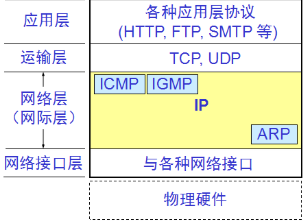

**虚拟互连网络**，当互联网上的主机进行通信时，就好像在一个网络上通信一样，而看不见各自具体的网络异构细节，利用IP协议就可以使这些性能各异的主机看起来好像一个统一的网络，**只要通过寻址，就可以完成交互**

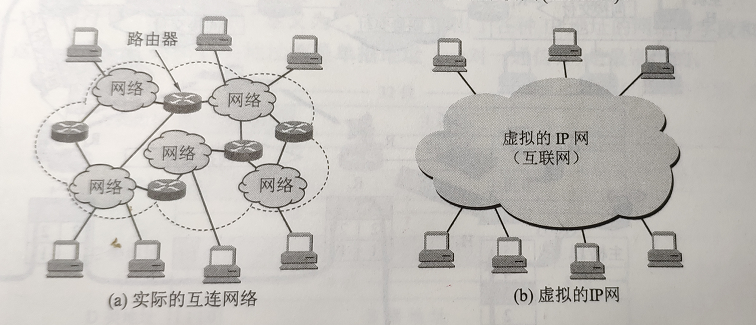

## IP地址：每个主机或路由器的每一个接口的唯一标识符

IP地址分类：

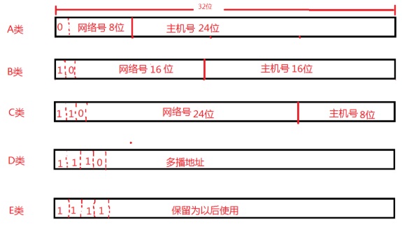

一个IP地址在整个因特网范围内是唯一的，这种两级的IP地址可以记为 **IP地址 ::= {<网络号>,<主机号>}**

IP地址的重要特点：
1. IP地址管理机构在分配IP地址时只分配网络号(第一级)，而剩下的主机号(第二级)则由得到该网络号的单位自行分配，这样就方便了IP地址的管理
2. 路由器仅根据目的主机所连接的网络号来转发分组(而不考虑目的主机号)，这样就可以使路由表中的项目数大幅度减少，从而减小了路由表所占的存储空间以及查找路由表的时间

## 地址解析协议ARP：通过目标设备的IP地址，查询目标设备的MAC地址，以保证通信的顺利进行

使用 ```arp -a```查看本地ARP映射表

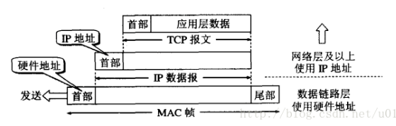

+ 在发送数据时，数据从高层到低层，然后才到通信链路上传输
+ 使用IP地址的IP数据报一旦交给了数据链路层，就被封装成了MAC帧
+ MAC帧在传送时使用的源地址和目的地址都是**硬件地址**，连接在通信链路上的设备（主机或路由器）在接收MAC帧时，根据是MAC帧首部的硬件地址
+ **在数据链路层看不到隐藏在MAC帧中的IP地址**
+ 只有在剥去MAC帧的首部和尾部后把MAC层的数据交给网络层后，网络层才能在IP数据报的首部中找到源IP地址和目的IP地址

在每台TCP/IP协议的电脑或路由器里都有一个ARP缓存表，表里的IP地址与MAC地址是一一对应的 
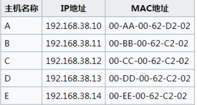

**ARP 工作流程**如下

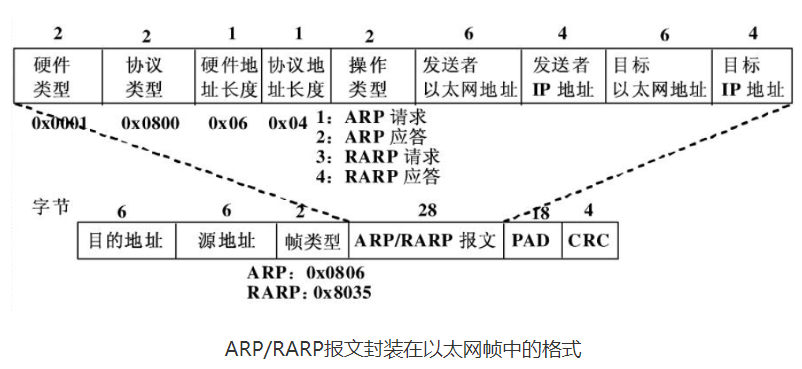

1. 当主机A要想向本局域网上的某个主机B发送IP数据报时，就先在其ARP高速缓存中查看有无主机B的IP地址，若有则在ARP高速缓存中查出其对应的硬件地址，再**把这个硬件地址写入MAC帧**，然后通过局域网把该MAC帧发往此硬件地址
	如果在ARP缓存表中查询不到，则主机A会自动运行ARP
    a. ARP进程在本局域网上广播发送一个ARP请求分组，请求的主要内容大意是：“我的IP地址时209.0.0.5，硬件地址是00-00-C0-15-AD-18。我想知道IP地址为209.0.0.6的主机的硬件地址。”
    b. 在本局域网上的所有主机上运行的ARP进程都收到此ARP请求分组
    c. 主机B在ARP请求分组中见到自己的IP地址，就向主机A发送ARP响应分组，并写入自己的硬件地址，其余的所有主机都不理睬这个ARP请求分组，ARP响应分组的主要内容是“我的IP地址是209.0.0.6，我的硬件地址是08-00-2B-00-EE-0A。”（注意：**ARP请求分组是广播发送的**，**ARP响应分组是普通的单播**，即从一个源地址发送到一个目的地址，同时主机A的这一地址映射也写入了主机B自己的ARP高速缓存中）
    d. 主机A收到主机B的ARP响应分组后，就在其ARP高速缓存中写入主机B的IP地址到硬件地址的映射
2. **注意：ARP 是解决同一个局域网上的主机或路由器的 IP 地址和硬件地址的映射问题**

**对于不在同一个子网的主机，并不需要知道其硬件地址，因为不会进行直接MAC帧传输，只需要先通过IP地址找到路由器（硬件地址），发送到路由器即可**
**发送方主机通过ARP找到一个本子网的某个路由器硬件地址，通过MAC帧把分组发送到路由器，路由器会通过相同的方式（IP，ARP）转发到下一个子网，剩下的发送工作则由下一个子网来完成**

## IP数据报的格式

一个IP数据报由**首部**和**数据**2部分组成
首部的前一部分是固定长度，**共20字节**，是所有IP数据报**必须具有**的

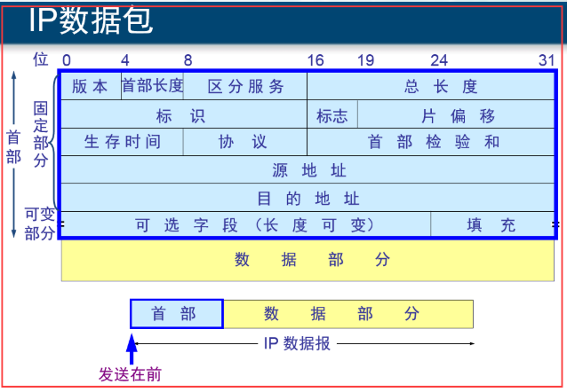

生存时间（TTL：Time To Live）：一个数据报每经过一个路由器，值减一，当值为0时，丢弃该数据报

### IP数据报分片——Fragmentation和重组

在TCP/IP分层中，数据链路层用**MTU（Maximum Transmission Unit，最大传输单元）**来限制所能传输的数据包大小，MTU是指**一次传送的数据最大长度**，不包括数据链路层数据帧的帧头，如以太网的MTU为1500字节，实际上数据帧的最大长度为1512字节，其中以太网数据帧的帧头为12字节（不包含FCS帧校验序列）

当**发送的IP数据报的大小超过了MTU**时，IP层就需要**对数据进行分片**，否则数据将无法发送成功

MTU （最大传输单元）决定 IP报文是否分片

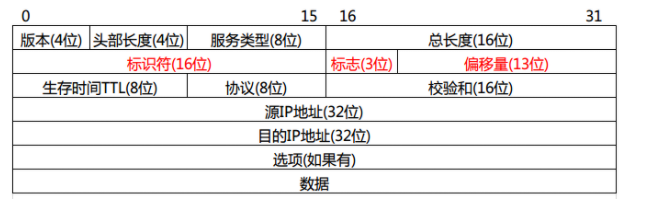

IP协议**理论上**允许的最大IP数据报为**65535字节**（16位来表示包总长）
协议栈网络层下面的数据链路层一般允许的帧长远远小于这个值，例如以太网的MTU（即Maximum Transmission Unit，最大传输单元）通常在1500字节左右
较大的IP数据包会被分片传递给数据链路层发送，分片的IP数据报可能会以不同的路径传输到接收主机，接收主机通过一系列的重组，将其还原为一个完整的IP数据报，再提交给上层协议处理
红色字段便是被设计用来处理IP数据包分片和重组的

+ **标识符（16位）**，协议栈应该保证来自同一个数据报的若干分片必须有一样的值
+ 其次是**标志位3位**分别是**R（保留位，未使用）位**、**DF（Do not Fragment，不允许分段）位**和**MF（More Fragment）位**，**MF**位为**1**表示当前数据报**还有更多的分片**，为**0**表示当前分片是该数据报**最后一个分片**
+ **偏移量（13位）**，表示**当前数据报分片数据起始位置在完整数据报的偏移**，注意这里一个单位代表**8个字节**，即这里的值如果是185，则代表该分片在完整数据报的偏移是185*8=1480字节

操作系统内核协议栈只需要申请一块和原始数据报相同大小的内存空间，然后将这些数据报分片按照其偏移拷贝到指定的位置就能恢复出原先的数据报了

**如果只使用标识符来判断IP分片**，标识符字段只有16位，所以理论上只有65536个不同的表示，当一台拥有着超过65536个活跃连接用户的服务器时，理论上会出现重复的数据报分片，即使连接的客户没这么多，但是从概率上如果只用这个标示符的话，依旧会出现可能造成混乱的数据报分片
ipqhashfn函数依靠（标示符、源地址、目标地址、协议）这个四元组来唯一的表示一个IP数据报分片

```C
hash = ipqhashfn(iph->id, iph->saddr, iph->daddr, iph->protocol);
```

```C
static unsigned int ipqhashfn(__be16 id, __be32 saddr, __be32 daddr, u8 prot)
{
	return jhash_3words((__force u32)id << 16 | prot,
			    (__force u32)saddr, (__force u32)daddr,
			    ip4_frags.rnd) & (INETFRAGS_HASHSZ - 1);
}
```

以上代码来自（Linux-3.12.6）

### 避免IP分片

**IP层是没有超时重传机制的 ，如果IP层对一个数据包进行了分片，只要有一个分片丢失了，只能依赖于传输层进行重传，结果是所有的分片都要重传一遍，这个代价有点大**

**TCP协议中使用MSS来避免出现IP分片**
在建立连接的TCP三次握手的过程中，连接双方会相互通告**MSS（Maximum Segment Size，最大报文段长度1460），MSS一般是MTU - IP首部（20） - TCP首部（20）**，每次发送的TCP数据都不会超过双方MSS的值，所以就保证了IP数据报不会超过MTU，避免了IP分片

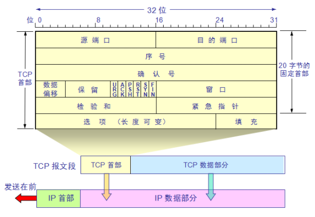

如果发送一段2000字节的TCP报文，那么会导致TCP分段，因为其超过了最大报文段的长度，一般是MTU - IP首部（20） - TCP首部（20）
分段后的每一段TCP报文段再加上IP首部后的长度不可能超过MTU，因此也就不需要在网络层进行IP分片了，因此TCP报文段很少会发生IP分片的情况

**UDP则需要在应用层去限制每个包的大小，一般不超过1472个字节，即以太网MTU（1500）-IP首部（20）-UDP首部（8）**

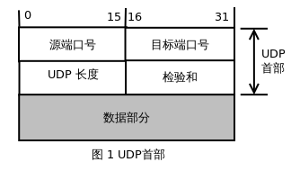

UDP数据报，由于UDP数据报不会自己进行分段，因此当长度超过了MTU时，会在**网络层**进行IP分片
在分片的数据中，传输层的**首部只会出现在第一个分片中**（传输层的数据格式对IP层是透明的，传输层的首部只有在传输层才会有它的作用，IP层不知道也不需要保证在每个分片中都有传输层首部，所以，在网络上传输的数据包是有可能没有传输层首部的）

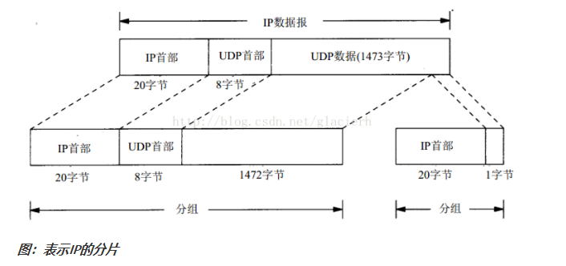

### IP分片重组

**接收方在收到经过IP层分片的数据报文后，首先根据分片标志中的 MF（More Fragment）位 （MF位为1表示当前数据报还有更多的分片，为0表示当前分片是该数据报最后一个分片）判断是否是最后一个分片报文，如果是，则根据分片偏移量计算各个分片报文在原始数据报中的位置，进行重组。如果不是最后一个分片，则需等待所有分片到达后再完成重组**

### IP分片带来的问题

1. **分片带来的性能消耗**，分片和重组会消耗发送方、接收方一定的CPU等资源，如果存在大量的分片报文的话，可能会造成较为严重的资源消耗；分片对接收方内存资源的消耗较多，因为接收方要为接收到的每个分片报文分配内存空间，以便于最后一个分片报文到达后完成重组
2. **分片丢包导致的重传问题**，如果某个分片报文在网络传输过程中丢失，那么接收方将无法完成重组，如果应用进程要求重传的话，发送方必须重传所有分片报文而不是仅重传被丢弃的那个分片报文，这种效率低下的重传行为会给端系统和网络资源带来额外的消耗
3. **分片攻击**，黑客构造的分片报文，但是不向接收方发送最后一个分片报文，导致接收方要为所有的分片报文分配内存空间，可由于最后一个分片报文永远不会达到，接收方的内存得不到及时的释放（接收方会启动一个分片重组的定时器，在一定时间内如果无法完成重组，将向发送方发送ICMP重组超时差错报文，，只要这种攻击的分片报文发送的足够多、足够快，很容易占满接收方内存，让接收方无内存资源处理正常的业务，从而达到DOS的攻击效果

## 路由表

**路由表是一个存储在路由器或者联网计算机中的表格（或文件）或类数据库，存储着指向特定网络地址的路径**

使用 ```route -n``` 可以查看本机路由表

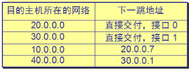

IP层转发分组流程：

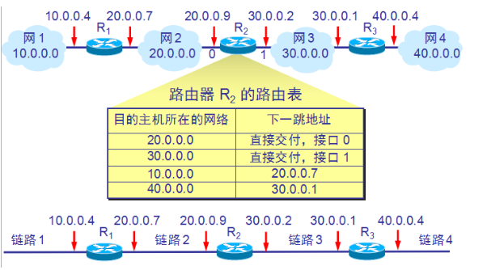

分组转发流程：
1. 从数据报的首部提取目的主机的IP地址D（全IP地址，有主机号），得出目的网络地址为N（即无主机号的网络地址）
2. 若**网络 N 与此路由器直接相连**，则把数据报**直接交付目的主机** D；否则是间接交付，执行(3)
3. 若路由表中**有目的地址为 D 的特定主机路由**，则把数据报传送给路由表中所指明的**下一跳路由器**；否则，执行(4)
4.  若路由表中**有到达网络 N 的路由**，则把数据报传送给路由表指明的**下一跳路由器**；否则，执行(5)
5.  若路由表中有一个**默认路由**，则把数据报传送给路由表中所指明的**默认路由器**；否则，执行(6)
6.  报告转发分组出错

## 划分子网

**IP地址 ::= {<网络号>,<子网号>,<主机号>}**

+ 子网掩码是一个网络或一个子网的重要属性
+ 对应的路由表发送规则：<目的网络地址，子网掩码，下一跳地址>
+ 路由器在收到 IP 数据报后，再按目的网络号 net-id 和子网号 subnet-id 找到目的子网
+ 路由器的路由表中的每一个项目，除了要给出目的网络地址外，还必须同时给出该网络的子网掩码
+ 一个网络如果不划分子网，路由表中就使用默认子网掩码，即与网络号对应

使用子网时分组的转发：
1. 从收到的分组的首部提取目的 IP 地址 D
2. 先用各网络的子网掩码和 D 逐位相“与”，看是否和相应的网络地址匹配，若匹配，则将分组直接交付，否则就是间接交付，执行(3)
3. 若路由表中有目的地址为 D 的特定主机路由，则将分组传送给指明的下一跳路由器；否则，执行(4)
4. 对路由表中的每一行的子网掩码和 D 逐位相“与”，若其结果与该行的目的网络地址匹配，则将分组传送给该行指明的下一跳路由器；否则，执行(5)
5. 若路由表中有一个默认路由，则将分组传送给路由表中所指明的默认路由器；否则，执行(6)
6. 报告转发分组出错

## 构成超网（无分类编制CIDR、无分类域间路由选择）:　解决因特网主干网上的路由表中的项目数急剧增长问题

IP地址从三级编址（使用子网掩码）又回到了两级编址

**IP地址 ::= {<网络前缀>,<主机号>}**

CIDR 把网络前缀都相同的连续的IP地址组成**CIDR地址块**
	**128.14.32.0/20** 表示的地址块共有2^12个地址（斜杠后的20表示的是网络前缀的位数，所以这个地址的主机号是12位）
	这个地址块的起始地址是128.14.32.0
	在不需要指出地址块的起始地址时，也可将这样的地址块简称为 **/20** 地址块，网络前缀越长，其地址块就越小
	128.14.32.0/20 地址块的最小地址：128.14.32.0
	128.14.32.0/20 地址块的最大地址：128.14.47.255
	全 0 和全 1 的主机号地址一般不使用
使用 CIDR 时，路由表中的每个项目由“网络前缀”和“下一跳地址”组成，在查找路由表时可能会得到不止一个匹配结果
应当从匹配结果中选择具有最长网络前缀的路由：最长前缀匹配
使用二叉线索查找路由表：使用唯一前缀构建二叉索引，同时每个节点要包含对应网络前缀和子网掩码，用于检查这个唯一前缀对应的前缀号，是否为要查找的，不是则丢弃该分组，是则转发该分组

## 网际控制报文协议ICMP

**目的是为了提高IP数据报交付成功的机会**

IP协议是一种面向无连接的数据报协议，它是一种不可靠的协议，它不提供任何差错检验
因此**网际报文控制协议（Internet Control Message Protocol）ICMP**出现了，ICMP协议**用于IP主机、路由器之间传递控制消息**，这里的控制消息可以包括很多种：数据报错误信息、网络状况信息、主机状况信息等，虽然这些控制消息虽然并不传输用户数据，但对于用户数据报的有效递交起着重要作用，从TCP/IP的分层结构看ICMP属于网络层，它配合着IP数据报的提交，提高IP数据报递交的可靠性

实现方式：ICMP报文作为IP层数据报的数据，加上数据报的首部，组成IP数据报发送出去

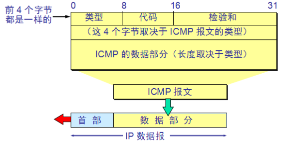

ICMP应用实例：
1. PING用来测试两个主机之间的连通性
    a. PING使用了ICMP回送请求与回送回答报文
    b. PING是应用层直接使用网络层ICMP的例子，没有通过运输层的TCP或UDP
2. tracert用来跟踪一组从源点到终点的路径，通过依次增加TTL，并返回ICMP时间超过报文来实现

## 路由选择协议

因特网的规模非常大，把它分为n个小的自治系统（AS），自治系统是在单一技术下管理一组路由器，这些路由器**使用本自治系统内部的路由协议和共同的度量**
尽管一个 AS 使用了多种内部路由选择协议和度量，但重要的是**一个 AS 对其他 AS 表现出的是一个单一的和一致的路由选择策略**

因特网有两大类路由选择协议：

1. 内部网关协议IGP（Interior Gateway Protocol）： 即在一个**自治系统内部使用**的路由选择协议，目前这类路由选择协议使用得最多，如 RIP 和 OSPF 协议
2. 外部网关协议EGP (External Gateway Protocol)  ：  若源站和目的站**处在不同的自治系统中**，当数据报传到一个自治系统的边界时，就需要使用一种协议将路由选择信息**传递到另一个自治系统中**，这样的协议就是外部网关协议 EGP，在外部网关协议中目前使用最多的是 BGP-4

### 内部网关协议RIP（Routing Information Protocol）

工作原理：
	路由信息协议 RIP 是内部网关协议 IGP中最先得到广泛使用的协议，但很少被使用
	RIP 是一种分布式的基于距离向量的路由选择协议
	RIP 协议要求网络中的每一个路由器都要维护从它自己到其他每一个目的网络的距离记录
距离的定义：
	从一路由器到直接连接的网络的距离定义为 1
	从一个路由器到非直接连接的网络的距离定义为所经过的路由器数加 1
	RIP 协议中的“距离”也称为“跳数”(hop count)，因为每经过一个路由器，跳数就加 1
	这里的“距离”实际上指的是“最短距离”
	RIP 认为一个好的路由就是它通RIP 允许一条路径最多只能包含 15 个路由器，“距离”的最大值为16 时即相当于不可达，可见 RIP 只适用于小型互联网
	RIP 不能在两个网络之间同时使用多条路由，RIP 选择一个具有最少路由器的路由（即最短路由），哪怕还存在另一条高速(低时延)但路由器较多的路由
RIP协议的三个要点：
	仅和相邻路由器交换信息
	交换的信息是当前本路由器所知道的全部信息，即自己的路由表
	按固定的时间间隔交换路由信息，例如，每隔 30 秒
	采用UDP进行传输
路由表的建立：
	路由器在刚刚开始工作时，只知道到直接连接的网络的距离（此距离定义为1）
	以后，每一个路由器也只和数目非常有限的相邻路由器交换并更新路由信息
	经过若干次更新后，所有的路由器最终都会知道到达本自治系统中任何一个网络的最短距离和下一跳路由器的地址
	RIP 协议的收敛(convergence)过程较快，即在自治系统中所有的结点都得到正确的路由选择信息的过程
RIP的优点：
	RIP 协议最大的优点就是实现简单，开销较小
RIP的缺点：
	RIP 限制了网络的规模，它能使用的最大距离为 15（16 表示不可达）
	路由器之间交换的路由信息是路由器中的完整路由表，因而随着网络规模的扩大，开销也就增加
	当网络出现故障时，要经过比较长的时间才能将此信息传送到所有的路由器，因此，RIP算法好消息传得快，坏消息传得慢，导致更新过程的收敛时间过长
	
### 内部网关协议OSPF (Open Shortest Path First)：开放最短路径优先

1. OSPF 是一种分布式的基于链路状态数据库的路由选择协议，使用Dijkstra 提出的最短路径算法来计算路由表的下一跳
2. 向本自治系统中所有路由器发送信息；发送的信息就是与本路由器相邻的所有路由器的链路状态，但这只是路由器所知道的部分信息，（比RIP 传送的数据小）；只有当链路状态发生变化时，路由器才用洪泛法向所有路由器发送此信息，（比RIP 定时交换数据合理）
3. OSPF 还规定每隔一段时间，如 30 分钟，要刷新一次数据库中的链路状态
4. 由于一个路由器的链路状态只涉及到与相邻路由器的连通状态，因而与整个互联网的规模并无直接关系，因此当互联网规模很大时，OSPF 协议要比距离向量协议 RIP 好得多
5. OSPF 没有“坏消息传播得慢”的问题，据统计，其响应网络变化的时间小于 100 ms

### 外部网关协议BGP：边界网关协议

1. BGP 是不同自治系统的路由器之间交换路由信息的协议
2. 边界网关协议 BGP 只能是力求寻找一条能够到达目的网络且比较好的路由（不能兜圈子），而并非要寻找一条最佳路由
3. BGP发言人：每一个自治系统的管理员要选择至少一个路由器作为该自治系统的“ BGP 发言人” 
4. 一个 BGP 发言人与其他自治系统中的 BGP 发言人要交换路由信息，就要先建立 TCP 连接，然后在此连接上交换 BGP 报文以建立 BGP 会话(session)，利用 BGP 会话交换路由信息

## 虚拟网络VPN：在公用网络上建立专用网络，进行加密通讯

本地地址和全球地址：

本地地址——**仅在机构内部使用的 IP 地址**，可以由本机构自行分配，而不需要向因特网的管理机构申请
全球地址——**全球唯一的IP地址**，必须向因特网的管理机构申请

专用地址：

本地地址和全球地址会在因特网上出现二义性，因此规定了专用地址，这些地址的数据报一律不准转发
10.0.0.0 到 10.255.255.255
172.16.0.0 到 172.31.255.255
192.168.0.0 到 192.168.255.255

使用隧道技术实现虚拟专用网：

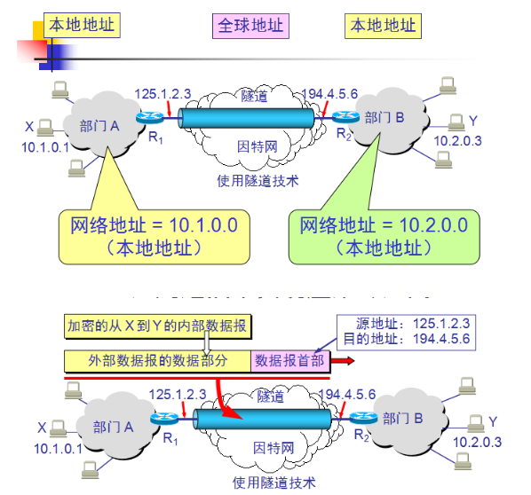

## 路由器的构成

路由器是一种具有多个输入端口和多个输出端口的专用计算机，其任务是**分组**

从路由器的某个输入端口收到分组，按照分组要去的目的网络，把分组从路由器的某个合适的输出端口转发给下一跳路由器，下一跳路由器重复此操作，直到转发到终点

转发表：包含从要到达的目的网络到输出端口和某些MAC地址信息的映射

路由器的转发分组正是网络层的主要工作：接受IP数据报--->查表--->转发

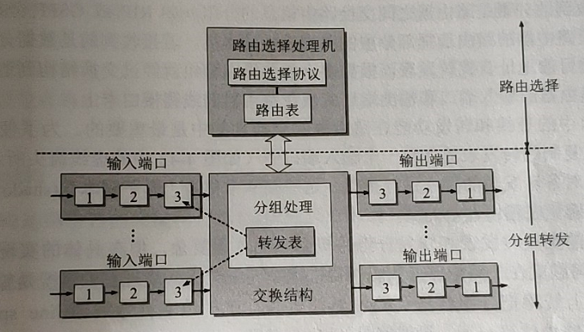

## IGMP协议（Internet Group Manage Protocol）

IGMP : Internet组管理协议,提供Internet网际多点传送的功能，即**个IP包拷贝给多个host**，Windows采用了这个协议，因为此项技术尚不成熟，因此被一些人用来攻击windows系统，尤其是对win98，因为对win95有oob攻击，受到IGMP攻击的症状是首先出现蓝屏,然后网速变得极慢,有的甚至鼠标,键盘均不管用非得重启不可

IGMP协议用于多播

1. 广播：老师在台上讲课，你们能随时看到老师的电脑屏幕，因为采用的广播，每个人度能接受到老师屏幕上所有的数据包
2. 多播：在一个局域网中，有三个多播组，A、B、C，A在放Java视频，B在放C++视频，C在放娱乐视频，如果你想看Java视频，那么你就调到A这个多播组中学习Java视频，学习累了，你就可以换到C这个多播组中看看娱乐节目，这就是多播的意思，相对广播来说，自己需要什么就调什么，而不是跟广播一样，被动接受，他播到哪，就只能看到哪，多播能自由控制速度
3. 单播：50个人想看视频，就得发送50个数据包，多播的话就发一个，然后通过路由器转发50分给不同的人

工作流程：

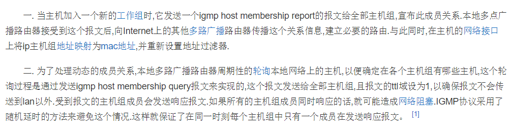
