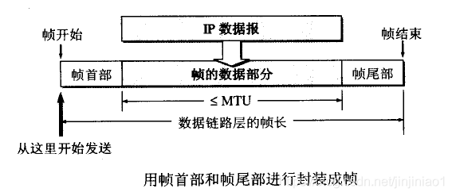
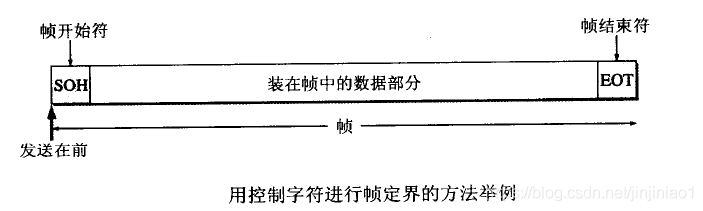
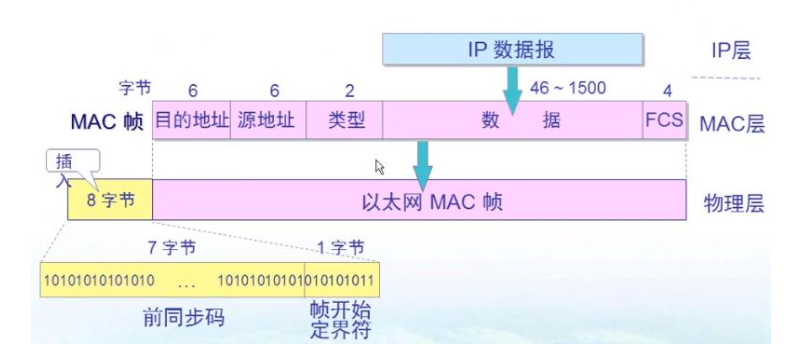
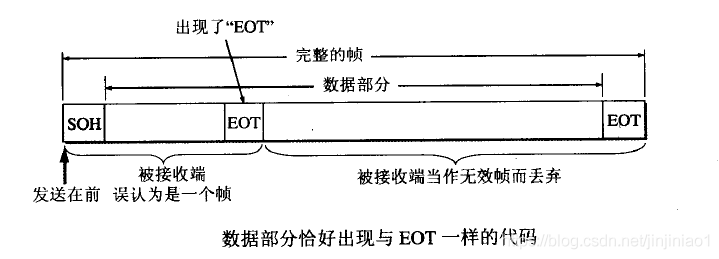
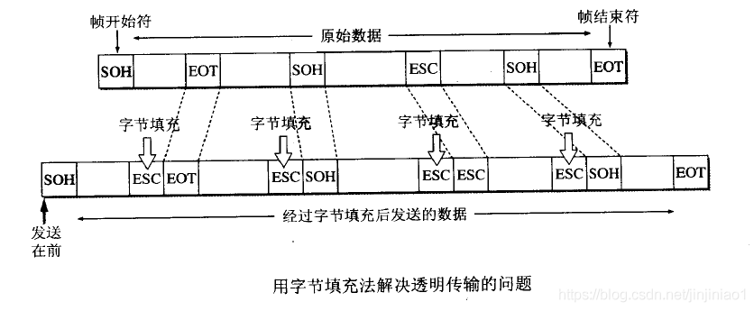

# 链路层

**数据链路层最基本的服务是将源计算机网络层来的数据可靠的传输到相邻节点的目标计算机网络层**
为了达到这一目的，数据链路层需要具备一系列的功能：如何**将数据组合成数据块**（在数据链路层中将这种数据块称为帧，帧是数据链路层的传送单位）；如何**控制帧在物理信道上的传输**，包括如何处理传输差错，如何调节发送速率以使之与接收方相匹配；在两个网路实体之间**提供数据链路通路的建立、维持和释放管理**

## 封装成帧

为了向网络层提供服务，数据链路层必须使用**物理层**提供的服务
物理层是以比特流进行传输的，这种比特流并不保证在数据传输过程中没有错误，接收到的位数量可能少于、等于或者多于发送的位数量，而且还可能有不同的值，这时数据链路层为了能实现数据有效的差错控制，就采用了一种“帧”的数据块进行传输
帧格式传输，就必须有相应的帧同步技术，这就是**数据链路层的“成帧”（也称为“帧同步”）**功能

+ **封装成帧（framing）**：在一段数据的前后分别**添加首部和尾部**，构成一个帧，接收端在收到物理层上交的比特流后，就能根据首部和尾部的标记，从收到的比特流中识别帧的开始和结束
+ **分组交换**：所有在互联网上传送的数据都是以分组（IP数据报）为传送单位
+ **网络层的IP数据报传送到数据链路层就成为帧的数据部分**
+ 在帧的数据部分的前面和后面分别添加上首部和尾部，就构成了一个完整的帧
+ 帧长等于数据部分长度加上帧首部和帧尾部的长度，而首部和尾部的一个重要作用就是进行帧定界（即确定帧的界限）
+ 首部和尾部还包含许多必要的控制信息，在发送帧时，是从帧首部开始发送
+ 各种数据链路层协议都要对帧首部和帧尾部的格式有明确的规定
+ 为了提高帧的传输效率，应当使帧的数据部分长度尽可能大于首部和尾部的长度，但是，每一种链路层协议都规定了帧的数据部分的长度上限——**最大传送单元MTU(Maximum Transfer Unit)**

+ 当数据是由可打印的ASCII码组成的文本文件时，帧定界可以使用特殊的帧定界符
+ 控制字符SOH(Start Of Header)放在一帧的最前面，表示帧的首部开始。另一个控制字符EOT(End Of Transmission)表示帧的结束。他们的十六进制编码分别是01(二进制是00000001)和04(二进制是00000100)

**采用帧传输方式的好处是，在发现有数据传送错误时，只需将有差错的帧再次传送，而不需要将全部数据的比特流进行重传，这就在传送效率上将大大提高**
**由于使用了帧定界符，在接收端就知道前面收到的数据时个不完整的帧(只有首部SOH，没有传输结束符EOT)，必须丢弃**

## MAC帧格式

**MAC帧最小为64字节**，目标地址+源地址+FCS(帧校验序列)占了18个字节，因此**IP数据报最小为46个字节**，一般情况下MTU最大为1500字节，MAC最大可以为1518字节

## 透明传输

**在数据链路层实现透明传输和封装成帧时，使用到了转义字符**

假设没有使用转义字符进行透明传输：
+ 由于帧的开始和结束的标记是使用专门指明的控制字符，因此，所传输的数据中的任何8比特的组合一定不允许和用作帧定界的控制字符的比特编码一样，否则就会出现帧定界的错误
+ 当传送的帧使用文本文件组成的帧时(文本文件中的字符都是从键盘上输入的)，其数据部分显然不会出现像SOH或EOT这样的帧定界控制字符，可见不管从键盘上输入什么字符都可以放在这样的帧中传输过去，因此这样的传输就是透明传输
+ 当数据部分是非ASCII码的文本文件时(如二进制代码的计算机程序或图像等)，如果数据中的某个字符的二进制代码恰好和SOH或EOT这种控制字符一样，数据链路层就会错误地找到帧的边界，把部分帧收下(误认为是完整的帧)，而把剩下的那部分数据丢弃(这部分找不到帧定界控制字符SOH)，这样的帧的传输显然就不是透明传输

**为了解决透明传输的问题，就必须设法使数据中可能出现的控制字符 SOH 和 EOT 在接收端不被解析为控制字符**

解决方法：**发送端的数据链路层在数据中出现控制字符 SOH 和 EOT 的前面插入一个转义字符 ESC (其十六进制编码是1B)**，在接收端的数据链路层在将数据送往网络层之前删除这个插入的转义字符，这种方法称为**字节填充(byte stuffing)**或**字符填充(character stuffing)**，如果转义字符也出现在数据当中，那么解决方法仍然是在转义字符的前面插入一个转义字符，当接收端收到连续的两个转义字符时，就删除其中前面的一个

## 差错检测

传输差错：可分为两大类，一类就是最基本的**比特差错**，另一类就是收到的帧并没有出现比特错误，但却出现了**帧丢失、帧重复或帧失序**

+ 比特差错：比特在传输过程中可能会产生差错，即1可能会变成0，0可能会变成1，比特差错是传输差错中的一种
+ 三个帧：[#1]-[#2]-[#3]，假定在接收端收到的却有可能出现的情况
   + 帧丢失：收到[#1]-[#3]（丢失了[#2]）
   + 帧重复：收到[#1]-[#2]-[#2]-[#3]（收到两个[#2]）
   + 帧失序：收到[#1]-[#3]-[#2]（后面发的帧反而先到达了接收端，这与一般的数据链路层传输概念不一样）
+ **误码率BER（Bit Error Rate）**：在一段时间内，传输错误的比特占所传输比特总数的比率，例如，误码率为10 ^ (-10)时，表示平均每传送10^10个比特就会出现一个比特的差错，误码率与信噪比有很大的关系，如果提高信噪比，就可以使误码率减小

实际的通信链路并非理想的，不可能使误码率下降到零
为了保证数据传输的可靠性，在计算机网络传输数据时，必须采用各种检测措施
目前在数据链路层广泛使用了**循环冗余检验CRC(Cyclic Redundancy Check)**的检测技术，在数据链路层使用CRC检验，能够实现**无比特差错**的传输，但这还不是可靠传输
**OSI的观点**是必须把数据链路层做成是可靠传输的，因此在CRC检测基础上，增加了帧编号、确认和重传机制，这种方法在历史上曾经起到很好的作用，但现在的通信线路的质量已经大大提高了，由通信链路质量不好引起差错的概率已经大大降低

因特网广泛使用的数据链路层协议**都不适用确认和重传机制**，即**不要求数据链路层向上层提供可靠传输的服务**(因为这要付出的代价太高，不合算)
如果在数据链路层传输数据时除了差错并且需要进行改正，那么**改正差错的任务就由上层协议（如，运输层TCP协议）来完成**

## MAC寻址

数据链路层中的MAC子层主要功能
在以太网中，采用**媒体访问控制（Media Access Control, MAC）**地址进行寻址，MAC地址被烧入每个以太网网卡中
