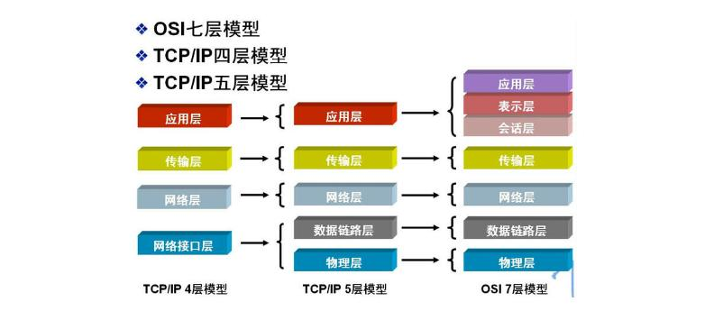
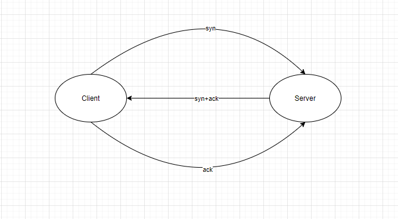
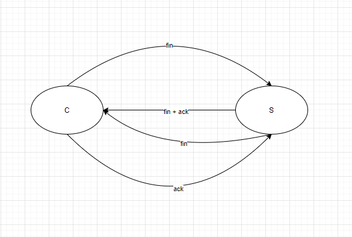
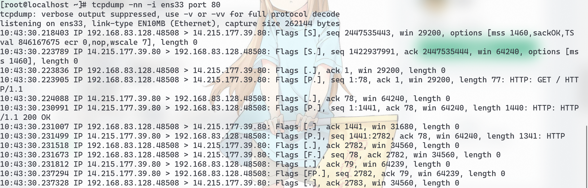

# Network

## 计算机网络分层



**TCP**：传输控制协议，面向连接的，可靠的传输协议
在现行的五层网络协议中，紧贴与最顶层的应用层，为应用层提供数据传输服务

建立一个TCP连接需要经过传输双方进行**三次握手**
等待经过三次握手后，传输双方均打开资源，视为已建立一个TCP连接
断开一个TCP连接需要经过**四次挥手**





如果一个TCP连接建立了10年但从没有传输过数据，此时，TCP连接仍然是有效连接，但发送数据则无法通信，TCP需要心跳来维持


可以使用 **tcpdump** 来进行TCP抓包（[更多关于tcpdump的操作可以参考](https://segmentfault.com/a/1190000019669218)）

```shell
tcpdump -nn -i eth0 port 80
```

下面是使用**tcpdump**抓包百度首页的传输过程

关于**Flags**的说明：
+ [S]：SYN同步标识
+ [.]：表示ACK确认标识
+ [S.]：SYN同步标识，以及ACK确认标识
+ [P.]：PSH，push推送，数据传输
+ [R.]：RST，连接重置
+ [F.]：FIN结束连接
+ [DF]：Don't Fragment（不要碎裂），当DF=0时，表示允许分片，一般-v时才有这个标识
+ [FP.]：标记FIN、PUSH、ACK组合，这样做是为了提升网络效率，减少数据来回确认等
