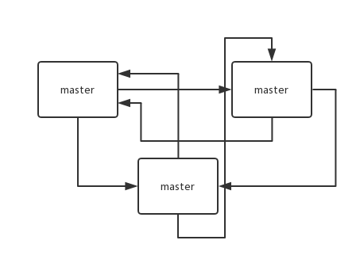
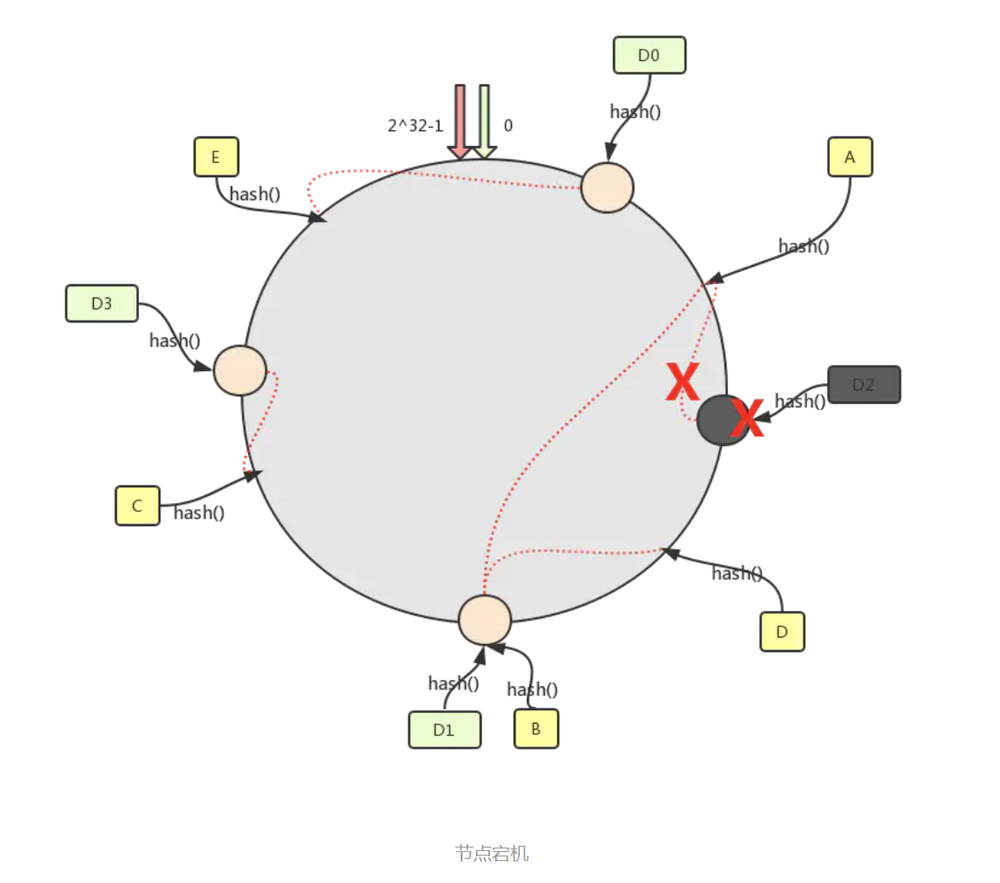
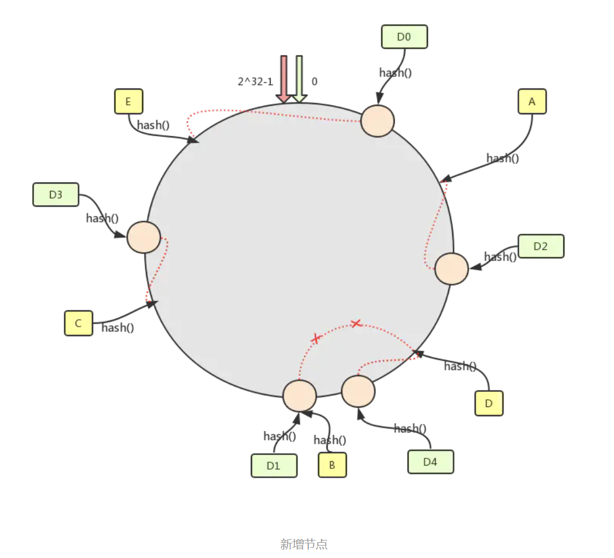
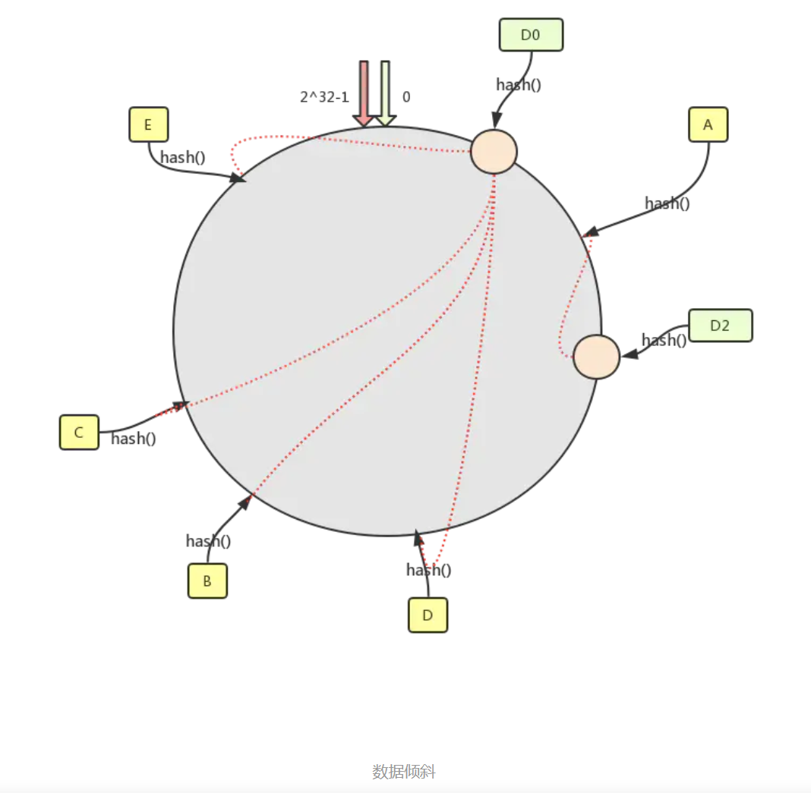
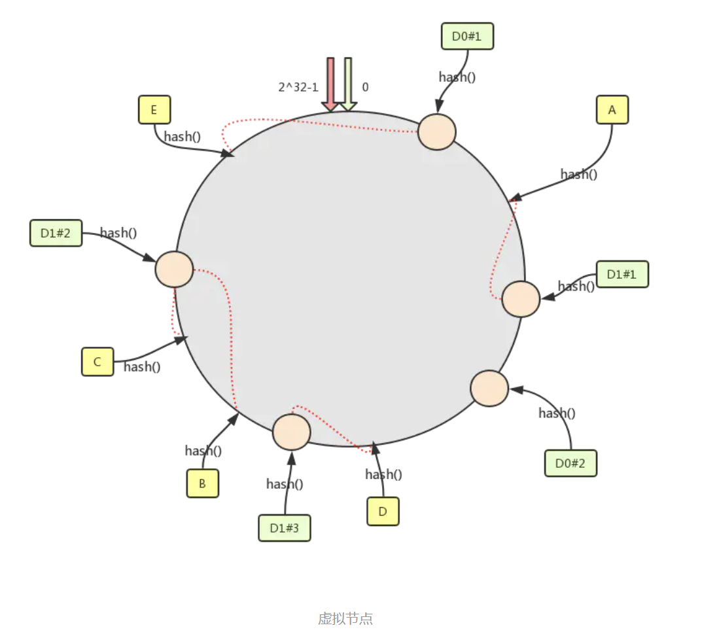
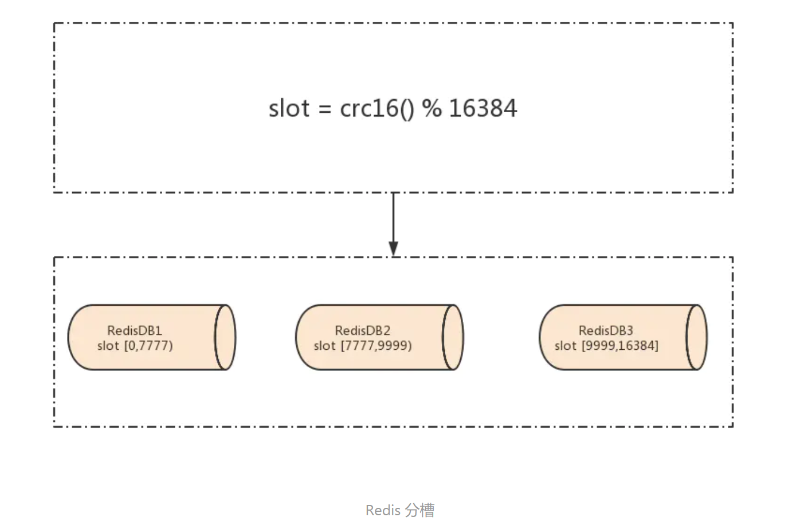

# Redis Cluster

+ 自动将数据进行分片，每个 master 上放一部分数据
+ 提供内置的高可用支持，部分 master 不可用时，还是可以继续工作

在 Redis cluster 架构下，每个 Redis 要放开两个端口号，比如一个是 6379，另外一个就是 加1w 的端口号，比如 16379

16379 端口号是用来进行节点间通信的，也就是 cluster bus 的东西，cluster bus 的通信，用来进行故障检测、配置更新、故障转移授权

cluster bus 用了另外一种二进制的协议， `gossip` 协议，用于节点间进行高效的数据交换，占用更少的网络带宽和处理时间

## 节点间的内部通信机制

### 基本通信原理

集群元数据的维护有两种方式：`集中式`、`Gossip 协议`

`Redis cluster` 节点间采用 `gossip` 协议进行通信

**集中式**是将集群元数据（节点信息、故障等等）几种存储在某个节点上
是将集群元数据（节点信息、故障等等）几种存储在某个节点上。集中式元数据集中存储的一个典型代表，就是大数据领域的 `storm`，它是分布式的大数据实时计算引擎，是集中式的元数据存储的结构，底层基于 

**集中式**的**好处**在于，元数据的读取和更新，时效性非常好，一旦元数据出现了变更，就立即更新到集中式的存储中，其它节点读取的时候就可以感知到；**不好**在于，所有的元数据的更新压力全部集中在一个地方，可能会导致元数据的存储有压力

**Redis 维护集群元数据采用另一个方式， `gossip` 协议**，所有节点都持有一份元数据，不同的节点如果出现了元数据的变更，就不断将元数据发送给其它的节点，让其它节点也进行元数据的变更

**gossip** 好处在于，元数据的更新比较分散，不是集中在一个地方，更新请求会陆陆续续打到所有节点上去更新，降低了压力；不好在于，元数据的更新有延时，可能导致集群中的一些操作会有一些滞后

+ `10000 端口`：每个节点都有一个专门用于节点间通信的端口，就是自己提供服务的端口号+10000，比如 7001，那么用于节点间通信的就是 17001 端口，每个节点每隔一段时间都会往另外几个节点发送 `ping` 消息，同时其它几个节点接收到 `ping` 之后返回 `pong`
+ 交换的信息：信息包括故障信息，节点的增加和删除，hash slot 信息等等  

### gossip 协议

gossip 协议包含多种消息，包含 `ping` , `pong` , `meet` , `fail` 等等

+ meet：某个节点发送 meet 给新加入的节点，让新节点加入集群中，然后新节点就会开始与其它节点进行通信
+ ping：每个节点都会频繁给其它节点发送 ping，其中包含自己的状态还有自己维护的集群元数据，互相通过 ping 交换元数据
+ pong：返回 ping 和 meet，包含自己的状态和其它信息，也用于信息广播和更新
+ fail：某个节点判断另一个节点 fail 之后，就发送 fail 给其它节点，通知其它节点说，某个节点宕机啦

### ping 消息探入

ping 时要携带一些元数据，如果很频繁，可能会加重网络负担

+ 每个节点每秒会执行 10 次 ping，每次会选择 5 个最久没有通信的其它节点
+ 如果发现某个节点通信延时达到了 `cluster_node_timeout / 2` ，那么立即发送 ping，避免数据交换延时过长
+ 比如说，两个节点之间都 10 分钟没有交换数据了，那么整个集群处于严重的元数据不一致的情况，就会有问题
+ 所以 `cluster_node_timeout` 可以调节，如果调得比较大，那么会降低 ping 的频率

每次 ping，会带上自己节点的信息，带上 1/10 其它节点的信息，发送出去，进行交换，至少包含 `3` 个其它节点的信息，最多包含 `总节点数减 2` 个其它节点的信息

## 分布式寻址算法

+ hash 算法（大量缓存重建）
+ 一致性 hash 算法（自动缓存迁移）+ 虚拟节点（自动负载均衡）
+ Redis cluster 的 hash slot

### hash 算法

+ 来了一个 key，首先计算 hash 值，然后对节点数取模
+ 计算后，打在不同的 master 节点上
+ 一旦某一个 master 节点宕机，所有请求过来，都会基于最新的剩余 master 节点数去取模，尝试去取数据，这会导致**大部分的请求过来，全部无法拿到有效的缓存**，导致大量的流量涌入数据库

### 一致性哈希算法

一致性 hash 算法将整个 hash 值空间组织成一个虚拟的圆环，整个空间按顺时针方向组织，下一步将各个 master 节点（使用服务器的 ip 或主机名）进行 hash，这样就能确定每个节点在其哈希环上的位置

来了一个 key，首先计算 hash 值，并确定此数据在环上的位置，从此位置沿环**顺时针“行走”**，遇到的第一个 master 节点就是 key 所在位置

在一致性哈希算法中，如果一个节点挂了，受影响的数据仅仅是此节点到环空间前一个节点（沿着逆时针方向行走遇到的第一个节点）之间的数据（当一个节点挂掉时，落在该节点到逆时针第一个节点间的数据将会落到该节点顺时针第一个节点上），其它不受影响，增加一个节点也同理

一致性哈希算法在节点太少时，容易因为节点分布不均匀而造成**缓存热点**的问题，为了解决这种热点问题，一致性 hash 算法引入了虚拟节点机制，即**对每一个节点计算多个 hash**，每个计算结果位置都放置一个虚拟节点，这样就实现了数据的均匀分布，负载均衡（即**每个物理节点在哈希环上有多个逻辑节点，逻辑节点即所谓的虚拟节点**）

### Redis Cluster Hash Slot

Redis cluster 有固定的 `16384` 个 hash slot，对每个 `key` 计算 `CRC16` 值，然后对 `16384` 取模，可以获取 key 对应的 hash slot，Redis 没有直接使用哈希算法 hash()

Redis cluster 中每个 master 都会持有部分 slot，比如有 3 个 master，那么可能每个 master 持有 5000 多个 hash slot

槽位具体在哪个机器上是用户自己根据自己机器的情况配置的，机器硬盘小的可以分配少一点槽位，硬盘大的可以分配多一点，如果节点硬盘都差不多则可以平均分配

hash slot 让 node 的增加和移除很简单，增加一个 master，就将其他 master 的 hash slot 移动部分过去，减少一个 master，就将它的 hash slot 移动到其他 master 上去，移动 hash slot 的成本是非常低的

客户端的 api，可以对指定的数据，让它们走同一个 hash slot，通过 `hash tag` 来实现

**`任何一台机器宕机，另外节点不受影响，因为 key 找的是 hash slot，不是机器`**

## Redis cluster 的高可用与主备切换原理

[Redis cluster 的高可用的原理，几乎跟哨兵是类似的](./Redis-Sentinel.md)

### 判断节点宕机

如果一个节点认为另外一个节点宕机，那么就是 `pfail` ，**主观宕机**
如果多个节点都认为另外一个节点宕机了，那么就是 `fail` ，**客观宕机**，跟哨兵的原理几乎一样，sdown，odown

在 `cluster-node-timeout` 内，某个节点一直没有返回 `pong` ，那么就被认为 `pfail`

如果一个节点认为某个节点 `pfail` 了，那么会在 `gossip ping` 消息中， `ping` 给其他节点，如果**超过半数**的节点都认为 `pfail` 了，那么就会变成 `fail`

### 从节点过滤

对宕机的 master node，从其所有的 slave node 中，选择一个切换成 master node

检查每个 slave node 与 master node 断开连接的时间，如果超过了 `cluster-node-timeout * cluster-slave-validity-factor` ，那么就**没有资格**切换成 `master`

### 从节点选举

每个从节点，都根据自己对 master 复制数据的 offset，来设置一个选举时间，offset 越大（复制数据越多）的从节点，选举时间越靠前，优先进行选举

所有的 master node 开始 slave 选举投票，给要进行选举的 slave 进行投票，如果大部分 master node `（N/2 + 1）` 都投票给了某个从节点，那么选举通过，那个从节点可以切换成 master

从节点执行主备切换，从节点切换为主节点

### 与哨兵比较

整个流程跟哨兵相比，非常类似，所以说，Redis cluster 功能强大，直接集成了 replication 和 sentinel 的功能
