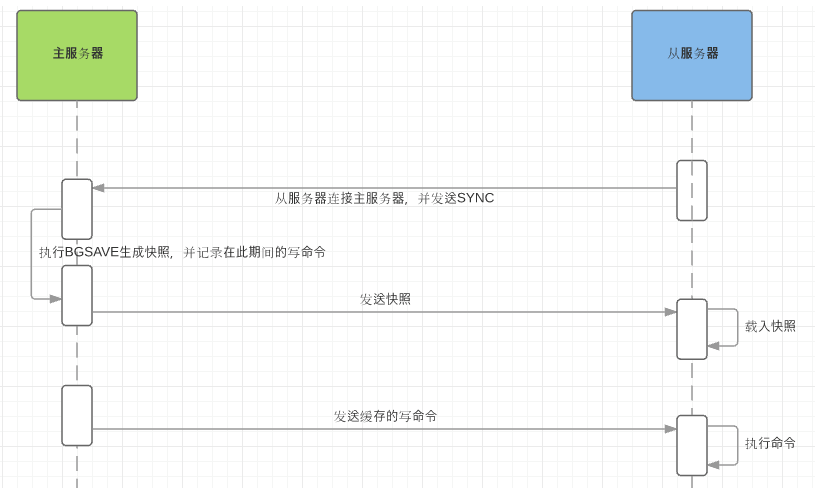

# Redis Master Slave

单机的 Redis，能够承载的 QPS 大概就在上万到几万不等
对于缓存来说，一般都是用来支撑**读高并发**的
因此架构做成`主从(master-slave)`架构，一主多从，主负责写，并且将数据复制到其它的 slave 节点，从节点负责读
所有的**读请求全部走从节点**
可以很轻松实现水平扩容，**支撑读高并发**


Redis replication -> 主从架构 -> 读写分离 -> 水平扩容支撑读高并发

## Redis replication 的核心机制

+ Redis 采用**异步方式**复制数据到 slave 节点，不过 Redis2.8 开始，slave node 会周期性地确认自己每次复制的数据量
+ 一个 master node 可以配置多个 slave node
+ slave node 也可以连接其他的 slave node
+ slave node 做复制的时候，不会 block master node 的正常工作
+ slave node 在做复制的时候，也不会 block 对自己的查询操作，它`会用旧的数据集来提供服务`；但是复制完成的时候，`需要删除旧数据集，加载新数据集，这个时候就会暂停对外服务了`
+ slave node 主要用来进行横向扩容，做读写分离，扩容的 slave node 可以提高读的吞吐量

注意，如果采用了`主从架构`，那么建议必须**开启** master node 的[持久化](./Redis-Persistence.md)，**不建议用 slave node 作为 master node 的数据热备**，因为那样的话，如果关掉 master 的持久化，可能在 master 宕机重启的时候数据是空的，然后可能一经过复制， slave node 的数据也丢了

master需要做好各种数据备份，万一本地的所有文件丢失了，从备份中挑选一份 rdb 去恢复 master，这样才能**确保启动的时候，是有数据的**

即使采用了后续讲解的[高可用机制](./Redis-Sentinel.md)，slave node 可以自动接管 master node，但也可能 sentinel 还没检测到 master failure，master node 就自动重启了，还是可能导致上面所有的 slave node 数据被清空

## Redis 主从复制的核心原理

+ 当启动一个 slave node 的时候，它会发送一个 `PSYNC` 命令给 master node
+ 如果这是 slave node 初次连接到 master node，那么会触发一次 `full resynchronization` 全量复制
+ 此时 master 会启动一个**后台线程**，开始生成一份 `RDB` 快照文件，同时还会**将从客户端 client 新收到的所有写命令缓存在内存中**
+ `RDB` 文件生成完毕后， master 会将这个 `RDB` 发送给 slave
+ slave 会先**写入本地磁盘，然后再从本地磁盘加载到内存**中，从节点成功加载完 RDB 后，如果开启了 AOF，会立刻做 bgrewriteaof
+ 接着 master 会将内存中缓存的写命令发送到 slave，slave 也会同步这些数据
+ slave node 如果跟 master node 有网络故障，断开了连接，会自动重连，连接之后 master node 仅会复制给 slave 部分缺少的数据
+ 从服务器完成对快照的载入（即完成全量同步后），开始接收命令请求，并执行来自主服务器缓冲区的写命令

**注意：**
如过 RDB 文件大于 6GB，并且是千兆网卡，`Redis 的默认超时机制（60 秒）`，会导致全量复制失败，可以通过调大 `repl-timeout` 参数来解决此问题


## 数据间的同步

Redis同步有2个命令：

+ sync：redis 2.8 之前的同步命令
+ psync：redis 2.8 为了优化 sync 新设计的命令

psync 命令需要 3 个组件支持：

+ **主从节点各自复制偏移量**
  + 参与复制的主从节点都会维护自身的复制偏移量
  + 主节点在处理完写入命令后，会把命令的字节长度做累加记录，统计信息在 info replication 中的 masterreploffset 指标中
  + 从节点每秒钟上报自身的的复制偏移量给主节点，因此主节点也会保存从节点的复制偏移量
  + 从节点在接收到主节点发送的命令后，也会累加自身的偏移量，统计信息在 info replication 中
  + `通过对比主从节点的复制偏移量，可以判断主从节点数据是否一致`
+ **主节点复制积压缓冲区**
  + 复制积压缓冲区是一个保存在主节点的一个固定长度的先进先出的队列，默认大小 1MB
  + 这个队列在 slave 连接时创建，这时主节点响应写命令时，不但`会把命令发送给从节点，也会写入复制缓冲区`
  + 作用就是`用于部分复制和复制命令丢失的数据补救`
+ **主节点运行 ID**
  + 每个 redis 启动的时候，都会生成一个 40 位的运行 ID，运行 ID 的主要作用是用来识别 Redis 节点
  + 如果使用 ip+port 的方式，那么如果主节点重启修改了 RDB/AOF 数据，从节点再基于偏移量进行复制将是不安全的
  + 当运行 id 变化后，从节点将进行全量复制，也就是说，`redis 重启后，默认从节点会进行全量复制`

## 主从复制的断点续传

从 Redis2.8 开始，就支持主从复制的断点续传，如果主从复制过程中，网络连接断掉了，那么可以接着上次复制的地方，继续复制下去，而不是从头开始复制一份

+ 主服务器端为复制流维护一个**内存缓冲区（in-memory backlog）**
+ 主从服务器都维护一个复制偏移量（`replication offset`）和 `master run id`
+ 当连接断开时，从服务器会重新连接上主服务器，然后请求继续复制，假如**主从服务器的两个master run id相同**，并且**指定的偏移量在内存缓冲区中还有效**，复制就会从上次中断的点开始继续
+ 如果其中一个条件不满足，就会进行完全重新同步（在2.8版本之前就是直接进行完全重新同步，因为主运行id不保存在磁盘中，如果从服务器重启了的话就只能进行完全同步了）


## 无磁盘化复制

master 在内存中直接创建 `RDB` ，然后发送给 slave，不会保存到本地磁盘
只需要在配置文件中开启 `repl-diskless-sync yes` 即可

```bash
repl-diskless-sync yes

# 等待 5s 后再开始复制，因为要等更多 slave 重新连接过来
repl-diskless-sync-delay 5
```

## 过期 key 处理

slave 不会过期 key，只会等待 master 过期 key
如果 master 过期了一个 key，或者通过 LRU 淘汰了一个 key，那么会模拟一条 del 命令发送给 slave

## 主从复制的完整流程

+ slave node 启动时，会在自己本地保存 master node 的信息，包括 master node 的 `host` 和 `ip` ，但是复制流程没开始
+ slave node 内部有个定时任务，每秒检查是否有新的 master node 要连接和复制，如果发现，就跟 master node 建立 socket 网络连接
+ 然后 slave node 发送 `ping` 命令给 master node
+ 如果 master 设置了 requirepass，那么 slave node 必须发送 masterauth 的口令过去进行认证
+ master node **第一次执行全量复制**，将所有数据发给 slave node
+ 在后续，master node 持续将**写命令**，**异步复制**给 slave node


## Redis 全量复制



+ 从服务器连接主服务器，发送SYNC命令
+ 主服务器接收到SYNC命名后，开始执行BGSAVE命令生成RDB文件并使用缓冲区记录此后执行的所有写命令
+ 主服务器BGSAVE执行完后，向所有从服务器发送快照文件，并在发送期间继续记录被执行的写命令
+ 从服务器收到快照文件后丢弃所有旧数据，载入收到的快照
+ 主服务器快照发送完毕后开始向从服务器发送缓冲区中的写命令
+ 从服务器完成对快照的载入，开始接收命令请求，并执行来自主服务器缓冲区的写命令

注意点：

+ master 执行 bgsave ，在本地生成一份 rdb 快照文件
+ master node 将 rdb 快照文件发送给 slave node，如果 rdb 复制时间超过 60秒（repl-timeout），那么 slave node 就会认为复制失败，可以适当调大这个参数(对于千兆网卡的机器，一般每秒传输 100MB，6G 文件，很可能超过 60s)
+ master node 在生成 rdb 时，会将所有新的写命令缓存在内存中，在 slave node 保存了 rdb 之后，再将新的写命令复制给 slave node
+ 如果在复制期间，内存缓冲区持续消耗超过 64MB，或者一次性超过 256MB，那么停止复制，复制失败

``` bash
client-output-buffer-limit slave 256MB 64MB 60
```

+ slave node 接收到 rdb 之后，清空自己的旧数据，然后重新加载 rdb 到自己的内存中，同时**基于旧的数据版本**对外提供服务（加载RDB过程中会停止服务）
+ 如果 slave node 开启了 AOF，那么会立即执行 BGREWRITEAOF，重写 AOF

## 增量同步

+ Redis增量复制是指Slave初始化后开始正常工作时主服务器发生的写操作同步到从服务器的过程
+ 增量复制的过程主要是主服务器每执行一个写命令就会向从服务器发送相同的写命令，从服务器接收并执行收到的写命令

## Redis主从同步策略

+ 主从刚刚连接的时候，进行全量同步
+ 全同步结束后，进行增量同步
+ 如果有需要，slave 在任何时候都可以发起全量同步
+ redis 策略是，无论如何，首先会尝试进行增量同步，如不成功，要求从机进行全量同步

## heartbeat

+ 主从节点互相都会发送 heartbeat 信息
+ master 默认每隔 10秒 发送一次 heartbeat，slave node 每隔 1秒 发送一个 heartbeat

心跳的关键机制如下：

+ 主从都有心跳检测机制，各自模拟成对方的客户端进行通信，通过 client list 命令查看复制相关客户端信息，主节点的连接状态为 flags = M，从节点的连接状态是 flags = S
+ 主节点默认每隔 10 秒对从节点发送 ping 命令，可修改配置 `repl-ping-slave-period` 控制发送频率
+ 从节点在主线程每隔一秒发送 `replconf ack{offset}` 命令，给主节点上报自身当前的复制偏移量
+ 主节点收到 replconf 信息后，判断从节点超时时间，如果超过 repl-timeout 60 秒，则判断节点下线

注意：为了降低主从延迟，一般把 redis 主从节点部署在相同的机房/同城机房，避免网络延迟带来的网络分区造成的心跳中断等情况

## 异步复制

master 每次接收到写命令之后，先在内部写入数据，然后异步发送给 slave node
写命令的发送过程是异步完成，也就是说主节点处理完写命令后立即返回客户度，并不等待从节点复制完成

## Redis 如何才能做到高可用

如果系统在 365 天内，有 99.99% 的时间，都是可以哗哗对外提供服务的，那么就说系统是高可用的

一个 slave 挂掉了，是不会影响可用性的，还有其它的 slave 在提供相同数据下的相同的对外的查询服务

但主从架构，一旦master宕机，则整个redis不可用

Redis 的高可用架构，叫做 `failover` **故障转移**，也可以叫做主备切换

master node 在故障时，自动检测，并且将某个 slave node 自动切换为 master node 的过程，叫做主备切换，这个过程，实现了 Redis 的主从架构下的高可用

Redis [基于哨兵的高可用性](./Redis-Sentinel.md)
