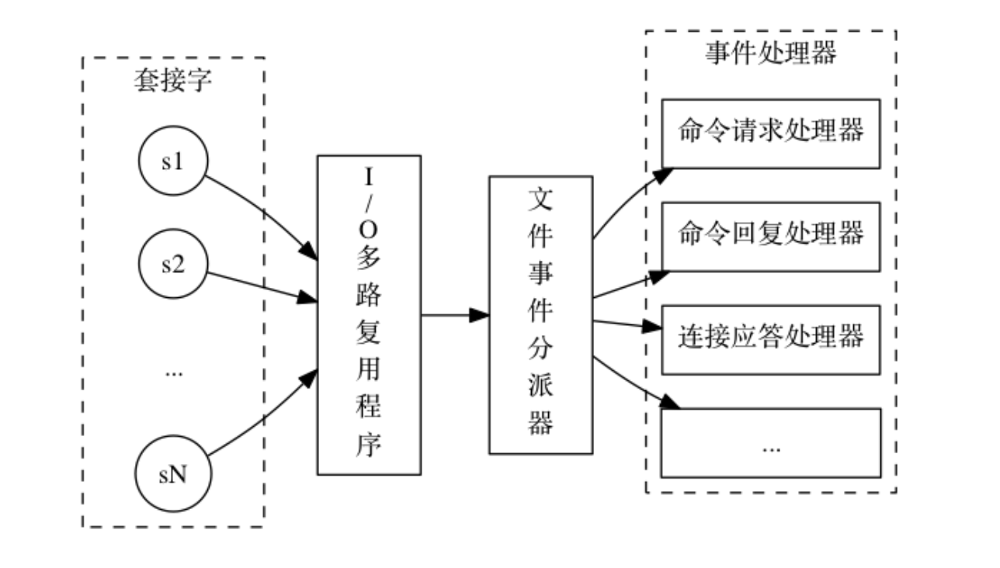
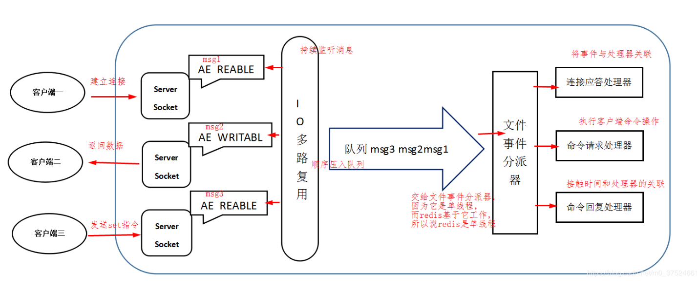

# Redis Thread Model

## 文件事件处理器（file event handler）

部使用文件事件处理器 `file event handler` ，这个文件事件处理器是单线程的，所以 Redis 才叫做单线程的模型（实际上是因为`文件事件分派器队列的消费是单线程的`）
采用 IO 多路复用机制同时监听多个 socket，将产生事件的 socket 压入内存队列中，事件分派器根据 socket 上的事件类型来选择对应的事件处理器进行处理

文件事件处理器的结构包含 4 个部分：

+ 多个 socket
+ IO 多路复用程序
+ 文件事件分派器
+ 事件处理器（连接应答处理器、命令请求处理器、命令回复处理器）

+ Redis 基于 `Reactor` 模式开发了自己的网络事件处理器：这个处理器被称为文件事件处理器（file event handler）
+ 文件事件处理器使用 `I/O 多路复用（multiplexing）程序来同时监听多个套接字`，并根据套接字目前执行的任务来为套接字关联不同的事件处理器
+ 当被监听的套接字准备好执行连接应答（accept）、读取（read）、写入（write）、关闭（close）等操作时， 与操作相对应的文件事件就会产生， 这时文件事件处理器就会调用套接字之前关联好的事件处理器来处理这些事件
+ `文件事件处理器以单线程方式运行`， 但通过使用 I/O 多路复用程序来监听多个套接字， 文件事件处理器既实现了高性能的网络通信模型， 又可以很好地与 redis 服务器中其他同样以单线程方式运行的模块进行对接， 这保持了 Redis 内部单线程设计的简单性

## Redis线程模型

## 客户端与Redis的一次通信过程

0. Redis 服务端进程初始化的时候，会将 server socket 的 `AE_READABLE` 事件与连接应答处理器关联

1. 客户端 socket01 向 Redis 进程的 server socket 请求建立连接，此时 server socket 会产生一个 `AE_READABLE` 事件，IO 多路复用程序监听到 server socket 产生的事件后，将该 socket 压入队列中
2. 文件事件分派器从队列中获取 socket，交给**连接应答处理器**。连接应答处理器会创建一个能与客户端通信的 socket01，并将该 socket01 的 `AE_READABLE` 事件与命令请求处理器关联
3. 假设此时客户端发送了一个 `set key value` 请求，此时 Redis 中的 socket01 会产生 `AE_READABLE` 事件，IO 多路复用程序将 socket01 压入队列，此时事件分派器从队列中获取到 socket01 产生的 `AE_READABLE` 事件，由于前面 socket01 的 `AE_READABLE` 事件已经与命令请求处理器关联，因此事件分派器将事件交给命令请求处理器来处理
4. 命令请求处理器读取 socket01 的 `key value` 并在自己内存中完成 `key value` 的设置，操作完成后，它会将 socket01 的 `AE_WRITABLE` 事件与命令回复处理器关联
5. 如果此时客户端准备好接收返回结果了，那么 Redis 中的 socket01 会产生一个 `AE_WRITABLE` 事件，同样压入队列中，事件分派器找到相关联的命令回复处理器，由命令回复处理器对 socket01 输入本次操作的一个结果，比如 `ok` ，之后解除 socket01 的 `AE_WRITABLE` 事件与命令回复处理器的关联
6. 完成了一次通信

## 为何 Redis 单线程模型也能效率这么高

+ 纯内存操作
+ 核心是基于非阻塞的 IO 多路复用机制
+ C 语言实现，一般来说，C 语言实现的程序“距离”操作系统更近，执行速度相对会更快
+ 单线程反而避免了多线程的频繁上下文切换问题，预防了多线程可能产生的竞争问题
