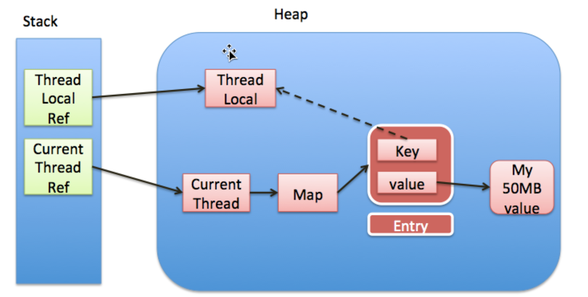

# ThreadLocal

---

[参考链接：ThreadLocal作用、场景、原理](https://www.jianshu.com/p/6fc3bba12f38)

[参考链接：ThreadLocal为什么要使用弱引用和内存泄露问题](https://blog.csdn.net/qq_42862882/article/details/89820017)

---

## Summary

+ JDK8中，ThreadLocal位于java.lang包中，支持泛型
+ ThreadLocal可以理解为一个变量，但这个变量只会被当前线程拥有
+ 通过为每个线程提供一个独立的变量副本解决了变量并发访问的冲突问题
+ 在很多情况下，ThreadLocal比直接使用synchronized同步机制解决线程安全问题更简单，更方便，且结果程序拥有更高的并发性

## ThreadLocal生命周期

图中，实线表示强引用，虚线表示弱引用



## 为什么使用弱引用

+ 每个Thread中都维护着一个Map，即`ThreadLocalMap threadLocals`
+ Map的key为一个ThreadLocal的实例，`key使用弱引用指向了ThreadLocal实例`
+ 当把栈中的强引用置为null后，ThreadLocal实例只剩下key的弱引用，因此，在gc触发时，堆中的ThreadLocal实例将会被回收，key被回收后可以理解为再也拿不到对应的value（注意，value的存在也可能会造成内存泄露，value会在thread结束后，才会被回收）
+ 注意！`假如每个key都强引用指向threadlocal，也就是上图虚线那里是个强引用，那么这个threadlocal就会因为和entry存在强引用无法被回收！`造成内存泄漏 ，除非线程结束，线程被回收了，map也跟着回收
+ 建议`当线程的某个localThread使用完了，马上调用threadlocal的remove方法`
+ 其实只要这个线程对象及时被gc回收，这个内存泄露问题影响不大，但在threadLocal设为null到线程结束中间这段时间不会被回收的，就发生了我们认为的内存泄露
+ 线程对象不被回收的情况，这就发生了真正意义上的内存泄露，`比如使用线程池的时候，线程结束是不会销毁的，会再次使用的，就可能出现内存泄露`

## 补充说明

+ Java为了最小化减少内存泄露的可能性和影响，在ThreadLocal的get,set的时候都会清除线程Map里所有key为null的value
+ 有极端情况：threadLocal对象设null了，开始发生“内存泄露”，然后使用线程池，这个线程结束，线程放回线程池中不销毁，这个线程一直不被使用，或者分配使用了又不再调用get,set方法，那么这个期间就会发生真正的内存泄露

## Methods

### getMap()

```java
   /**
    * Get the map associated with a ThreadLocal. Overridden in
    * InheritableThreadLocal.
    * 每个线程都会维护一个ThreadLocalMap类型的threadLocals变量，该变量存放的就是当前线程独享的变量
    *
    * @param  t the current thread
    * @return the map
    */
    ThreadLocalMap getMap(Thread t) {
        return t.threadLocals;
    }
```

### ThreadLocal.get()

```java
   /**
    * Returns the value in the current thread's copy of this
    * thread-local variable.  If the variable has no value for the
    * current thread, it is first initialized to the value returned
    * by an invocation of the {@link #initialValue} method.
    * 获取当前线程，通过当前线程获取ThreadLocalMap，将当前ThreadLocal对象当做key获取Entry，如果Entry为空则进入setInitialValue方法
    *
    * @return the current thread's value of this thread-local
    */
    public T get() {
        Thread t = Thread.currentThread();
        ThreadLocalMap map = getMap(t);
        if (map != null) {
            ThreadLocalMap.Entry e = map.getEntry(this);
            if (e != null) {
                @SuppressWarnings("unchecked")
                T result = (T)e.value;
                return result;
            }
        }
        return setInitialValue();
    }

    /**
     * Variant of set() to establish initialValue. Used instead
     * of set() in case user has overridden the set() method.
     *
     * @return the initial value
     */
    private T setInitialValue() {
        T value = initialValue();
        Thread t = Thread.currentThread();
        ThreadLocalMap map = getMap(t);
        if (map != null)
            map.set(this, value);
        else
            createMap(t, value);
        return value;
    }

    /**
     * Create the map associated with a ThreadLocal. Overridden in
     * InheritableThreadLocal.
     * ThreadLocalMap是ThreadLocal的内部类，维护一个Entry数组，Entry数组即真正存放线程变量的容器，键值对的形式，类似于HashMap
     *
     * @param t the current thread
     * @param firstValue value for the initial entry of the map
     */
    void createMap(Thread t, T firstValue) {
        t.threadLocals = new ThreadLocalMap(this, firstValue);
    }
```

### ThreadLocal.set()

```java
    /**
     * Sets the current thread's copy of this thread-local variable
     * to the specified value.  Most subclasses will have no need to
     * override this method, relying solely on the {@link #initialValue}
     * method to set the values of thread-locals.
     *
     * @param value the value to be stored in the current thread's copy of
     *        this thread-local.
     */
    public void set(T value) {
        Thread t = Thread.currentThread();
        ThreadLocalMap map = getMap(t);
        if (map != null)
            map.set(this, value);
        else
            createMap(t, value);
    }
```

### ThreadLocal.remove()

```java
    /**
     * Removes the current thread's value for this thread-local
     * variable.  If this thread-local variable is subsequently
     * {@linkplain #get read} by the current thread, its value will be
     * reinitialized by invoking its {@link #initialValue} method,
     * unless its value is {@linkplain #set set} by the current thread
     * in the interim.  This may result in multiple invocations of the
     * {@code initialValue} method in the current thread.
     *
     * @since 1.5
     */
     public void remove() {
         ThreadLocalMap m = getMap(Thread.currentThread());
         if (m != null)
             m.remove(this);
     }
```
