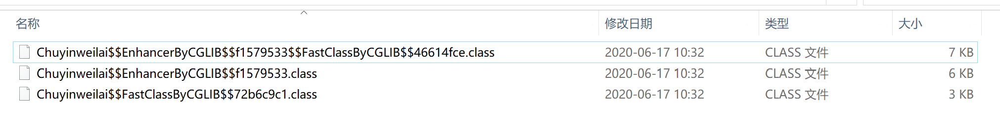

# CGLIB

---

[参考链接：CGLIB(Code Generation Library)详解](https://blog.csdn.net/danchu/article/details/70238002)

[参考链接：Java两种动态代理JDK动态代理和CGLIB动态代理](https://blog.csdn.net/flyfeifei66/article/details/81481222)

[参考链接：CGLib动态代理](https://www.cnblogs.com/wyq1995/p/10945034.html)

[参考链接：jdk动态代理和cglib的区别](https://www.cnblogs.com/jayjie/p/11561620.html)

---

## 关于cglib

+ CGLIB（Code Generation Library）是一个强大的、高性能的代码生成库
+ 广泛应用于AOP框架（Spring、dynaop）中，用以提供方法拦截操作（spring中一般会优先使用JDK动态代理技术）
+ CGLIB代理主要通过对字节码的操作，为对象引入间接级别，以控制对象的访问
+ JDK本身也有动态代理的 API，但是`JDK的动态代理只能对实现了顶层接口的类进行代理，如果类没有顶层接口，无法用JDK Proxy进行动态代理`，JDK的动态代理实现即`生成一个实现顶层接口并继承Proxy的代理类，属于和被代理类同级别的类`；而cglib是通过继承关系（可以查阅里氏替换原则LSP），`继承需要被代理的类，生成新的代理类，代理类重写父类（被代理类）方法`，因此，被代理类或被代理方法不能声明为final

## cglib demo

```java
package top.tjsanshao;

import net.sf.cglib.core.DebuggingClassWriter;
import net.sf.cglib.proxy.Enhancer;
import net.sf.cglib.proxy.MethodInterceptor;
import net.sf.cglib.proxy.MethodProxy;

import java.lang.reflect.Method;

/**
 * custom MethodInterceptor
 *
 * @author TjSanshao
 * @date 2020-06-17 09:57
 */
public class CustomMethodInterceptor implements MethodInterceptor {
    // 要对被代理类实现方法的增强功能（即需要代理类来处理的流程），则需要实现MethodInterceptor接口

    public static void main(String[] args) {
        // 保存class文件到本地，可以直接使用idea反编译查看
        System.setProperty(DebuggingClassWriter.DEBUG_LOCATION_PROPERTY, "D:\\garbages");
        // 新建增强器实例
        Enhancer enhancer = new Enhancer();
        // 设置MethodInterceptor
        enhancer.setCallback(new CustomMethodInterceptor());
        // 设置父类（被代理类）
        enhancer.setSuperclass(Chuyinweilai.class);
        // 获取代理类
        Princess princess = (Princess) enhancer.create();
        // 调用代理类方法
        princess.say();
        princess.sing();
    }

    /**
     * MethodInterceptor方法，生成的代理类在重写父类需要代理的方法时，会调用该方法
     * @param o 代理类的对象实例
     * @param method 被代理的方法
     * @param objects 方法参数
     * @param methodProxy 方法代理实例，这个实例中记录了代理类和被代理类的fastClass（通过数字索引的方法，避免使用反射）
     * @return 返回值同被代理方法返回值
     * @throws Throwable 可以抛出异常
     */
    @Override
    public Object intercept(Object o, Method method, Object[] objects, MethodProxy methodProxy) throws Throwable {
        System.out.println("Custom MethodInterceptor");
        System.out.println(method);
        System.out.println(methodProxy);
        return methodProxy.invokeSuper(o, objects);
    }
}
```

## cglib源码分析

cglib会生成3个类，代理类、代理类fastClass、被代理类fastClass



```java
// 获取代理类
Princess princess = (Princess) enhancer.create();
```

以上是生成代理类的主要方法，这里是无参数构造器，有相应的有参构造器

以下是`enhancer.create()`源码

```java
public Object create() {
    this.classOnly = false;
    this.argumentTypes = null;
    // 主要调用了createHelper()方法
    return this.createHelper();
}
```

```java
private Object createHelper() {
    this.validate();
    // 这里是设置代理类的名称前缀
    if (this.superclass != null) {
        this.setNamePrefix(this.superclass.getName());
    } else if (this.interfaces != null) {
        this.setNamePrefix(this.interfaces[ReflectUtils.findPackageProtected(this.interfaces)].getName());
    }

    // 这里是生成代理类的方法，其父类抽象类AbstractClassGenerator的create()方法
    return super.create(KEY_FACTORY.newInstance(this.superclass != null ? this.superclass.getName() : null, ReflectUtils.getNames(this.interfaces), this.filter, this.callbackTypes, this.useFactory, this.interceptDuringConstruction, this.serialVersionUID));
}
```

```java
protected Object create(Object key) {
    try {
        Class gen = null;
        synchronized(this.source) {
            ClassLoader loader = this.getClassLoader();
            Map cache2 = null;
            cache2 = (Map)this.source.cache.get(loader);
            if (cache2 == null) {
                cache2 = new HashMap();
                ((Map)cache2).put(NAME_KEY, new HashSet());
                this.source.cache.put(loader, cache2);
            } else if (this.useCache) {
                Reference ref = (Reference)((Map)cache2).get(key);
                gen = (Class)(ref == null ? null : ref.get());
            }

            if (gen == null) {
                Object save = CURRENT.get();
                CURRENT.set(this);

                Object var24;
                try {
                    this.key = key;
                    if (this.attemptLoad) {
                        try {
                            gen = loader.loadClass(this.getClassName());
                        } catch (ClassNotFoundException var17) {
                        }
                    }

                    if (gen == null) {
                        // 这里生成字节码
                        byte[] b = this.strategy.generate(this);
                        // 获取到类名
                        String className = ClassNameReader.getClassName(new ClassReader(b));
                        this.getClassNameCache(loader).add(className);
                        // 获取到生成代理类的类信息
                        gen = ReflectUtils.defineClass(className, b, loader);
                    }

                    if (this.useCache) {
                        ((Map)cache2).put(key, new WeakReference(gen));
                    }

                    var24 = this.firstInstance(gen);
                } finally {
                    CURRENT.set(save);
                }

                return var24;
            }
        }

        // 返回代理类实例
        return this.firstInstance(gen);
    } catch (RuntimeException var20) {
        throw var20;
    } catch (Error var21) {
        throw var21;
    } catch (Exception var22) {
        throw new CodeGenerationException(var22);
    }
}
```

以上代码创建了代理类对象并返回，可以通过idea反编译查看到生成的代理类源码

```java
//
// Source code recreated from a .class file by IntelliJ IDEA
// (powered by Fernflower decompiler)
//

package top.tjsanshao;

import java.lang.reflect.Method;
import net.sf.cglib.core.ReflectUtils;
import net.sf.cglib.core.Signature;
import net.sf.cglib.proxy.Callback;
import net.sf.cglib.proxy.Factory;
import net.sf.cglib.proxy.MethodInterceptor;
import net.sf.cglib.proxy.MethodProxy;

public class Chuyinweilai$$EnhancerByCGLIB$$f1579533 extends Chuyinweilai implements Factory {
    // 可以看到类的成员中，每个方法都有一个Method对象和一个MethodProxy对象
    private boolean CGLIB$BOUND;
    private static final ThreadLocal CGLIB$THREAD_CALLBACKS;
    private static final Callback[] CGLIB$STATIC_CALLBACKS;
    // 这里的 MethodInterceptor对象需要手动传入，带有方法的前后处理流程
    private MethodInterceptor CGLIB$CALLBACK_0;
    private static final Method CGLIB$sing$0$Method;
    private static final MethodProxy CGLIB$sing$0$Proxy;
    private static final Object[] CGLIB$emptyArgs;
    private static final Method CGLIB$say$1$Method;
    private static final MethodProxy CGLIB$say$1$Proxy;
    private static final Method CGLIB$finalize$2$Method;
    private static final MethodProxy CGLIB$finalize$2$Proxy;
    private static final Method CGLIB$equals$3$Method;
    private static final MethodProxy CGLIB$equals$3$Proxy;
    private static final Method CGLIB$toString$4$Method;
    private static final MethodProxy CGLIB$toString$4$Proxy;
    private static final Method CGLIB$hashCode$5$Method;
    private static final MethodProxy CGLIB$hashCode$5$Proxy;
    private static final Method CGLIB$clone$6$Method;
    private static final MethodProxy CGLIB$clone$6$Proxy;

    // 静态代码块，大致意思是找到每个方法的Method对象以及生成相应MethodProxy对象
    static void CGLIB$STATICHOOK1() {
        CGLIB$THREAD_CALLBACKS = new ThreadLocal();
        CGLIB$emptyArgs = new Object[0];
        Class var0 = Class.forName("top.tjsanshao.Chuyinweilai$$EnhancerByCGLIB$$f1579533");
        Class var1;
        Method[] var10000 = ReflectUtils.findMethods(new String[]{"finalize", "()V", "equals", "(Ljava/lang/Object;)Z", "toString", "()Ljava/lang/String;", "hashCode", "()I", "clone", "()Ljava/lang/Object;"}, (var1 = Class.forName("java.lang.Object")).getDeclaredMethods());
        CGLIB$finalize$2$Method = var10000[0];
        CGLIB$finalize$2$Proxy = MethodProxy.create(var1, var0, "()V", "finalize", "CGLIB$finalize$2");
        CGLIB$equals$3$Method = var10000[1];
        CGLIB$equals$3$Proxy = MethodProxy.create(var1, var0, "(Ljava/lang/Object;)Z", "equals", "CGLIB$equals$3");
        CGLIB$toString$4$Method = var10000[2];
        CGLIB$toString$4$Proxy = MethodProxy.create(var1, var0, "()Ljava/lang/String;", "toString", "CGLIB$toString$4");
        CGLIB$hashCode$5$Method = var10000[3];
        CGLIB$hashCode$5$Proxy = MethodProxy.create(var1, var0, "()I", "hashCode", "CGLIB$hashCode$5");
        CGLIB$clone$6$Method = var10000[4];
        CGLIB$clone$6$Proxy = MethodProxy.create(var1, var0, "()Ljava/lang/Object;", "clone", "CGLIB$clone$6");
        var10000 = ReflectUtils.findMethods(new String[]{"sing", "()V", "say", "()V"}, (var1 = Class.forName("top.tjsanshao.Chuyinweilai")).getDeclaredMethods());
        CGLIB$sing$0$Method = var10000[0];
        CGLIB$sing$0$Proxy = MethodProxy.create(var1, var0, "()V", "sing", "CGLIB$sing$0");
        CGLIB$say$1$Method = var10000[1];
        CGLIB$say$1$Proxy = MethodProxy.create(var1, var0, "()V", "say", "CGLIB$say$1");
    }

    final void CGLIB$sing$0() {
        super.sing();
    }

    // 这里是重写了父类的方法
    public final void sing() {
        MethodInterceptor var10000 = this.CGLIB$CALLBACK_0;
        // 判断MethodInterceptor是否为null
        if (var10000 == null) {
            // null会调用BIND_CALLBACKS绑定MethodInterceptor
            CGLIB$BIND_CALLBACKS(this);
            var10000 = this.CGLIB$CALLBACK_0;
        }

        if (var10000 != null) {
            // 调用MethodInterceptor的intercept
            // 传入代理类本身实例this，原方法，参数，代理方法MethodProxy
            var10000.intercept(this, CGLIB$sing$0$Method, CGLIB$emptyArgs, CGLIB$sing$0$Proxy);
        } else {
            // 否则直接调用父类方法，没有任何增强
            super.sing();
        }
    }

    final void CGLIB$say$1() {
        super.say();
    }

    public final void say() {
        MethodInterceptor var10000 = this.CGLIB$CALLBACK_0;
        if (var10000 == null) {
            CGLIB$BIND_CALLBACKS(this);
            var10000 = this.CGLIB$CALLBACK_0;
        }

        if (var10000 != null) {
            var10000.intercept(this, CGLIB$say$1$Method, CGLIB$emptyArgs, CGLIB$say$1$Proxy);
        } else {
            super.say();
        }
    }

    final void CGLIB$finalize$2() throws Throwable {
        super.finalize();
    }

    protected final void finalize() throws Throwable {
        MethodInterceptor var10000 = this.CGLIB$CALLBACK_0;
        if (var10000 == null) {
            CGLIB$BIND_CALLBACKS(this);
            var10000 = this.CGLIB$CALLBACK_0;
        }

        if (var10000 != null) {
            var10000.intercept(this, CGLIB$finalize$2$Method, CGLIB$emptyArgs, CGLIB$finalize$2$Proxy);
        } else {
            super.finalize();
        }
    }

    final boolean CGLIB$equals$3(Object var1) {
        return super.equals(var1);
    }

    public final boolean equals(Object var1) {
        MethodInterceptor var10000 = this.CGLIB$CALLBACK_0;
        if (var10000 == null) {
            CGLIB$BIND_CALLBACKS(this);
            var10000 = this.CGLIB$CALLBACK_0;
        }

        if (var10000 != null) {
            Object var2 = var10000.intercept(this, CGLIB$equals$3$Method, new Object[]{var1}, CGLIB$equals$3$Proxy);
            return var2 == null ? false : (Boolean)var2;
        } else {
            return super.equals(var1);
        }
    }

    final String CGLIB$toString$4() {
        return super.toString();
    }

    public final String toString() {
        MethodInterceptor var10000 = this.CGLIB$CALLBACK_0;
        if (var10000 == null) {
            CGLIB$BIND_CALLBACKS(this);
            var10000 = this.CGLIB$CALLBACK_0;
        }

        return var10000 != null ? (String)var10000.intercept(this, CGLIB$toString$4$Method, CGLIB$emptyArgs, CGLIB$toString$4$Proxy) : super.toString();
    }

    final int CGLIB$hashCode$5() {
        return super.hashCode();
    }

    public final int hashCode() {
        MethodInterceptor var10000 = this.CGLIB$CALLBACK_0;
        if (var10000 == null) {
            CGLIB$BIND_CALLBACKS(this);
            var10000 = this.CGLIB$CALLBACK_0;
        }

        if (var10000 != null) {
            Object var1 = var10000.intercept(this, CGLIB$hashCode$5$Method, CGLIB$emptyArgs, CGLIB$hashCode$5$Proxy);
            return var1 == null ? 0 : ((Number)var1).intValue();
        } else {
            return super.hashCode();
        }
    }

    final Object CGLIB$clone$6() throws CloneNotSupportedException {
        return super.clone();
    }

    protected final Object clone() throws CloneNotSupportedException {
        MethodInterceptor var10000 = this.CGLIB$CALLBACK_0;
        if (var10000 == null) {
            CGLIB$BIND_CALLBACKS(this);
            var10000 = this.CGLIB$CALLBACK_0;
        }

        return var10000 != null ? var10000.intercept(this, CGLIB$clone$6$Method, CGLIB$emptyArgs, CGLIB$clone$6$Proxy) : super.clone();
    }

    public static MethodProxy CGLIB$findMethodProxy(Signature var0) {
        String var10000 = var0.toString();
        switch(var10000.hashCode()) {
        case -1574182249:
            if (var10000.equals("finalize()V")) {
                return CGLIB$finalize$2$Proxy;
            }
            break;
        case -909388886:
            if (var10000.equals("say()V")) {
                return CGLIB$say$1$Proxy;
            }
            break;
        case -508378822:
            if (var10000.equals("clone()Ljava/lang/Object;")) {
                return CGLIB$clone$6$Proxy;
            }
            break;
        case 1826985398:
            if (var10000.equals("equals(Ljava/lang/Object;)Z")) {
                return CGLIB$equals$3$Proxy;
            }
            break;
        case 1913648695:
            if (var10000.equals("toString()Ljava/lang/String;")) {
                return CGLIB$toString$4$Proxy;
            }
            break;
        case 1984935277:
            if (var10000.equals("hashCode()I")) {
                return CGLIB$hashCode$5$Proxy;
            }
            break;
        case 2094464646:
            if (var10000.equals("sing()V")) {
                return CGLIB$sing$0$Proxy;
            }
        }

        return null;
    }

    public Chuyinweilai$$EnhancerByCGLIB$$f1579533() {
        CGLIB$BIND_CALLBACKS(this);
    }

    public static void CGLIB$SET_THREAD_CALLBACKS(Callback[] var0) {
        CGLIB$THREAD_CALLBACKS.set(var0);
    }

    public static void CGLIB$SET_STATIC_CALLBACKS(Callback[] var0) {
        CGLIB$STATIC_CALLBACKS = var0;
    }

    private static final void CGLIB$BIND_CALLBACKS(Object var0) {
        Chuyinweilai$$EnhancerByCGLIB$$f1579533 var1 = (Chuyinweilai$$EnhancerByCGLIB$$f1579533)var0;
        if (!var1.CGLIB$BOUND) {
            var1.CGLIB$BOUND = true;
            Object var10000 = CGLIB$THREAD_CALLBACKS.get();
            if (var10000 == null) {
                var10000 = CGLIB$STATIC_CALLBACKS;
                if (var10000 == null) {
                    return;
                }
            }

            var1.CGLIB$CALLBACK_0 = (MethodInterceptor)((Callback[])var10000)[0];
        }

    }

    public Object newInstance(Callback[] var1) {
        CGLIB$SET_THREAD_CALLBACKS(var1);
        Chuyinweilai$$EnhancerByCGLIB$$f1579533 var10000 = new Chuyinweilai$$EnhancerByCGLIB$$f1579533();
        CGLIB$SET_THREAD_CALLBACKS((Callback[])null);
        return var10000;
    }

    public Object newInstance(Callback var1) {
        CGLIB$SET_THREAD_CALLBACKS(new Callback[]{var1});
        Chuyinweilai$$EnhancerByCGLIB$$f1579533 var10000 = new Chuyinweilai$$EnhancerByCGLIB$$f1579533();
        CGLIB$SET_THREAD_CALLBACKS((Callback[])null);
        return var10000;
    }

    public Object newInstance(Class[] var1, Object[] var2, Callback[] var3) {
        CGLIB$SET_THREAD_CALLBACKS(var3);
        Chuyinweilai$$EnhancerByCGLIB$$f1579533 var10000 = new Chuyinweilai$$EnhancerByCGLIB$$f1579533;
        switch(var1.length) {
        case 0:
            var10000.<init>();
            CGLIB$SET_THREAD_CALLBACKS((Callback[])null);
            return var10000;
        default:
            throw new IllegalArgumentException("Constructor not found");
        }
    }

    public Callback getCallback(int var1) {
        CGLIB$BIND_CALLBACKS(this);
        MethodInterceptor var10000;
        switch(var1) {
        case 0:
            var10000 = this.CGLIB$CALLBACK_0;
            break;
        default:
            var10000 = null;
        }

        return var10000;
    }

    public void setCallback(int var1, Callback var2) {
        switch(var1) {
        case 0:
            this.CGLIB$CALLBACK_0 = (MethodInterceptor)var2;
        default:
        }
    }

    public Callback[] getCallbacks() {
        CGLIB$BIND_CALLBACKS(this);
        return new Callback[]{this.CGLIB$CALLBACK_0};
    }

    public void setCallbacks(Callback[] var1) {
        this.CGLIB$CALLBACK_0 = (MethodInterceptor)var1[0];
    }

    static {
        CGLIB$STATICHOOK1();
    }
}
```

代理类调用重写的父类方法时，主要调用了intercept方法，intercept方法中，除了手写的额外流程外，还调用了方法methodProxy.invokeSuper()方法

```java
public Object invokeSuper(Object obj, Object[] args) throws Throwable {
    try {
        // init方法可以理解为加载fastClass信息
        this.init();
        // 获取fastClass信息，其中fastClassInfo是一个内部类，分别有代理类fastClass，被代理类fastClass，代理类方法序号，被代理类方法序号4个成员
        MethodProxy.FastClassInfo fci = this.fastClassInfo;
        // f2是被代理类的fastClass，调用fastClass的invoke方法，可以理解为调用父类的方法，只不过这里通过fastClass来调用，省去了反射的时间
        return fci.f2.invoke(fci.i2, obj, args);
    } catch (InvocationTargetException var4) {
        throw var4.getTargetException();
    }
}
```

```java
// invokeSuper方法最终会调用到被代理类的fastClass的invoke方法
public Object invoke(int var1, Object var2, Object[] var3) throws InvocationTargetException {
    // 里氏替换原则，转换成父类
    Chuyinweilai var10000 = (Chuyinweilai)var2;
    int var10001 = var1;

    try {
        // 直接通过序号判断调用哪个方法
        switch(var10001) {
        case 0:
            var10000.sing();
            return null;
        case 1:
            var10000.say();
            return null;
        case 2:
            var10000.wait();
            return null;
        case 3:
            var10000.wait(((Number)var3[0]).longValue(), ((Number)var3[1]).intValue());
            return null;
        case 4:
            var10000.wait(((Number)var3[0]).longValue());
            return null;
        case 5:
            return new Boolean(var10000.equals(var3[0]));
        case 6:
            return var10000.toString();
        case 7:
            return new Integer(var10000.hashCode());
        case 8:
            return var10000.getClass();
        case 9:
            var10000.notify();
            return null;
        case 10:
            var10000.notifyAll();
            return null;
        }
    } catch (Throwable var4) {
        throw new InvocationTargetException(var4);
    }

    throw new IllegalArgumentException("Cannot find matching method/constructor");
}
```

以上分析只是浅显的阐述了cglib的动态代理的简单过程

+ 实现`MethodInterceptor`，实现`public Object intercept(Object o, Method method, Object[] objects, MethodProxy methodProxy) throws Throwable`方法，该方法即需要做代理的流程，在里面需要`methodProxy.invokeSuper(o, objects)`方法来调用原本父类的方法，即需要做处理的流程可以在调用`invokeSuper`前后
+ 创建`Enhancer`实例，中文名叫增强器，设置`MethodInterceptor`，设置被代理类
+ 通过`Enhancer.create()`方法可以获取到代理类实例，此时，cglib已经生成了3个类（分别是代理类、代理类fastClass、被代理类fastClass）
+ 直接通过获得的代理类实例的方法进行调用，即可得到代理的效果（此时的代理类是被代理类的子类，可以直接调用被代理类的可继承方法，即可得到代理效果）
+ 代理类调用方法时，会调用传入到Enhancer实例的MethodInterceptor接口的intercept方法，intercept方法中调用了invokeSuper方法，invokeSuper方法即调用生成的被代理类fastClass中的invoke方法，最终调用了父类的相应方法

## cglib和jdk Proxy的区别

JDK Proxy：利用反射机制`生成一个实现代理接口的匿名类`，在调用具体方法之前调用InvokeHandler来处理，如果目标对象实现了接口，默认情况下会采用JDK的动态代理实现AOP

cglib：利用asm开源包，将代理对象的class文件加载进来，`通过修改字节码生成子类来处理`，如果目标对象没有实现了接口，必须采用CGLIB库

### 区别

+ JDK动态代理`只能对实现了接口的类生成代理，而不能针对类`
+ CGLIB是针对类实现代理，主要是`对指定的类生成一个子类，覆盖其中的方法`，因为是继承，所以该类或方法最好不要声明成final
+ `由于java的单继承，动态生成的代理类已经继承了Proxy类的，就不能再继承其他的类，所以只能靠实现被代理类的接口的形式，故JDK的动态代理必须有接口`
