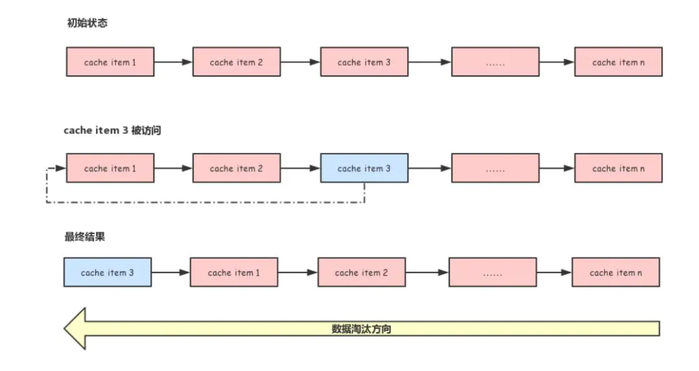

# Redis Expiration Policies

---

[参考链接：Redis淘汰删除策略](https://www.cnblogs.com/George1994/p/10681090.html)

[参考链接：Redis数据淘汰算法](https://www.jianshu.com/p/857282187164)

---

## Redis删除过期键策略

Redis 目前采用的策略是：**定期删除 + 惰性删除**

共有3种删除过期键策略：

1. **定时删除**：在设置键的过期时间的同时，创建一个定时器，让定时器在键的过期时间来临时，立即执行对键的删除操作；定时删除操作对于内存来说是友好的，内存不需要操作，而是通过使用定时器，可以保证尽快的将过期键删除，但是对于CPU来说不是友好的，如果过期键比较多的话，起的定时器也会比较多，删除的这个操作会占用到CPU的资源

2. **惰性删除**：放任键过期不管，但是每次从键空间中获取键是，都检查取得的键的过期时间，如果过期的话，删除即可；`惰性操作对于CPU来说是友好的`，过期键只有在程序读取时判断是否过期才删除掉，而且也只会删除这一个过期键，但是对于内存来说是不友好的，如果多个键都已经过期了，而这些键又恰好没有被访问，那么这部分的内存就都不会被释放出来

3. **定期删除**：每隔一段时间，程序就对数据库进行一次检查，删除掉过期键；定期删除是上面两种方案的折中方案，`每隔一段时间来删除过期键，并通过限制删除操作执行的时长和频率来减少删除操作对CPU时间的影响`，除此之外，还有效的减少内存的浪费；但是该策略的难点在于间隔时长，这个需要根据自身业务情况来进行设置

但是实际上这还是有问题的，如果定期删除漏掉了很多过期 key，也没及时去查，即也没走惰性删除，此时大量过期 key 堆积在内存里，导致 Redis 内存块耗尽

此时，需要**内存淘汰机制**

## Redis内存淘汰策略

Redis的所有数据都存储在内存中，但是内存是一种有限的资源，所以为了防止Redis无限制的使用内存，在启动Redis时可以通过配置项 `maxmemory` 来指定其最大能使用的内存容量

当Redis使用的内存超过配置的 `maxmemory` 时，便会触发数据淘汰策略

1. `volatile-lru`：最近最少使用算法，从设置了过期时间的键中选择空转时间最长的键值对清除掉
2. `volatile-lfu`：最近最不经常使用算法，从设置了过期时间的键中选择某段时间之内使用频次最小的键值对清除掉
3. `volatile-ttl`：从设置了过期时间的键中选择过期时间最早的键值对清除
4. `volatile-random`：从设置了过期时间的键中，随机选择键进行清除
5. `allkeys-lru`：最近最少使用算法，从所有的键中选择空转时间最长的键值对清除
6. `allkeys-lfu`：最近最不经常使用算法，从所有的键中选择某段时间之内使用频次最少的键值对清除
7. `allkeys-random`：所有的键中，随机选择键进行删除
8. `noeviction`：做任何的清理工作，在redis的内存超过限制之后，所有的写入操作都会返回错误；但是读操作都能正常的进行

## 其他模块对于过期键删除的处理

### RDB

+ RDB是通过创建快照获取内存中的数据在某一个时间点上的数据的副本
+ 有两个命令可以创建RDB文件，分别是SAVE和BGSAVE，两者的区别在于是否阻塞进程去创建RDB文件
+ 这两个命令**都不会将数据空间中的过期键给保存到RDB文件中**

+ 在启动Redis服务器时，如果服务器开启了RDB文件，那么服务器就会对RDB文件进行载入，需要注意⚠️的是：
  + 如果当前服务器是**Master**，那么**过期键将会被忽略**，不会载入到主服务器中
  + 如果当前服务器是**Slave**，**文件中所有键，不过是否过期都会被载入到从服务器中**

### AOF

+ 数据库中的过期键没有被删除时，其不会对AOF文件有任何的影响
+ 当过期键被删除以后，程序**会向AOF文件追加一条`DEL`命令**，显示记录该键已经被删除

+ AOF是将执行的写命令添加到AOF文件的末尾来记录数据的变化
+ 为了避免文件被添加得越来越大，甚至有可能用完硬盘的所有空间，因此Redis提供了Rewrite的优化策略，分别是`REWRITEAOF`和`BGREWRITEAOF`，两个命令的区别也是在于是否阻塞主进程
+ **这两个命令都不会将数据空间中的过期键给保存到AOF文件中**

### 主从模式下对过期键的处理

通常在主从模式下，主服务器来读取写命令，从服务器用来读取读命令，分担主服务器的压力（与那种持久化模式无关），需要注意⚠️的是：

+ 如果当前服务器是**Slave**的话，如果有命令读取当前过期键的话，**不会惰性删除**，因为这会影响读取的性能，因此不会删除，并且返回过期键对应的值
+ **Slave只会在Master服务器同步告知Slave服务器需要删除过期键才会删除**
+ 如果当前服务器是**Master**的话，当服务器通过策略得知某个键过期，则**将该过期键给删除**，并且**同步给其他从服务器**让它们删除掉该键

## LRU算法

`LRU` 是 `Least Recently Used` 的缩写，即`最近最少使用`，很多缓存系统都使用此算法作为淘汰策略

最简单的实现方式就是把所有缓存通过一个链表连接起来，新创建的缓存添加到链表的头部，如果有缓存被访问了，就把缓存移动到链表的头部；由于被访问的缓存会移动到链表的头部，所以没有被访问的缓存会随着时间的推移移动的链表的尾部，淘汰数据时只需要从链表的尾部开始即可

## Redis LRU 算法

Redis使用了结构体`robj`来存储缓存对象，而robj结构有个名为`lru`的字段，用于记录缓存对象最后被访问的时间，Redis就是以lru字段的值作为淘汰依据

当缓存对象被访问时，便会更新此字段的值

Redis在处理每一个命令时都会检查内存的使用是否超过了限制的最大值，处理命令是通过`processCommand()`函数进行的

当使用非随机淘汰策略时需要进行数据采样（`volatile-lru/volatile-lfu/volatile-ttl/allkeys-lru/allkeys-lfu`），数据采样通过 `evictionPoolPopulate()` 函数进行

**`淘汰数据时只是从样本中找到最优的淘汰缓存对象，并不是从所有缓存对象集合中查找`**

LRU算法 需要维护一个LRU链表，而维护一个LRU链表的成本比较大，所以Redis才出此下策

更多有关解析，请查看[Redis数据淘汰算法](https://www.jianshu.com/p/857282187164)
