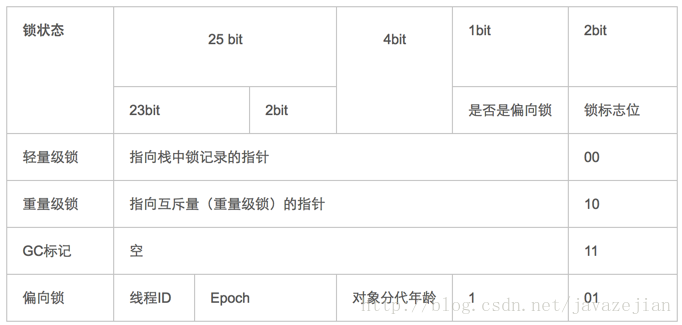

# synchronized原理

---

[参考链接：深入理解Java并发之synchronized实现原理](https://blog.csdn.net/javazejian/article/details/72828483?depth_1-utm_source=distribute.pc_relevant.none-task&utm_source=distribute.pc_relevant.none-task)

---

## 关于并发编程中的线程安全问题诱因

造成线程安全的主要诱因有两点：

1. 存在共享资源（即临界资源）

2. 存在多个线程同时操作共享资源

`在实际的多线程中，往往需要使用一个互斥锁来解决多个线程同时操作共享资源的问题，即当一个线程操作共享资源时会同时给共享资源加锁，在加锁后，其他线程无法访问该共享资源，会处于等待状态，直至互斥锁释放`

在 Java 中，关键字 ***`synchronized`*** 可以保证在同一个时刻，只有一个线程可以执行某个方法或者某个代码块(主要是对方法或者代码块中存在共享数据的操作)
同时，synchronized关键字还可以保证一个线程的变化（主要是共享数据的变化）可以被其他线程所监听，即可见性（此处可参考[volatile关键字](./volatile关键字.md)）

## synchronized的三种应用方式

1. 修饰实例方法，作用于当前实例加锁，进入同步代码前要获得当前实例的锁

2. 修饰静态方法，作用于当前类对象加锁，进入同步代码前要获得当前类对象的锁

3. 修饰代码块，指定加锁对象，对给定对象加锁，进入同步代码库前要获得给定对象的锁

### 修饰实例方法

正确示例：

```java
public class AccountingSync implements Runnable{
    // 共享资源(临界资源)
    static int i = 0;

    /**
     * synchronized 修饰实例方法
     */
    public synchronized void increase(){
        // 获取实例的对象锁
        i++;
    }
    @Override
    public void run() {
        for(int j = 0; j < 1000000; j++){
            increase();
        }
    }
    public static void main(String[] args) throws InterruptedException {
        AccountingSync instance=new AccountingSync();

        // 这里2个线程使用同一个对象，获取的是同一个对象锁，因此可以互斥
        Thread t1 = new Thread(instance);
        Thread t2 = new Thread(instance);
        t1.start();
        t2.start();
        t1.join();
        t2.join();
        System.out.println(i);
    }
    /**
     * 输出结果:
     * 2000000
     */
}
```

错误示例：

```java
public class AccountingSyncBad implements Runnable{
    static int i = 0;
    public synchronized void increase(){
        // 获取实例的对象锁
        i++;
    }
    @Override
    public void run() {
        for(int j = 0;j < 1000000; j++){
            increase();
        }
    }
    public static void main(String[] args) throws InterruptedException {
        // new新实例
        Thread t1 = new Thread(new AccountingSyncBad());
        // new新实例
        Thread t2 = new Thread(new AccountingSyncBad());

        // 2个线程使用的不是同一个对象，即2个线程获取的并不是同一个锁，因此无法产生互斥
        t1.start();
        t2.start();
        // join含义:当前线程A等待thread线程终止之后才能从thread.join()返回
        t1.join();
        t2.join();
        System.out.println(i);
    }
}
```

### 修饰静态方法

当synchronized作用于静态方法时，其锁就是当前类的class对象锁（只有当调用修饰的静态方法时获取的才是当前类的class对象锁）

### synchronized同步代码块

demo：

```java
public class AccountingSync implements Runnable{
    static AccountingSync instance = new AccountingSync();
    static int i = 0;
    @Override
    public void run() {
        // 省略其他耗时操作....
        // 使用同步代码块对变量i进行同步操作,锁对象为instance
        synchronized(instance){
            for(int j = 0;j < 1000000; j++){
                    i++;
              }
        }
    }
    public static void main(String[] args) throws InterruptedException {
        Thread t1 = new Thread(instance);
        Thread t2 = new Thread(instance);
        t1.start();
        t2.start();
        t1.join();
        t2.join();
        System.out.println(i);
    }
}
```

上述代码使用了一个静态对象作为锁，在使用synchronized关键字修饰代码块时，只需要保证需要共享资源的线程间竞争同一把锁即可

## synchronized底层语义原理

Java 虚拟机中的同步(Synchronization)基于进入和退出管程(Monitor)对象实现，无论是显式同步(有明确的 monitorenter 和 monitorexit 指令,即同步代码块)还是隐式同步都是如此
在 Java 语言中，同步用的最多的地方可能是被 synchronized 修饰的同步方法，同步方法并不是由 monitorenter 和 monitorexit 指令来实现同步的，而是由方法调用指令读取运行时常量池中方法的 `ACC_SYNCHRONIZED` 标志来隐式实现的

## Java对象头与Monitor

在JVM中，对象在内存中的布局分为三块区域：对象头、实例数据和对齐填充


1. 实例变量：存放类的属性数据信息，包括父类的属性信息，如果是数组的实例部分还包括数组的长度，这部分内存按4字节对齐

2. 填充数据：由于虚拟机要求对象起始地址必须是8字节的整数倍。填充数据不是必须存在的，仅仅是为了字节对齐

3. 对象头：一般而言，synchronized使用的锁对象是存储在Java对象头里的，jvm中采用2个字（这里的字是指寻址长度，即32bitjvm中，一个字=32bit=8byte）来存储对象头(如果对象是数组则会分配3个字，多出来的1个字记录的是数组长度)，其主要结构是由Mark Word 和 Class Metadata Address 组成

虚拟机位数 | 对象头结构 | 说明
:-: | :-: | :-: |
32/64bit | Mark Word | 存储对象的hashCode、锁信息或分代年龄或GC标志等信息
32/64bit | Class Metadata Address | 类型指针指向对象的类元数据，JVM通过这个指针确定该对象是哪个类的实例

其中Mark Word在默认情况下存储着对象的HashCode、分代年龄、锁标记位等

以下是32位JVM的Mark Word默认存储结构

锁状态 | 25bit | 4bit | 1bit是否是偏向锁 | 2bit 锁标志位
:-: | :-: | :-: | :-: | :-: |
无锁状态 | 对象HashCode | 对象分代年龄 | 0 | 01

由于对象头的信息是与对象自身定义的数据没有关系的额外存储成本，因此考虑到JVM的空间效率，Mark Word 被设计成为一个非固定的数据结构，以便存储更多有效的数据，它会根据对象本身的状态复用自己的存储空间

如32位JVM下，除了上述列出的Mark Word默认存储结构外，还有如下可能变化的结构



`重量级锁` ：也就是通常所说的synchronized的对象锁，锁标识位为10，其中指针指向的是monitor对象（也称为管程或监视器锁）的起始地址，每个对象都存在一个monitor与之关联，对象与其 monitor 之间的关系有存在多种实现方式，如monitor可以与对象一起创建销毁或当线程试图获取对象锁时自动生成，但当一个 monitor 被某个线程持有后，它便处于锁定状态
在Java虚拟机(HotSpot)中，monitor是由ObjectMonitor实现的，其主要数据结构如下（位于HotSpot虚拟机源码ObjectMonitor.hpp文件，C++实现的）

```cpp
ObjectMonitor() {
    _header       = NULL;
    _count        = 0; // 记录个数
    _waiters      = 0,
    _recursions   = 0;
    _object       = NULL;
    _owner        = NULL;
    _WaitSet      = NULL; // 处于wait状态的线程，会被加入到_WaitSet
    _WaitSetLock  = 0 ;
    _Responsible  = NULL ;
    _succ         = NULL ;
    _cxq          = NULL ;
    FreeNext      = NULL ;
    _EntryList    = NULL ; // 处于等待锁block状态的线程，会被加入到该列表
    _SpinFreq     = 0 ;
    _SpinClock    = 0 ;
    OwnerIsThread = 0 ;
  }
```

ObjectMonitor中有两个队列，_WaitSet和_EntryList，用来保存ObjectWaiter对象列表（每个等待锁的线程都会被封装成ObjectWaiter对象）
`_owner指向持有ObjectMonitor对象的线程`
当多个线程同时访问一段同步代码时，首先会进入_EntryList集合，当线程获取到对象的monitor 后进入_owner区域并把monitor中的_owner变量设置为当前线程，同时monitor中的计数器count + 1
若线程调用wait()方法，将释放当前持有的monitor，_owner变量恢复为null，count - 1，同时该线程进入_WaitSet集合中等待被唤醒
若当前线程执行完毕也将释放monitor（锁）并复位变量的值，以便其他线程进入获取monitor（锁🔒）

`monitor对象存在于每个Java对象的对象头中`（存储的指针的指向），synchronized锁便是通过这种方式获取锁的，也是为什么Java中任意对象可以作为锁的原因，同时也是notify/notifyAll/wait等方法存在于顶级对象Object中的原因

## synchronized代码块底层原理

现在编写下面的代码：

```java
public class SyncCodeBlock {

   public int i;

   public void syncTask(){
       // 同步代码块
       synchronized (this){
           i++;
       }
   }
}
```

编译上述代码并使用javap反编译后得到字节码如下：

```java
Classfile SyncCodeBlock.class
  Last modified 2017-6-2; size 426 bytes
  MD5 checksum c80bc322c87b312de760942820b4fed5
  Compiled from "SyncCodeBlock.java"
public class com.zejian.concurrencys.SyncCodeBlock
  minor version: 0
  major version: 52
  flags: ACC_PUBLIC, ACC_SUPER
Constant pool:
  //........省略常量池中数据
  //构造函数
  public com.zejian.concurrencys.SyncCodeBlock();
    descriptor: ()V
    flags: ACC_PUBLIC
    Code:
      stack=1, locals=1, args_size=1
         0: aload_0
         1: invokespecial #1                  // Method java/lang/Object."<init>":()V
         4: return
      LineNumberTable:
        line 7: 0
  //`````=主要看看syncTask方法实现````````
  public void syncTask();
    descriptor: ()V
    flags: ACC_PUBLIC
    Code:
      stack=3, locals=3, args_size=1
         0: aload_0
         1: dup
         2: astore_1
         3: monitorenter  //注意此处，进入同步方法
         4: aload_0
         5: dup
         6: getfield      #2             // Field i:I
         9: iconst_1
        10: iadd
        11: putfield      #2            // Field i:I
        14: aload_1
        15: monitorexit   //注意此处，退出同步方法
        16: goto          24
        19: astore_2
        20: aload_1
        21: monitorexit //注意此处，退出同步方法
        22: aload_2
        23: athrow
        24: return
      Exception table:
      //省略其他字节码.......
}
SourceFile: "SyncCodeBlock.java"
```

从字节码中可知同步语句块的实现使用的是monitorenter 和 monitorexit 指令，其中monitorenter指令指向同步代码块的开始位置，monitorexit指令则指明同步代码块的结束位置
当执行monitorenter指令时，当前线程将试图获取 objectref(即对象锁) 所对应的 monitor 的持有权，当 objectref 的 monitor 的进入计数器为 0，那线程可以成功取得 monitor，并将计数器值设置为 1，取锁成功
如果当前线程已经拥有 objectref 的 monitor 的持有权，那它可以重入这个 monitor ，重入时计数器的值也会加 1
倘若其他线程已经拥有 objectref 的 monitor 的所有权，那当前线程将被阻塞，直到正在执行线程执行完毕，即monitorexit指令被执行，执行线程将释放 monitor(锁)并设置计数器值为0 ，其他线程将有机会持有 monitor
值得注意的是编译器将会确保无论方法通过何种方式完成，方法中调用过的每条 monitorenter 指令都有执行其对应 monitorexit 指令，而无论这个方法是正常结束还是异常结束
为了保证在方法异常完成时 monitorenter 和 monitorexit 指令依然可以正确配对执行，编译器会自动产生一个异常处理器，这个异常处理器声明可处理所有的异常，它的目的就是用来执行 monitorexit 指令，从字节码中也可以看出多了一个monitorexit指令，它就是异常结束时被执行的释放 monitor 的指令

## synchronized方法底层原理

方法级的同步是隐式，即无需通过字节码指令来控制的，它实现在方法调用和返回操作之中
JVM可以从方法常量池中的方法表结构（method_info Structure）中的 `ACC_SYNCHRONIZED` 访问标志区分一个方法是否同步方法
当方法调用时，调用指令将会 检查方法的 ACC_SYNCHRONIZED 访问标志是否被设置，如果设置了，执行线程将先持有monitor（虚拟机规范中用的是管程一词）， 然后再执行方法，最后再方法完成（无论是正常完成还是非正常完成）时释放monitor
在方法执行期间，执行线程持有了monitor，其他任何线程都无法再获得同一个monitor
如果一个同步方法执行期间抛 出了异常，并且在方法内部无法处理此异常，那这个同步方法所持有的monitor将在异常抛到同步方法之外时自动释放

编写如下代码：

```java
public class SyncMethod {

   public int i;

   public synchronized void syncTask(){
           i++;
   }
}
```

反编译后的字节码如下：

```java
Classfile SyncMethod.class
  Last modified 2017-6-2; size 308 bytes
  MD5 checksum f34075a8c059ea65e4cc2fa610e0cd94
  Compiled from "SyncMethod.java"
public class com.zejian.concurrencys.SyncMethod
  minor version: 0
  major version: 52
  flags: ACC_PUBLIC, ACC_SUPER
Constant pool;

   //省略没必要的字节码
  //`````````syncTask方法```````````
  public synchronized void syncTask();
    descriptor: ()V
    //方法标识ACC_PUBLIC代表public修饰，ACC_SYNCHRONIZED指明该方法为同步方法
    flags: ACC_PUBLIC, ACC_SYNCHRONIZED
    Code:
      stack=3, locals=1, args_size=1
         0: aload_0
         1: dup
         2: getfield      #2                  // Field i:I
         5: iconst_1
         6: iadd
         7: putfield      #2                  // Field i:I
        10: return
      LineNumberTable:
        line 12: 0
        line 13: 10
}
SourceFile: "SyncMethod.java"
```

从字节码中可以看出，synchronized修饰的方法并没有monitorenter指令和monitorexit指令，取得代之的确实是ACC_SYNCHRONIZED标识，该标识指明了该方法是一个同步方法，`JVM通过该ACC_SYNCHRONIZED访问标志来辨别一个方法是否声明为同步方法，从而执行相应的同步调用`
同时我们还必须注意到的是在Java早期版本中，synchronized属于重量级锁，效率低下，因为监视器锁（monitor）是依赖于底层的操作系统的Mutex Lock来实现的，而操作系统实现线程之间的切换时需要从用户态转换到核心态，这个状态之间的转换需要相对比较长的时间，时间成本相对较高，这也是为什么早期的synchronized效率低的原因
在Java 6之后Java官方对从JVM层面对synchronized较大优化，所以现在的synchronized锁效率也优化得很不错了，Java 6之后，为了减少获得锁和释放锁所带来的性能消耗，引入了轻量级锁和偏向锁

## Java虚拟机对synchronized的优化

锁的状态总共有四种，无锁状态、偏向锁、轻量级锁和重量级锁
随着锁的竞争，锁可以从偏向锁升级到轻量级锁，再升级的重量级锁，但是锁的升级是单向的，也就是说只能从低到高升级，不会出现锁的降级

### 偏向锁

偏向锁是Java 6之后加入的新锁，它是一种针对加锁操作的优化手段
在大多数情况下，锁不仅不存在多线程竞争，而且总是由同一线程多次获得，因此为了减少同一线程获取锁（会涉及到一些CAS操作，耗时）的代价而引入偏向锁
偏向锁的核心思想是，`如果一个线程获得了锁，那么锁就进入偏向模式`，此时Mark Word 的结构也变为偏向锁结构，当这个线程再次请求锁时，无需再做任何同步操作，即获取锁的过程，这样就省去了大量有关锁申请的操作，从而也就提供程序的性能
对于没有锁竞争的场合，偏向锁有很好的优化效果，毕竟极有可能连续多次是同一个线程申请相同的锁
对于锁竞争比较激烈的场合，偏向锁就失效了，因为这样场合极有可能每次申请锁的线程都是不相同的，因此这种场合下不应该使用偏向锁，否则会得不偿失，需要注意的是，`偏向锁失败后，并不会立即膨胀为重量级锁，而是先升级为轻量级锁`

### 轻量级锁

倘若偏向锁失败，虚拟机并不会立即升级为重量级锁，它还会尝试使用一种称为轻量级锁的优化手段（1.6之后加入的），此时Mark Word 的结构也变为轻量级锁的结构
轻量级锁能够提升程序性能的依据是“对绝大部分的锁，在整个同步周期内都不存在竞争”，注意这是经验数据
需要了解的是，轻量级锁所适应的场景是线程交替执行同步块的场合，如果存在同一时间访问同一锁的场合，就会导致轻量级锁膨胀为重量级锁

### 自旋锁

轻量级锁失败后，`虚拟机为了避免线程真实地在操作系统层面挂起，还会进行一项称为自旋锁的优化手段`（即获取锁失败时，线程并不会立即挂起）
这是基于在大多数情况下，线程持有锁的时间都不会太长，如果直接挂起操作系统层面的线程可能会得不偿失，毕竟操作系统实现线程之间的切换时需要从用户态转换到核心态，这个状态之间的转换需要相对比较长的时间，时间成本相对较高，`因此自旋锁会假设在不久将来，当前的线程可以获得锁，因此虚拟机会让当前想要获取锁的线程做几个空循环(这也是称为自旋的原因)，一般不会太久，可能是50个循环或100循环`，在经过若干次循环后，如果得到锁，就顺利进入临界区
如果还不能获得锁，那就会将线程在操作系统层面挂起，这就是自旋锁的优化方式，这种方式确实也是可以提升效率的，最后没办法也就只能升级为重量级锁了（即线程空转之后，仍然获取不到锁，此时需要膨胀为重量级锁）

### 锁消除

消除锁是虚拟机另外一种锁的优化，这种优化更彻底，Java虚拟机在JIT编译时，通过对运行上下文的扫描，`去除不可能存在共享资源竞争的锁`，通过这种方式消除没有必要的锁，可以节省毫无意义的请求锁时间

## synchronized的可重入性

从互斥锁的设计上来说，当一个线程试图操作一个由其他线程持有的对象锁的临界资源时，将会处于阻塞状态，但当一个线程再次请求自己持有对象锁的临界资源时，这种情况属于重入锁，请求将会成功，在java中synchronized是基于原子性的内部锁机制，是可重入的，因此在一个线程调用synchronized方法的同时在其方法体内部调用该对象另一个synchronized方法，也就是说一个线程得到一个对象锁后再次请求该对象锁，是允许的，这就是synchronized的可重入性
需要特别注意另外一种情况，当子类继承父类时，子类也是可以通过可重入锁调用父类的同步方法
注意由于synchronized是基于monitor实现的，因此每次重入，monitor中的计数器仍会加1

## 线程中断与synchronized

### 线程中断

```java
// 中断线程（实例方法）
public void Thread.interrupt();

// 判断线程是否被中断（实例方法）
public boolean Thread.isInterrupted();

// 判断是否被中断并清除当前中断状态（静态方法）
public static boolean Thread.interrupted();
```

当一个线程处于被阻塞状态或者试图执行一个阻塞操作时，使用Thread.interrupt()方式中断该线程，注意此时将会抛出一个InterruptedException的异常，同时中断状态将会被复位（由中断状态改为非中断状态）
`注意，调用Thread.interrupt()方法并不会终止线程，只是将线程的中断状态标志位设置为中断状态，线程中断的结果仍然取决于程序本身，不同于Thread.stop()的立即终止线程`
`如果一个线程处于了阻塞状态（如线程调用了thread.sleep、thread.join、thread.wait、1.5中的condition.await、以及可中断的通道上的 I/O 操作方法后可进入阻塞状态），则在线程在检查中断标示时如果发现中断标示为true，则会在这些阻塞方法（sleep、join、wait、1.5中的condition.await及可中断的通道上的 I/O 操作方法）调用处抛出InterruptedException异常，并且在抛出异常后立即将线程的中断标示位清除，即重新设置为false`
`抛出异常是为了线程从阻塞状态醒过来，并在结束线程前让程序员有足够的时间来处理中断请求`

`**有关线程中断详细可参考：[Thread中断机制](./Thread中断机制.md)**`

如下代码将演示该过程：

```java
public class InterruputSleepThread3 {
    public static void main(String[] args) throws InterruptedException {
        Thread t1 = new Thread() {
            @Override
            public void run() {
                //  while在try中，通过异常中断就可以退出run循环
                try {
                    while (true) {
                        // 当前线程处于阻塞状态，异常必须捕捉处理，无法往外抛出
                        TimeUnit.SECONDS.sleep(2);
                    }
                } catch (InterruptedException e) {
                    System.out.println("Interruted When Sleep");
                    boolean interrupt = this.isInterrupted();
                    // 中断状态被复位
                    System.out.println("interrupt:"+interrupt);
                }
            }
        };
        t1.start();
        TimeUnit.SECONDS.sleep(2);
        // 中断处于阻塞状态的线程
        t1.interrupt();

        /**
         * 输出结果:
           Interruted When Sleep
           interrupt:false
         */
    }
}
```

### 中断与synchronized

事实上`线程的中断操作对于正在等待获取的锁对象的synchronized方法或者代码块并不起作用`，也就是对于synchronized来说，如果一个线程在等待锁，那么结果只有两种，要么它获得这把锁继续执行，要么它就保存等待，即使调用中断线程的方法，也不会生效

`**有关线程中断详细可参考：[Thread中断机制](./Thread中断机制.md)**`

### 等待唤醒机制与synchronized

主要指的是notify/notifyAll和wait方法，在使用这3个方法时，必须处于synchronized代码块或者synchronized方法中，否则就会抛出IllegalMonitorStateException异常
因为调用这几个方法前必须拿到当前对象的监视器monitor对象，也就是说notify/notifyAll和wait方法依赖于monitor对象
monitor 存在于对象头的Mark Word 中(存储monitor引用指针)，而synchronized关键字可以获取 monitor ，这也就是为什么notify/notifyAll和wait方法必须在synchronized代码块或者synchronized方法调用的原因
与sleep方法不同的是wait方法调用完成后，线程将被暂停，但wait方法将会释放当前持有的监视器锁(monitor)，直到有线程调用notify/notifyAll方法后方能继续执行，而sleep方法只让线程休眠并不释放锁
同时notify/notifyAll方法调用后，并不会马上释放监视器锁，而是在相应的synchronized(){}/synchronized方法执行结束后才自动释放锁
