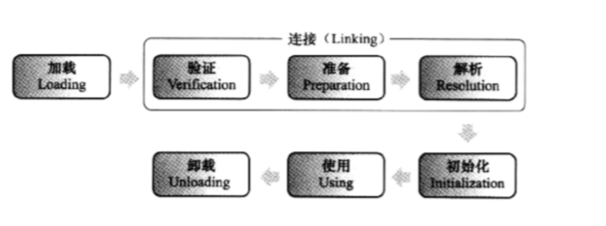

# 常量池

---

[参考链接：基于JDK1.8 分析运行时常量池、字符串常量池、各种常量池](https://blog.csdn.net/qq_31615049/article/details/81611918)

[参考链接：Java 中容易混淆的概念：Java 8 中的常量池、字符串池、包装类对象池](https://blog.csdn.net/Xu_JL1997/article/details/89150026)

---

## 常量池类型

在Java程序中，有很多的东西是永恒的，不会在运行过程中变化，比如一个类的名字，一个类字段的名字/所属类型，一个类方法的名字/返回类型/参数名与所属类型，一个常量，还有在程序中出现的大量的字面值
这些在JVM解释执行程序的时候是非常重要的，那么编译器将源程序编译成class文件后，会用`一部分字节分类存储这些不变的代码，而这些字节我们就称为常量池`
Java 中静态/运行时常量池并非特指保存 final 常量，它还保存诸如字面量、类和接口全限定名、字段、方法名称、修饰符等永恒不变的东西

Java中的常量池分为三种类型

+ 类文件中常量池（The Constant Pool）（或者静态常量池）
+ 运行时常量池（The Run-Time Constant Pool）
+ String常量池

### 静态常量池

所处区域：class文件

诞生时间：编译时

内容概要：符号引用和字面量

class常量池是在编译的时候每个class都有的，在编译阶段，存放的是字面量和符号引用（可以理解为静态常量池是class文件中一段存储常量和符号引用的字节）
类的加载过程中的链接部分的解析步骤就是把符号引用替换为直接引用，即把那些描述符（名字）替换为能直接定位到字段、方法的引用或句柄（地址）

符号引用：在未加载到JVM的时候，在 .class 文件的静态常量池中我们可以找到这么一项 CONSTANT_Class，当然这一项仅仅只是符号引用，只知道有 java.lang.String 这么一个类，只有等 JVM 启动，并判断程序用到 java.lang.String 的时候才会加载 String 的 .class 文件到内存中（准确地说是方法区），之后，`就可以在运行时常量池中将原本的符号引用替换为直接引用`，实际上定位是依靠运行时常量池的，这也就是为什么运行时常量池对于动态加载非常重要的原因

详细的内容可以了解一下 JVM 的类加载过程（加载、连接和初始化），如下图，将 .class 文件中的静态常量池转换为方法区的运行时常量池发生在“Loading”阶段，而符号引用替换为直接引用发生在 “Resolution”阶段

特别关注 `CONSTANT_Utf8`、`CONSTANT_String` 这两种常量类型

`CONSTANT_Utf8：`用 UTF-8 编码方式来表示程序中所有的重要常量字符串，这些字符串包括：

+ 类或接口的全限定名
+ 超类的全限定名
+ 父接口的全限定名
+ 类字段名和所属类型名
+ 类方法名和返回类型名、以及参数名和所属类型名
+ 字符串字面值

`CONSTANT_String：`字符串字面量都以 utf8 的形式存储，但是使用CONSTANT_Utf8 存储的各种类型字符串这么多，哪些是字符串字面量？哪些是全限定名字符串？所以需要一些指向该 utf8 项的符号引用常量来区分，CONSTANT_Class 的作用也是类似的，指向的是类全限定名的 utf8 项

### 运行时常量池

所处区域：方法区（jdk8后，在MetaSpace区域）

诞生时间：JVM运行时

内容概要：class文件元信息描述，编译后的代码数据，引用类型数据，类文件常量池

所谓的运行时常量池其实就是`将编译后的类信息放入运行时的一个区域中，用来动态获取类信息`
运行时常量池是在类加载完成之后，`将每个class常量池中的符号引用值转存到运行时常量池中`，也就是说，每个class都有一个运行时常量池，类在解析之后，将符号引用替换成直接引用，与全局常量池中的引用值保持一致

### 字符串常量池

字符串池里的内容是在类加载完成，经过验证，准备阶段之后在堆中生成字符串对象实例，然后将该字符串对象实例的引用值存到string pool中（记住：`string pool中存的是引用值而不是具体的实例对象，具体的实例对象是在堆中开辟的一块空间存放的`）
`在HotSpot VM里实现的string pool功能的是一个StringTable类`，它是一个哈希表，里面存的是驻留字符串的引用（而不是驻留字符串实例本身），也就是说在堆中的某些字符串实例被这个StringTable引用之后就等同被赋予了”驻留字符串”的身份
这个StringTable在每个HotSpot VM的实例只有一份，被所有的类共享

`字符串池(String pool)实际上是一个 HashTable`

`字符串池这个 HashTable 保存的本质上是 reference`

### 包装类型常量池

`这是一个误解`

`包装类的对象池(也有称常量池)和JVM的静态/运行时常量池没有任何关系`

`包装类的对象池是池化技术的应用，并非是虚拟机层面的东西，而是 Java 在类封装里实现的`

Integer 对象池在底层实际上就是一个变量名为 cache 的数组，里面包含了 -128 ～ 127 的 Integer 对象实例
使用对象池的方法就是通过 Integer.valueOf() 返回 cache 中的对象，像 Integer i = 10 这种自动装箱实际上也是调用 Integer.valueOf() 完成的
如果使用的是 new 构造器，则会跳过 valueOf()，所以不会使用对象池中的实例

## 为什么 Java 要分常量、简单类型、引用类型等

`唯一的动机就是增加复杂性换取性能`
那么如果不换取性能，最简单的方式就是一切变量都是引用类型，这是最简单的，一个引用类型可以概括 Java 里所有的东西

对于整数来说，它频繁参与到计算中，如果用定义一个类，并且使用一个指针的方式来使用它，就会浪费很多性能，所以才有了简单类型
常量是对大量重复使用的引用类型的一种性能优化，用共享对象的方式，来将大量相同的对象合并存储唯一的一份
