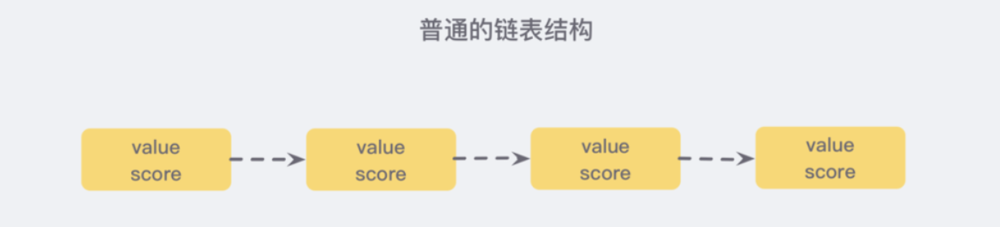
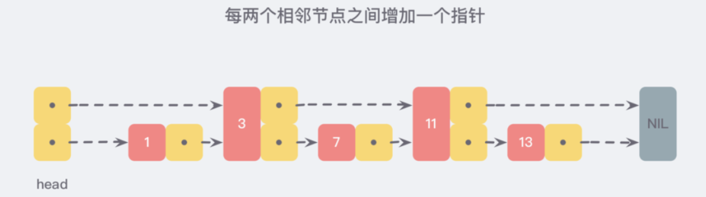
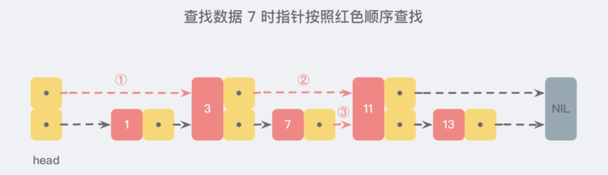
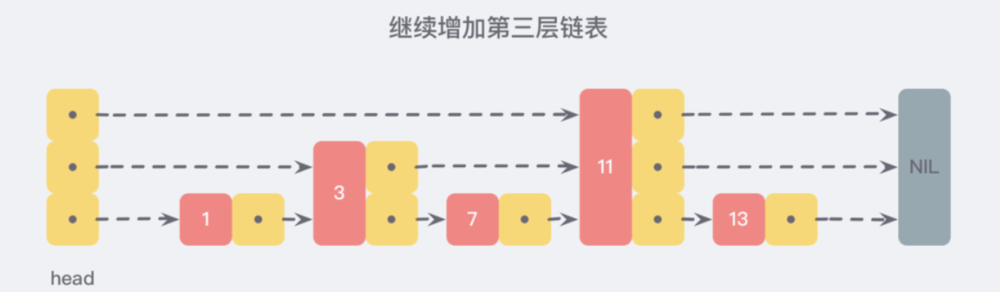
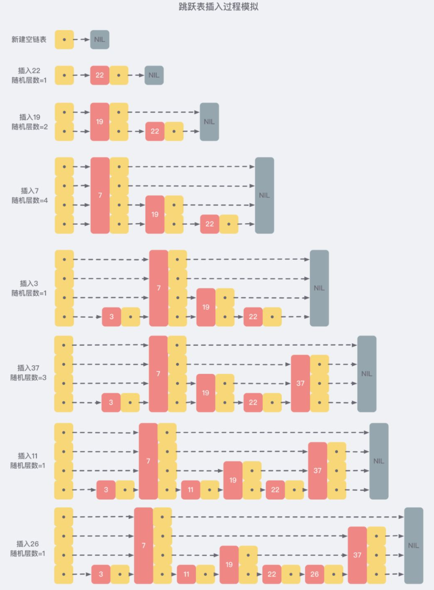

# 跳跃表

在 Redis 中，有序集合 zset 的数据结构使用的就是 **跳跃表**

类似于 Java 中的 SortedSet 和 HashMap 的结合体，一方面它是一个 set 保证了内部 value 的唯一性，另一方面又可以给每个 value 赋予一个排序的权重值 score，来达到 排序 的目的

## 使用跳跃表的原因

zset 要支持随机的插入和删除，所以它**不宜使用数组来实现**

关于排序不使用红黑树/平衡树的原因：

1. 性能考虑： 在高并发的情况下，树形结构需要执行一些类似于 rebalance 这样的可能涉及整棵树的操作，相对来说跳跃表的变化只涉及局部
2. 实现考虑： 在复杂度与红黑树相同的情况下，跳跃表实现起来更简单，看起来也更加直观

## 从链表开始

这个链表按照 score 值进行排序，这也就意味着，当需要添加新的元素时，需要定位到插入点，这样才可以继续保证链表是有序的，通常会使用 **二分查找法**，但二分查找是有序数组的，链表没办法进行位置定位，除了遍历整个找到第一个比给定数据大的节点为止 （时间复杂度 O(n)) 似乎没有更好的办法

假如每相邻两个节点之间就增加一个指针，让指针指向下一个节点，如下图：

所有新增的指针连成了一个新的链表，但包含的数据却只有原来的一半

查找数据时：

继续增加链表：

***可以想象，当链表足够长，这样的多层链表结构可以跳过很多下层节点，从而加快查找的效率***

## Skip List

跳跃表 skiplist 就是受到这种多层链表结构的启发而设计出来的

按照上面生成链表的方式，上面每一层链表的节点个数，是下面一层的节点个数的一半，这样查找过程就非常类似于一个二分查找，使得查找的时间复杂度可以降低到 O(logn)

多层链表 存在的缺陷：

+ 新插入一个节点之后，就会打乱上下相邻两层链表上节点个数严格的 2:1 的对应关系
+ 如果要维持这种对应关系，就必须把新插入的节点后面的所有节点 （也包括新插入的节点） 重新进行调整，这会让时间复杂度重新蜕化成 O(n)
+ 删除数据也有同样的问题

skiplist 为了避免这一问题，它不要求上下相邻两层链表之间的节点个数有严格的对应关系，而是 **为每个节点随机出一个层数(level)**

从上面的创建和插入的过程中可以看出，每一个节点的层数（level）是随机出来的，而且新插入一个节点并不会影响到其他节点的层数，因此，**插入操作只需要修改节点前后的指针，而不需要对多个节点都进行调整**，这就降低了插入操作的复杂度
