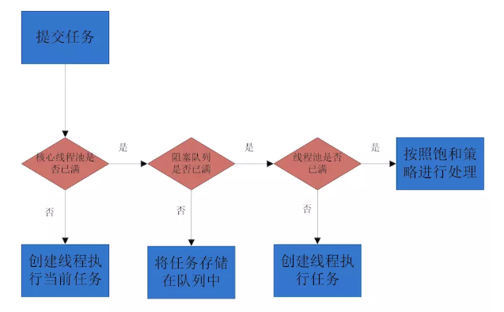

# 线程池原理

## 线程池作用

1. **降低资源消耗**，通过重复利用已创建的线程降低线程创建、销毁线程造成的消耗
2. **提高响应速度**，当任务到达时，任务可以不需要等到线程创建就能立即执行
3. **提高线程的可管理性**，线程是稀缺资源，如果无限的创建，不仅会消耗系统资源，还会降低系统的稳定性，使用线程池可以进行统一的分配、调优、监控

## 线程池如何复用

线程池中的线程在循环中尝试取任务执行，这一步会被阻塞，如果设置了```allowCoreThreadTimeOut```为true，则线程池中的所有线程都会在keepAliveTime时间超时后还未取到任务而退出，或者线程池已经STOP，那么所有线程都会被中断，然后退出

## 线程池如何支持高并发

1. 线程池状态和工作线程数量的变更，这个由一个**AtomicInteger变量 ctl**来解决原子性问题
2. 向工作Worker容器workers中添加新的Worker的时候，这个线程池本身已经加锁了
3. 工作线程Worker从等待队列中取任务的时候，这个由工作队列本身来保证线程安全，比如LinkedBlockingQueue等

## 线程池状态

1. ***RUNNING***, 运行状态，值也是最小的，刚创建的线程池就是此状态
2. ***SHUTDOWN***，停工状态，不再接收新任务，已经接收的会继续执行
3. ***STOP***，停止状态，不再接收新任务，已经接收正在执行的，也会中断
4. ***TIDYING***，所有任务都停止了，工作的线程也全部结束了
5. ***TERMINATED***，终止状态，线程池已销毁

流转关系如下：


## ThreadPoolExecutor线程池类参数

|参数|说明|
|---|---|
|corePoolSize|核心线程数量，线程池维护线程的最少数量|
|maximumPoolSize|线程池维护线程的最大数量|
| keepAliveTime|线程池除核心线程外的其他线程的最大空闲时间，超过该时间的空闲线程将会被销毁|
|unit|keepAliveTime的单位，TimeUnit中的静态属性|
|workQueue|线程池所使用的任务缓冲队列|
|threadFactory|线程工厂，用于创建线程，一般用默认即可|
|handler|线程池对拒绝任务的处理策略|

ThreadPoolExecutor提供了四种策略:
1. **```ThreadPoolExecutor.AbortPolicy```**：丢弃任务并抛出RejectedExecutionException异常，也是默认的处理方式
2. **```ThreadPoolExecutor.DiscardPolicy```**：丢弃任务，但是不抛出异常
3. **```ThreadPoolExecutor.DiscardOldestPolicy```**：丢弃队列最前面的任务，然后重新尝试执行任务（重复此过程）
4. **```ThreadPoolExecutor.CallerRunsPolicy```**：由调用线程处理该任务

可以通过实现```RejectedExecutionHandler```接口自定义处理方式

## 线程池任务执行

### 添加执行任务

```submit()``` 该方法返回一个Future对象，可执行带返回值的线程，或者执行想随时可以取消的线程，```Future```对象的```get()```方法获取返回值，```Future```对象的```cancel(true/false)```取消任务，未开始或已完成返回false，参数表示是否中断执行中的线程

```execute()``` 没有返回值

### 线程池任务提交过程

一个线程提交到线程池的处理流程如下图



1. 如果此时线程池中的数量**小于corePoolSize**，即使线程池中的线程**都处于空闲状态**，也要**创建新的线程**来处理被添加的任务
2. 如果此时线程池中的数量等于corePoolSize，但是缓冲队列workQueue未满，那么任务被放入缓冲队列
3. 如果此时线程池中的数量大于等于corePoolSize，缓冲队列workQueue满，并且线程池中的数量小于maximumPoolSize，建新的线程来处理被添加的任务
4. 如果此时线程池中的数量大于corePoolSize，缓冲队列workQueue满，并且线程池中的数量等于maximumPoolSize，那么通过 handler所指定的策略来处理此任务
5. 当线程池中的线程数量大于 corePoolSize时，如果某线程空闲时间超过keepAliveTime，线程将被终止，这样，线程池可以动态的调整池中的线程数

需要注意的点：
1. 当workQueue使用的是无界限队列时，maximumPoolSize参数就变的无意义了，比如```new LinkedBlockingQueue()```或者```new ArrayBlockingQueue(Integer.MAX_VALUE)```
2. 使用```SynchronousQueue```队列时由于该队列没有容量的特性，所以不会对任务进行排队，如果线程池中没有空闲线程，会立即创建一个新线程来接收这个任务，maximumPoolSize要设置大一点
3. 核心线程和最大线程数量相等时keepAliveTime无作用

### 线程池关闭

1. ```shutdown()``` 不接收新任务，会处理已添加任务
2. ```shutdownNow() ```不接受新任务，不处理已添加任务，中断正在处理的任务

## 常用队列介绍

1. ```ArrayBlockingQueue```：这是一个由数组实现的容量固定的有界阻塞队列
2. ```SynchronousQueue```：没有容量，不能缓存数据，每个put必须等待一个take， offer()的时候如果没有另一个线程在poll()或者take()的话返回false
3. ```LinkedBlockingQueue```：这是一个由单链表实现的默认无界的阻塞队列，LinkedBlockingQueue提供了一个可选有界的构造函数，而在未指明容量时，容量默认为```Integer.MAX_VALUE```

队列操作：

|方法|说明|
|---|---|
|add|增加一个元索，如果队列已满，则抛出一个异常|
|remove|移除并返回队列头部的元素，如果队列为空，则抛出一个异常|
|offer|添加一个元素并返回true，如果队列已满，则返回false|
|poll|移除并返回队列头部的元素，如果队列为空，则返回null|
|put|添加一个元素，如果队列满，则阻塞|
|take|移除并返回队列头部的元素，如果队列为空，则阻塞|
|element|返回队列头部的元素，如果队列为空，则抛出一个异常|
|peek|返回队列头部的元素，如果队列为空，则返回null|

## Executors线程工厂类

1. ```Executors.newCachedThreadPool()```
    a. 创建一个可缓存线程池，如果线程池长度超过处理需要，可灵活回收空闲线程，若无可回收，则新建线程
    b. ```new ThreadPoolExecutor(0,Integer.MAX_VALUE,60L,TimeUnit.SECONDS,new SynchronousQueue())```
2. ```Executors.newFixedThreadPool(int)```
    a. 创建一个定长线程池，可控制线程最大并发数，超出的线程会在队列中等待
    b. ```new ThreadPoolExecutor(nThreads, nThreads,0L,TimeUnit.MILLISECONDS,new LinkedBlockingQueue())```
3. ```Executors.newSingleThreadExecutor()```
    a. 创建一个单线程化的线程池，它只会用唯一的工作线程来执行任务，保证所有任务按照顺序执行
    b. ```new ThreadPoolExecutor(1,1,0L,TimeUnit.MILLISECONDS,new LinkedBlockingQueue())```
4. ```Executors.newScheduledThreadPool(int)```
    a. 创建一个定长线程池，支持定时及周期性任务执行
    b. ```new ScheduledThreadPoolExecutor(corePoolSize)```
    
## 线程池源码（待补充）
